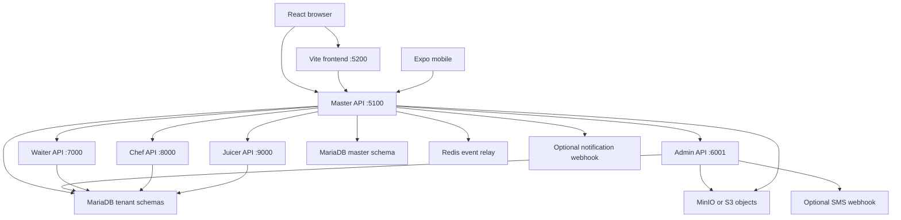
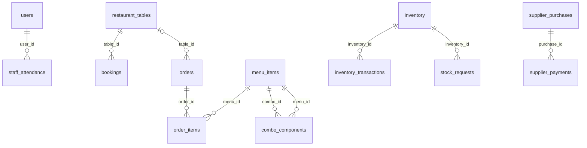
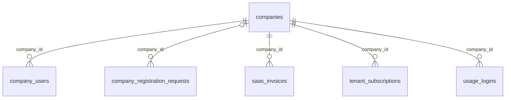
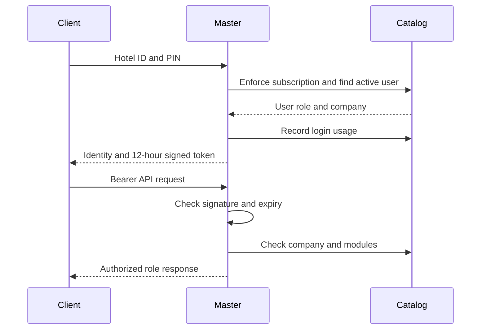

# HOTEL MANAGEMENT SYSTEM (PMS)

Complete Technical, Architecture, Deployment & Operations Documentation

Document version: 1.0

Generated: 4 October 2026 · Asia/Kolkata

Application: KnockOUT Hospitality · Root package 2.0.0

Repository commit: a8b3d69a9f0569d537d3d21bee32544a298d94a0

Snapshot: working tree, including uncommitted mobile SDK 57 and premium dashboard changes. The commit alone does not reproduce this snapshot. See the source manifest for fingerprints.

Classification: Internal technical handover. Credentials, seed PINs and private environment values are intentionally excluded. This document records source behavior, not certification of a live production deployment.

## Table of Contents

The PDF provides a clickable, paginated table of contents. The editable source follows the 32 requested subject areas, with complete API, schema, environment and source inventories in section 32.

1. Executive summary
2. System features
3. Technology stack
4. Project directory structure
5. System architecture
6. Application request flow
7. Database architecture
8. Entity relationship diagrams
9. Database data flow
10. API documentation
11. Authentication
12. Authorization and RBAC
13. Security architecture
14. Environment variables
15. Installation guide
16. Local development
17. Docker documentation
18. Production deployment
19. CI/CD
20. Observability
21. Backup and restore
22. Disaster recovery
23. Performance and scalability
24. Business workflows
25. User guide
26. Administrator guide
27. Testing
28. Troubleshooting
29. Operations runbook
30. Known limitations
31. Prioritized improvements
32. Appendices and evidence

## 1. Executive summary

KnockOUT coordinates restaurant table service, kitchen preparation, takeaway orders, billing, stock, staff attendance and daily finances across multiple companies. The master console manages company onboarding, subscriptions and module entitlements. Although the requested title uses PMS, this codebase is predominantly a restaurant/hospitality operations platform. Guest-room inventory, overnight stays, room-rate plans and lodging folios: **Not identified from the current codebase.** Staff check-in/check-out is attendance, not a hotel stay.

Primary users are Super Admin, company Admin, Waiter, Head Chef, Juicer and registration applicants. The system addresses order coordination, service/payment handoff, stock visibility and multi-company access. Browser clients use React/Vite; mobile uses React Native/Expo. NestJS hosts Express handlers. A master API authenticates and proxies requests to four role processes. MariaDB stores a master catalog and separate tenant schemas; MinIO/S3 stores images/reports; Redis relays change events between master replicas.

Docker Compose is the only full-stack orchestration found. Application functionality is substantial, but production readiness is not established: functional automation, TLS ingress, backup scheduling, monitoring and CI/CD are missing. Material risks include plaintext PINs, incomplete authorization, schema drift, destructive startup updates and financial transaction edge cases. These findings are source-based, not a live penetration test or database audit.

## 2. System features

Every implemented capability below maps to actual screens, entities and APIs. Appendix 32.1 expands individual contracts; workflows and user instructions appear in sections 24–26.

| Feature / purpose | Users and screens | Backend, entities and API family | Workflow, validation, dependencies and edge cases |
|---|---|---|---|
| Company applications | Applicant; public registration/onboarding | master-server.js; company_registration_requests; /public/company-registrations, /onboarding-status, /complete-registration | Business/contact details, starter/growth/complete, 1/6/12 months; temporary PIN, approval then setup/payment reference. Payment is not gateway-verified. |
| Tenant provisioning | Super Admin; company workspace | provisionCompany; companies/company_users and tenant schema; /companies | Normalize company database name, clone primary schema, copy menu/combos, zero stock, generate Hotel ID/Admin PIN. DDL and catalog/object writes are not atomic. |
| Company controls | Super Admin; network/controls | companies.modules/status; /companies/:id/modules, /status, DELETE /companies/:id | Ten module flags; suspend/reactivate; exact company name required for deletion; primary tenant protected. Deletion drops schema, not necessarily objects. |
| SaaS billing | Super Admin, applicant; pricing/billing/onboarding | saas_invoices, module_pricing, tenant_subscriptions | Six-month 5% and annual 10% discount, 18% tax; two-day grace, request-triggered suspension. Invoice paid status does not renew subscription dates. |
| Identity/profile | Portal roles; login/profile | master_users, company_users, users; /login, /public/resolve-login, /profile | Hotel ID/PIN lookup; HMAC token; profile name/phone/email/image. Email format validation; old photo removed after replacement. |
| Dashboard | Admin/role overview; mobile PremiumDashboard | GET /state; tables/orders/attendance | Live KPIs and shortcuts; mobile paid-order value selects orders created today, not payment timestamp. History is bounded. |
| Restaurant tables | Admin, Waiter; floor views | restaurant_tables; /tables, /tables/:id/status | Positive number/seats and area; duplicate number blocked; inactive table restored by number. Active order blocks deletion/release, cleaning blocks order. |
| Table bookings | Admin create/cancel; Waiter views | bookings; POST /bookings, DELETE /bookings/:id | Future date/time, phone, 30–240 minutes; lock table, overlap check, commit then SMS. No implemented arrival/seating transition. |
| Dine-in orders | Waiter; order builder/table drawer | orders/order_items/menu_items; /orders, /orders/:id/items | Available menu price snapshot; occupy table; additions use batch number. Billing/completed blocks additions. Initial quantities insufficiently validated. |
| Preparation | Chef/Juicer; kitchen and parcel queues | order_items.production_status; /orders/:id/items/status | New/preparing/ready per batch; Juicer owns normalized category juices, Chef others. Backend combo routing uses parent category. |
| Handoff | Chef, Waiter; round tickets | order_items.handoff_status/orders.status; /batches/:batchNo/handoff | Ready round → Chef collected → Waiter received. Legacy whole-order status route does not update line handoffs. |
| Parcels | Admin creates/pays/completes; kitchen prepares | orders.order_type=parcel; /parcels, /mark-paid, /finalize | No table; optional advance payment. Cash/Card / UPI are labels, not payment integrations. UI readiness rules exceed finalize guards. |
| Billing/printing | Waiter request; Admin finalization; web receipts | billFor, orders/order_items; /request-bill, /bill, /finalize | Stored line prices summed; tax/CGST/service zero. Completion sets table cleaning. Client estimates use current menu prices. |
| Menu/combos/photos | Admin; Chef/Juicer availability | menu_items/combo_components; /menu, /combos, /image | Create/edit dish or combo composition; delete means unavailable. Juicer only juice availability. Images require MIME prefix, max 5 MiB; object storage dependency. |
| Inventory | Admin; stock | inventory/inventory_transactions; /inventory, /movements | Opening stock and purchase/usage/adjustment/waste; positive movement, no negative resulting balance. History blocks delete; no recipe depletion. |
| Stock requests | Chef requests; Admin manages | stock_requests; /stock-requests and /:id/status | Existing inventory, positive quantity; pending/ordered duplicate check. Resolving does not automatically add stock. |
| Finance | Admin; daily finance/calendar | finance_entries; /finance | Income/expense, category, description, amount/date, payment label/reference. Not double-entry accounting. |
| Supplier balances | Admin; purchases/payments | supplier_purchases/supplier_payments; /supplier-purchases | Purchase and optional initial payment, subsequent partial payments with purchase lock and overpayment check. Purchase delete removes payment history. |
| Staff logins | Admin staff; Chef Juicer login | users; /staff, /juicer-login | Generated six-digit PIN, singleton Admin/Head Chef/Juicer rules, daily/monthly pay. Staff soft-delete preserves shifts; Admin protected. |
| Kitchen roster | Admin/Head Chef; chef management | kitchen_staff; /kitchen-staff | Non-login personnel with designation/specialization/pay. Hard delete; distinct from attendance users. |
| Attendance | Staff portal; Admin monitor/correction | staff_attendance; /attendance/:id, /staff/:id/check-in/out | Sequential duplicate/open-shift checks; no concurrent unique constraint. Same-role membership checked, not authenticated user ownership. |
| Settings | Admin screen | settings; PUT /settings | Hotel/currency/charge fields; no explicit role guard on handler. Charge fields do not enable restaurant taxes. |
| Reports | Web stock/finance/master export | storage.js; POST /reports | Client-supplied filename/content/type stored as object. No server report validation or immutable ledger export. |
| Realtime | Portal users | /ws; realtime.js; Redis | Token-bound channels, heartbeat and polling fallback. Events are transient invalidation, not audit history. AttendancePanel socket lacks token. |

Room types, hotel stays, room housekeeping/maintenance, guest/corporate/travel-agent master profiles, rate plans, seasonal rates, refunds/deposits, OTA integration and full audit logs: **Not identified from the current codebase.** Table cleaning, staff shifts and SaaS discounts must not be described as corresponding lodging features. Currency is configurable in settings, but major formatters hardcode INR/en-IN; full localization is not implemented.

## 3. Technology stack

| Component | Declared technology/version | Purpose |
|---|---|---|
| Runtime | Node 26.0.0; npm 11.12.1 | Exact runtime checks in web/backend preinstall |
| Browser | React/React DOM ^19.1.1; Vite ^7.0.0 | Unified role-aware web client |
| Browser UI | lucide-react ^0.536.0; motion 13.1.0 | Icons and motion effects |
| Backend | NestJS 11.2.1; Express ^5.1.0 | Express handlers via Nest ExpressAdapter |
| Languages | JavaScript, JSX; TypeScript ^5.8.3 dependency | Most application sources are JS/JSX |
| Database | MariaDB 11.4 image; mysql2 ^3.14.3 | Raw SQL and pooled transactions; no ORM |
| Realtime | ws ^8.21.3; redis 5.12.1; Redis 7.4-alpine | WebSocket and cross-master pub/sub |
| Storage | minio ^8.0.5; minio/minio:latest | MinIO or S3 objects |
| Uploads/HTTP | multer ^2.0.2; cors ^2.8.5; native fetch | Memory uploads, CORS and proxy |
| Mobile | Expo ~57.0.24; React Native 0.86.3; React 19.2.3 | iOS/Android; independent npm project |
| Database console | phpmyadmin:latest | Database administration |
| Testing | k6, runner version not pinned | Load test script, not functional suite |
| Distribution | eas.json, CLI >=12.0.0 | Native development/preview/production profiles |
| Build | npm workspaces, Docker Compose | Root web/backend and service orchestration |

Full package and lock-resolved versions are in Appendix 32.4. Lock versions do not establish deployed versions. Cloud compute, reverse-proxy product, monitoring vendor and CI/CD platform: **Not identified from the current codebase.** Optional S3 support is not proof of an AWS deployment.

## 4. Project directory structure

```text
Hotel Management/
  package.json, package-lock.json   web/backend npm workspaces
  .env.example                     configuration template
  docker-compose.yml               ten-service local stack
  docker-compose.scale.yml         master port-range override
  knockout-production.sql          older structure-only export
  scripts/                         exact runtime checks
  backend/
    Dockerfile, package.json
    src/server.js                  restaurant role handlers
    src/master-server.js           identity, tenants, SaaS, proxy
    src/database.js                DDL, seed and state projection
    src/store.js                   demonstration seed content
    src/storage.js                 MinIO/S3 adapter
    src/realtime.js                Redis event relay
    src/main.js, main-master.js     process entry points
    src/nest/                      Nest adapter/framework route
  frontend/
    Dockerfile, vite.config.js
    src/App.jsx                    public/master/role screens
    src/api.js                     bearer HTTP helpers
    src/AttendancePanel.jsx        clock and shifts
    src/AnimatedUI.jsx             transitions
    src/styles.css, knockout.css
  mobile/
    App.js, AdminModules.js         native operations
    PremiumDashboard.js            premium Admin overview
    assets/                        branding/watermarks
    app.config.js, eas.json         platform/build settings
    package.json, package-lock.json
  load-tests/api-capacity.js        k6 scenarios
  app.js, index.html, styles.css    standalone legacy prototype
  README.md, SCALING.md             older guidance
  docs/pms/                        this handover
```

Generated dist bundles, node_modules, .git internals, Expo caches and historical mobile export-check directories are omitted. The root prototype uses localStorage and is not the React/MariaDB runtime. README links to TESTING_GUIDE.md, which was not found in this snapshot.

## 5. System architecture



Browser HTTP helpers target page hostname:5100 directly; browser WebSockets target page-origin /ws through Vite. Although Vite proxies /api, most HTTP calls bypass that proxy. Mobile uses EXPO_PUBLIC_API_HOST and EXPO_PUBLIC_API_PORT (default 5100), HTTP/ws transport.

Only master is published among API containers. It authenticates, checks company/module state and selects a role target from the token. Internal role APIs trust tenant/user headers and PORTAL_ROLE. AsyncLocalStorage scopes SQL to a tenant-specific pool. They must remain private.

A tenant is a company/schema; no nested property hierarchy exists. Master uses administrative credentials across schemas. Redis relays events, not database state or jobs. Role state cache is process-local. Objects use sanitized company-name prefixes. No TLS ingress, load balancer, cloud infrastructure or worker service is defined. Jobs run during startup or requests.

## 6. Application request flow

```mermaid
sequenceDiagram
  participant U as Waiter UI
  participant M as Master API
  participant A as Waiter API
  participant D as Tenant DB
  U->>M: POST /api/orders with bearer token
  M->>M: Verify signature, expiry and company status
  M->>A: Forward token-derived tenant and user headers
  A->>D: BEGIN; lock table and check booking
  A->>D: Read available menu prices
  A->>D: Insert order and lines; occupy table; COMMIT
  A-->>M: 201 with ID and bill
  M-->>U: Response and change notification
  U->>M: Refresh GET /api/state
```

The order handler rejects non-Waiter roles, empty items, missing/cleaning tables, active orders and a current reservation. Prices are copied into order_items. Exceptions roll back the transaction, but a post-commit bill read can fail after the write succeeds. Blind POST retries are unsafe. Initial line quantities lack robust validation.

Change notifications use the request tenant header while proxy SQL identity uses the token tenant. This mismatch needs correction; events must not be treated as authoritative audit records. Cached state can briefly lag a committed mutation.

## 7. Database architecture

MariaDB via mysql2/promise, raw parameterized SQL, no ORM. Default schemas: knockout_master and knockout; new schemas tenant_<normalized_name>, with legacy knockout_<digits> also accepted. Runtime source declares 16 tenant and 9 master tables, plus views tenant_waiting_list and tenant_registrations. Appendix 32.2 lists columns, primary keys, FKs, indexes and constraints.

Most primary keys are AUTO_INCREMENT id. settings uses id=1; module_pricing uses module_key. No stored procedures, custom SQL functions, triggers or independent sequences were identified. Major indexes include booking_slot, request_status, order_live_history, order_payment_date, order_round_status, user_portal_login, registration_status, invoice_month and company_login. company_users has unique company/user and company/PIN; companies has unique company/database/cy_db/Hotel ID; invoices have unique company/month.

### 7.1 Startup migration mechanism

Role migrate() creates tables, executes repeated ALTER/UPDATE upgrades, scans recognized company schemas and seeds the default tenant if users is empty. Master initialize() independently upgrades catalog tables, syncs user directory, ensures finance tables, migrates image prefixes and generates invoices. There is no migration ledger or rollback command.

RUN_MIGRATIONS=false suppresses role migrate only. Compose does not inject that variable into role containers, despite its example-file presence; master initialize ignores it. Startup updates reset charge settings, translate salary types, backfill handoffs and release some reserved tables. These are data mutations, not harmless schema checks. Replicas can race.

### 7.2 Schema drift

knockout-production.sql is an older structure-only export with unsigned IDs and additional uniqueness/indexes, but missing newer fields/master tables. Combining it with runtime DDL can fail on FK type mismatches. Do not treat it as the authoritative current migration.

Provisioning uses CREATE TABLE LIKE; foreign keys are not preserved by this mechanism (MariaDB CREATE TABLE documentation, reference R1 below). ensureDailyFinanceTables also creates supplier_payments with an index instead of an FK when missing. ER relationships below describe explicit base DDL, not a verified constraint guarantee for every tenant. Inspect SHOW CREATE TABLE and information_schema before migration/recovery.

## 8. Entity relationship diagrams

### 8.1 Tenant base DDL



Parcels have nullable table_id. Base DDL cascades order-line, combo-component and supplier-payment deletion from parents. restaurant_tables.order_id is an application pointer without FK. settings, finance_entries and kitchen_staff are independent; kitchen personnel are not attendance users. No guest/payment master table exists for restaurant transactions.

### 8.2 Master DDL



company_users.tenant_user_id and usage_logins.user_id are logical cross-schema references without FK. Company deletion cascades catalog dependents, while registration company_id becomes null. master_users, module_pricing and notification_outbox are independent. Registration views partition by completion, not approval alone.

## 9. Database data flow

| Operation | Reads/locks | Writes | Edge/failure boundary |
|---|---|---|---|
| Booking | Active table FOR UPDATE and same-date overlap | Confirmed booking; post-commit notification status | SMS failure retains booking; cross-midnight overlap risk |
| New order | Table/current booking, available menu | orders/lines; occupied table | Bill lookup after commit may fail |
| Additional round | Order and maximum batch | New lines; order reset new | No idempotency key |
| Kitchen/handoff | Batch lines and order locks | Production/handoff/aggregate state | Parent category owns combo routing |
| Finalize | Bill before transaction; then order lock | Paid totals/completion; table cleaning | Early returns after BEGIN require rollback review |
| Stock | Inventory row lock | Quantity and movement history | No recipe link; adjustment adds or subtracts according to adjustmentDirection |
| Supplier payment | Purchase lock and previous payment sum | Payment record | Overpayment rejected; no external settlement |
| Staff | Tenant user queries | users then company_users replacement | Directory sync can fail after tenant write |
| Onboarding | Approval/name/schema validation | Tenant DDL, company, subscription, invoice | Cross-schema/object/notification flow is non-atomic |

## 10. API documentation

Default public base: http://localhost:5100/api. Use Authorization: Bearer <ACCESS_TOKEN>. Client tenant/role headers also exist, but the gateway derives internal role/user/schema from the token. Internal role routes are not safe unauthenticated public endpoints.

JSON limit is 6 MB. Image endpoints accept multipart field image, maximum 5 MiB. Error format is usually {message}; company suspension/module denial also returns code. Generic exceptions return status 500 and error.message. There is no OpenAPI specification, API version prefix, pagination contract or idempotency mechanism.

Appendix 32.1 documents all 76 explicit Express handlers separately, plus Nest GET /api/framework, middleware GET /api/session and /ws. Duplicate master/role paths have different responses. Tenant authenticated requests are intercepted before master handlers.

```json
POST /api/public/resolve-login
{"hotelId":"<HOTEL_ID>","pin":"<USER_PIN>"}

POST /api/bookings
{"tableId":1,"customerPhone":"<CUSTOMER_PHONE>","bookingDate":"<YYYY-MM-DD>","bookingTime":"18:00","durationMinutes":90}

POST /api/orders
{"tableId":1,"guestName":"<GUEST_NAME>","waiter":"<WAITER_NAME>","items":[{"menuId":1,"qty":2,"note":"No added salt"}]}

PATCH /api/orders/1/items/status
{"status":"ready","batchNo":1}

POST /api/orders/1/finalize
{"paymentMethod":"Cash"}
```

Booking returns 201 {ok,id,notificationStatus,notificationDetail}. Order returns 201 {id,bill}; bill contains items/subtotal/tax/cgst/service/total. Bill item fields include menuId, qty, note, price, name, icon, imageUrl. Finalization returns {id,paymentStatus,paymentMethod,bill}. Replace placeholders and IDs with authorized test-tenant data.

## 11. Authentication

Staff login resolves four-digit Hotel ID and six-digit PIN through company_users and active companies. Master can use its PIN with no Hotel ID or reserved master identifier. Applicants use temporary PIN without Hotel ID and receive no portal bearer token.

Tokens are custom payload.signature, not JWT: base64url JSON {id,role,companyDatabase,exp} signed with HMAC-SHA256, twelve-hour expiry in milliseconds. Verification checks timing-safe signature equality, expiry, role and tenant format. MASTER_SESSION_SECRET has a fallback derived from DB root configuration; production should supply a strong independent secret.



PINs are plaintext, duplicated in user directories. Hashing, refresh tokens, OAuth, server logout, password reset, MFA and login rate limiting: **Not identified from the current codebase.** User PIN changes/deactivation do not revoke every existing token. Browser logout clears sessionStorage; mobile uses AsyncStorage for persisted identity and an in-memory token. AsyncStorage is not an encrypted vault. No authentication cookies/cookie configuration exists.

## 12. Authorization and RBAC

| Role | Module | Read | Create | Update | Delete | Special actions |
|---|---|---|---|---|---|---|
| Super Admin | Companies/catalog | Yes | Company | Status/modules/PIN/pricing | Non-primary company | Approve/reject application, invoice status |
| Admin | Tables/bookings/menu | Yes | Yes | Table state/menu/combo | Table soft-delete, cancel, menu hide | Photos/reports |
| Admin | Orders | Yes | Parcels only | Payment/finalize | No endpoint | Not waiter dine-in creation |
| Admin | Stock/finance/suppliers | Yes | Yes | Stock/request | Guarded stock, finance/purchase | Supplier payments |
| Admin | Staff/roster | Yes | Staff/roster | Staff/roster | Soft staff except Admin; hard roster | Attendance correction endpoints |
| Waiter | Tables/orders | State | Order/round | Table status/receipt | No | Bill request |
| Chef | Kitchen/stock/team | State and stock | Stock request, roster, Juicer login | Food production, availability, roster | Roster | Confirm collection |
| Juicer | Juice | State | No orders | Juice production/availability | No | Attendance |
| Staff | Attendance/profile | Same-role attendance; own profile | Shift | Checkout/profile | No | No ownership check on attendance ID |
| Tenant roles | Unguarded handlers | Bill/state | Reports/images | Settings | Menu image | Access gap, not intended policy |

Gateway maps module checks for bookings, tables, finance/suppliers, inventory/stock, menu/combos and staff/attendance/kitchen-staff. Chef/Juicer portal flags are enforced. Billing/parcels paths are not mapped to their flags. UI hiding is not API authorization. Non-Admin state filtering removes some fields, but supplier data and other broad projections remain.

Role APIs trust private network and forwarded headers; they do not validate bearer signatures. Master tokens route to master handlers, not arbitrary tenant impersonation via headers. Tenant DB credentials remain broadly privileged, so logical schema isolation is not an independent credential boundary.

## 13. Security architecture

### 13.1 Implemented controls

HMAC/expiry/timing-safe comparison; token-derived proxy identity; company/partial module gates; many role checks; validated dynamic database identifiers; SQL placeholders; locks/transactions for key workflows; MIME and upload-size limits; filename sanitization; internal-only role ports; x-powered-by disabled; authenticated WebSockets with heartbeat.

### 13.2 Recommended improvements

Replace plaintext PIN storage with reviewed credential hashing and throttling; remove seed/fallback credentials and credential-bearing state responses. Add revocation, secure mobile credential storage and explicit secrets management. Enforce action/record ownership and complete module checks; minimize state by role; authenticate internal services and reduce DB grants.

TLS, CORS allowlists, CSP/HSTS/security middleware, CSRF controls, secret rotation and API throttling are absent. Bearer headers reduce traditional cookie-CSRF but not XSS/token theft. React escapes text; legacy prototype innerHTML and receipt HTML need separate escaping review. General-purpose sanitization is not identified.

Validate finite numeric ranges, dates and transitions server-side. Verify decoded image bytes/dimensions rather than MIME alone. Keep reports/profile images private with signed URLs and stable tenant IDs; default MinIO policy covers the entire bucket. CSV formula protection was not identified. Avoid raw database errors and redact PINs, tokens and PII in logs. Query-string WebSocket tokens can enter URL logs. Dependency vulnerability status is not established by source inspection; no zero-vulnerability claim is made.

## 14. Environment variables

Appendix 32.3 lists all discovered application/Compose/Expo/k6 variables, safe examples, requirements and sources. No private .env values are reproduced. VITE_ and EXPO_PUBLIC_ values are public configuration, not secret storage.

Development requires reviewed database/storage credentials, DB_NAME, public object URL and signing secret. Raw Node scripts do not automatically load .env; export configuration or use Node --env-file. Compose substitutes root .env; Expo loads mobile/.env. Testing requires a disposable tenant and test PIN. Staging/production require explicit secrets, reachable TLS endpoints, selected storage and recovery controls. Separate staging/prod manifests were not found.

RUN_MIGRATIONS, NOTIFICATION_WEBHOOK_URL, REDIS_EVENTS_CHANNEL, INSTANCE_ID, MINIO_SSL and AWS aliases are read by code but not all injected by Compose. Adding variables to .env alone is insufficient. VITE_API_URL is set in Compose but ignored by frontend/src/api.js, which fixes port 5100.

## 15. Installation guide

Prerequisites: Git, Docker with Compose, Node 26.0.0 and npm 11.12.1. Native builds need platform tooling (Xcode/macOS for iOS; Android SDK for Android). Exact platform SDK minimum versions: **Not identified from the current codebase.**

Do not overwrite an existing environment file. Review the example locally and replace credentials before first start. Avoid printing expanded Compose configuration, which includes secrets.

```bash
cd "/Users/reemusjanus/project/Hotel Management"
node --version
npm --version
# Only if .env is absent:
cp .env.example .env
# Edit .env privately, including fresh credentials/signing secret.
docker compose config --quiet
docker compose up -d --build
docker compose ps
curl --fail http://localhost:5100/api/health
```

Startup performs schema creation/upgrades and demo seeding when empty. Seed PINs are deliberately omitted; obtain credentials through an authorized operator. Changing .env passwords does not rotate existing initialized DB accounts.

```bash
# Developer dependencies and web build, from root:
npm ci
npm run build
cd mobile
npm ci
# Only if mobile/.env is absent:
cp .env.example .env
npm run start:clear
```

Mobile is outside root npm workspaces and uses its own lock. Set EXPO_PUBLIC_API_HOST to the workstation LAN IP for a physical phone; keep API reachable. This is the current HTTP development path, not a recommended production transport.

## 16. Local development

Compose is the complete runnable topology because master proxy targets Docker service names. Root npm run dev starts one role API and Vite, not master plus all roles; it does not provide full unified login. Direct backend defaults to 4000 while Vite fallback proxy is 6000, requiring explicit configuration.

Run Compose dependencies/APIs, then host Vite for hot reload:

```bash
VITE_PROXY_TARGET=http://localhost:5100 VITE_PORTAL_ROLE=unified npm run dev --workspace frontend -- --host 127.0.0.1
```

Vite prints its chosen address (normally 5173). HTTP still uses hostname:5100; WebSocket /ws uses the configured proxy. Compose has no source bind mounts, so container code is a build snapshot. Backend watch command exists, but host processes do not automatically replace the master's Docker targets.

| Service | Default local address |
|---|---|
| Compose web | http://localhost:5200 |
| Master API | http://localhost:5100/api |
| WebSocket | ws://localhost:5100/ws |
| MariaDB host | localhost:3307 |
| phpMyAdmin | http://localhost:9200 |
| MinIO API / console | http://localhost:9100 / http://localhost:9101 |
| Metro | Usually 8081; use printed Expo address |

Use browser network/console, container stdout/stderr and Expo bundler output for debugging. Redact bearer values, query tokens and personal data before sharing logs.

## 17. Docker documentation

Both Dockerfiles use node:26.0.0-alpine and install npm 11.12.1. Backend uses npm install --omit=dev; master overrides start to start:master. Frontend installs packages and runs Vite dev, not a production static server. Image EXPOSE 4000 does not override Compose PORT values.

| Service | Internal port | Host port | Persistence / health |
|---|---|---|---|
| mariadb | 3306 | 3307 | knockout_mariadb; connect/InnoDB check |
| redis | 6379 | None | knockout_redis; ping, AOF, 512 MB allkeys-lru |
| minio | 9000/9001 | 9100/9101 | knockout_minio; live endpoint |
| phpmyadmin | 80 | 9200 | Database dependency |
| admin-backend | 6001 | None | /api/health |
| waiter-backend | 7000 | None | /api/health |
| chef-backend | 8000 | None | /api/health |
| juicer-backend | 9000 | None | /api/health |
| superadmin-backend | 5000 | 5100 | /api/health |
| superadmin-frontend | 5000 | 5200 | No explicit healthcheck |

Implicit Compose network, restart unless-stopped, three named volumes with project-prefix actual names. No resource limits/custom network declaration. Host ports bind without loopback restriction. Health dependencies sequence startup but do not provide runtime failover.

```bash
docker build -t knockout-api:local ./backend
docker build -t knockout-web:local ./frontend
docker compose up -d --build
docker compose logs --tail=100 superadmin-backend admin-backend
docker logs --tail=100 knockout-mariadb
docker compose down
```

Do not use --volumes for routine shutdown. Restrict DB/storage administration interfaces. latest image tags reduce reproducibility.

## 18. Production deployment

### 18.1 Current implementation

Single-host Compose plus scaling port-range override (5100–5102, !override syntax). SCALING.md proposes replicas, TLS load balancing and managed infrastructure; it is not an infrastructure deployment. TLS/DNS, Kubernetes, Terraform, registry publishing, production static hosting and automated rollback: **Not identified from the current codebase.**

### 18.2 Recommended deployment

Close critical findings; pin source/images; build frontend static assets; create production static hosting separately. Rehearse versioned migrations and backup/restore before replicas start. Introduce TLS ingress for static assets, /api and /ws; replace hardcoded browser port and mobile transport with configurable URLs. Keep role APIs, DB, Redis and admin consoles private; use least privilege and secret injection.

Deploy immutable images, verify liveness/readiness then safe login/state and role workflows. Retain previous image plus schema-compatible rollback plan. Reverting code does not revert startup DDL/data updates. Suggested topology: Internet → DNS/TLS ingress → frontend/master replicas → private role APIs → managed DB/Redis/objects. No deployment was executed for this documentation.

## 19. CI/CD

No pipeline files/triggers, registry automation, runner secrets or rollback automation found. EAS profiles are build settings, not CI or store submission evidence.

Recommended: PR → pinned install → source checks/unit/API isolation tests → browser/native bundle build → dependency/image/secret scans → immutable artifacts → staging migration rehearsal → functional smoke tests → approved production rollout → health validation. Use isolated credentials, no production secrets in PR jobs, and backup evidence before destructive migration. Native signing and release versioning need their own secured pipeline.

## 20. Observability

Existing: console startup/error logging, Nest logs, Redis errors and startup retry messages, captured by Docker stdout/stderr. No central retention/rotation, metrics, dashboards, alert rules or tracing configuration found.

/api/live is process liveness. Role /api/health queries SQL and reports provider; master /api/health queries catalog and reports realtimeStatus. It does not deeply probe every API/storage/SMS dependency. /api/framework is metadata, not full readiness. usage_logins is usage tracking, not a complete audit log. notification_outbox statuses are not updated by queueNotice delivery handling.

Recommend redacted structured request IDs, latency/error rates, DB pool/locks, WebSocket counts, Redis errors, object failures and operational alerts. Protect logs that might contain query tokens, raw SQL errors or customer details.

## 21. Backup and restore

Scheduled backups, retention, encryption, off-site copies and restore-test evidence: **Not identified from the current codebase.** Volumes are persistence, not backups; structure-only SQL has no business records.

Recommended: encrypted daily DB backups, verified binlog/PITR if needed, independent/versioned object backups, protected configuration/secret recovery and image references. Preserve catalog and all tenant schemas together. Pause provisioning/DDL during logical snapshots.

### 21.1 Proposed manual database backup

The following is a proposed procedure, not an existing automation. Run only against an approved target. Output contains sensitive records/PINs; restrict, encrypt and transfer it using organization-approved tooling. The password is taken from the existing container environment and not printed.

```bash
mkdir -p backups
chmod 700 backups
umask 077
docker compose exec -T mariadb sh -c 'MYSQL_PWD="$MARIADB_ROOT_PASSWORD" mariadb-dump -u root --all-databases --single-transaction --routines --events --triggers' > backups/pms-all.sql
test -s backups/pms-all.sql
shasum -a 256 backups/pms-all.sql
```

Do not commit backups. --single-transaction does not make concurrent DDL safe (MariaDB mariadb-dump documentation, reference R2 below). A concrete off-site destination/KMS configuration is not identified.

### 21.2 Restore rehearsal

Restore only to an isolated MariaDB 11.4 recovery stack; all-database dumps can replace schemas/accounts. Keep APIs stopped to prevent migration. Validate checksum/decrypt, restore, recover object keys and bucket policy, compare catalog/tenant/FK counts, test sampled bills/stock/shifts, then start a controlled app instance and verify authorized login/isolation. Re-enable writes/notifications only after validation.

```bash
# RECOVERY STACK ONLY; not a healthy production deployment.
docker compose exec -T mariadb sh -c 'MYSQL_PWD="$MARIADB_ROOT_PASSWORD" mariadb -u root' < backups/pms-all.sql
```

DB backups contain object references, not image/report bytes. No MinIO/S3 backup CLI or versioning configuration exists here; select and test an object-backup procedure before declaring recoverability. Copying a live MinIO directory is not automatically consistent. Redis carries transient events, not authoritative business data; reconnect/refetch after loss.

## 22. Disaster recovery

No established RPO/RTO. Suggested targets after automation: database RPO 15 minutes with proven binlogs, otherwise up to 24 hours for daily backups; RTO 4 hours. These require business agreement and drills, not guarantees.

| Scenario | Detection / immediate action | Recovery / validation | Prevention |
|---|---|---|---|
| App failure | Health/error alerts; stop rollout | Known-good image, verify roles/login/state | Tested redundancy and drain |
| DB failure | SQL readiness/connectivity; stop writes | Failover/restore; reconcile master and tenants | HA, PITR and drills |
| Disk failure/full | Capacity or I/O errors; contain writes | Replace/expand storage, verify DB/object integrity | Alerts, rotation, redundancy |
| Accidental deletion | Missing data; preserve evidence | Isolated point-in-time copy and reviewed reconciliation | Audits and destructive-action controls |
| Bad release | Errors/billing discrepancies; halt | Compatible image rollback or forward fix/restore | Migration/compatibility tests |
| Credential breach | Suspicious access; restrict ingress | Rotate keys/passwords, revoke sessions, assess exposure | Strong auth and secret manager |
| Region/host loss | Broad outage; declare incident | Recreate approved target, restore DB/objects/config, DNS switch | Off-site backups, infrastructure as code |

Signing-key rotation affects subsequent validation but does not alone close all already-authorized sockets. Validate isolation, credentials and storage policy before reopening access.

## 23. Performance and scalability

Existing controls: pooled SQL, bounded queues, keepalive, tenant idle-pool cleanup, process-local state promise coalescing (1-second default), 90-day history default clamped 7–365, operational indexes and Redis cross-master event relay. These do not prove a user-capacity claim.

getState issues 16 parallel queries: max 5,000 orders; 300 attendance/movement/request rows; 500 finance/purchase rows; 1,000 supplier payments. Order items are not limited to the same 5,000 orders; matching repeatedly filters arrays. Daily order sequence uses correlated counts. Master state fans out per company, enforces subscriptions and creates invoices; login also enforces subscriptions.

Pool budget is active tenants × role replicas × pool limit, plus master pools. Large state responses, memory uploads, fully buffered proxy bodies and no explicit fetch timeouts are likely bottlenecks. Request-triggered jobs can race between replicas. No shared state cache or pagination API exists.

Recommend smaller role projections, pagination, reporting summaries, worker/outbox processing, explicit timeouts, tenant connection budgets and measured staging load tests. Replication/HA/load balancing described in SCALING.md remains proposed infrastructure.

## 24. Business workflows

Reservation: Admin selects future date/table → enters phone/time/duration → locked overlap validation → confirmed row → SMS attempt → active slot projects reserved table → cancel to release. A seated enum exists but no arrival/seating endpoint; active reservation blocks ordering. Modification/no-show/room-change/early check-in/late checkout: **Not identified from the current codebase.**

Dine-in: Waiter selects available table and food → create order → Chef/Juicer prepare batches → all round items ready → Chef collected → Waiter received → optional extra round → Waiter bill request → Admin payment/finalize → table cleaning → available. Finalization does not enforce every UI predecessor.

Parcel: Admin enters customer/items → optional advance Cash/Card / UPI → preparation → ready → Admin records unpaid balance and completes. No table; no implemented refund/provider settlement.

Stock/supplier: Chef requests → Admin marks ordered → separately records stock movement and supplier purchase → partial/full payments → request resolved. These are human-coordinated actions, not linked automatic procurement. No ingredient recipe depletion.

SaaS: apply → temporary PIN → approval → setup/payment reference → provision → paid invoice/subscription → expiry → grace → suspension on enforcement request. A complete verified renewal flow updating subscription dates is absent.

## 25. User guide

Sign in with assigned identity, keep PIN private, and use role navigation. Module visibility follows company settings; refresh after writes if cache briefly lags. Do not infer accounting totals beyond loaded history.

| Screen | Access / action / fields | Expected result / common error |
|---|---|---|
| Registration | Public web Register; business/admin/email/phone/package/duration | Pending application; duplicate name/email conflicts |
| Onboarding | Temporary PIN login; approval, address/type/payment reference | Hotel/Admin credentials after completion; approval required |
| Master workspace | Choose company; status/modules/users/revenue/billing | Company controls; deletion removes tenant database |
| Admin overview | Dashboard; inspect metrics and shortcuts | Operational snapshot, not audited ledger |
| Tables | Add number/seats/area; choose table/status | Active bill prevents release/delete |
| Bookings | Select date, table/time/duration/phone | Confirmed even if SMS fails; overlap conflicts |
| Waiter orders | Select table/dishes/quantities/notes; send or add round | Kitchen round; unavailable dish rejected |
| Kitchen/Juice | Select ticket/batch; preparing/ready | Other station may still block handoff |
| Handoff | Chef collection then Waiter receipt | Premature transition rejected |
| Billing | Waiter requests; Admin reviews/records payment | Completed bill and table cleaning |
| Parcels | Admin creates customer/items, chooses pay timing | Takeaway completion without table |
| Food & Photos | Create/edit dish or combo, upload photo | Hidden items preserve history; max 5 MiB |
| Stock | Item/unit/min/cost; movement and request status | History updated; historical item cannot delete |
| Finance | Calendar day, entry or supplier purchase/payment | Balances; overpayment rejected |
| Staff | Admin creates role/pay/active; edits or deletes | Generated PIN, singleton role rules |
| Chef Management | Non-login team roster; Juicer login | Separate personnel/login concepts |
| Attendance | Shift start/end and recent history | Duplicate/no-open-shift conflicts |
| Profile | Web profile, name/phone/email/image | Email validation and replacement photo |
| Settings | Hotel/currency/charge values | Saved fields do not activate tax calculation |
| Reports/print | Web finance/stock export and receipt controls | Client file/print; compare authoritative server bill |

Mobile implements role operations and a simpler master view; full web public onboarding/master-control parity is not established. No useful screen captures were identified in source assets; logos/watermarks are not screenshots, so no UI evidence is fabricated.

## 26. Administrator guide

Super Admin provisions or approves companies, checks generated identity/schema, privately distributes access and configures modules. Company Admin creates tables/menu, Waiters and Head Chef, salary basis, stock/finance. Head Chef creates Juicer login and kitchen roster. Deactivation affects subsequent PIN resolution after sync but does not guarantee token revocation.

Do not claim Settings activates restaurant taxes: billFor disables them. SaaS tax is distinct. Integrations are environment-configured. Room/rate configuration and full audit administration are absent. Tenant/finance/supplier deletion needs an organizational approval/backup procedure because application controls do not provide a full approval history. Verify orphaned objects after tenant deletion.

## 27. Testing

Discovered: runtime checks, Vite build, Expo export check and k6 script. Unit/API integration/UI/E2E/migration suites were not identified. Old export directories are not functional test suites; TESTING_GUIDE.md link is unresolved.

```bash
npm run build
cd mobile
npm run check
# Repository root; disposable staging only, replace placeholders first:
k6 run -e BASE_URL=http://localhost:5100 -e HOTEL_ID=<TEST_HOTEL_ID> -e USER_PIN=<TEST_PIN> load-tests/api-capacity.js
```

Use approved secret injection to avoid PIN shell history. k6 ramps HTTP to 500 VUs and runs 100 WebSocket VUs; thresholds include failure <1%, p95 <500 ms, p99 <1200 ms. These are thresholds, not measured results. It logs in/reads state; it does not validate financial mutations or 15,000 users.

| Coverage to add | Critical scenarios |
|---|---|
| Auth/isolation | Tampered/expired tokens, suspended users/companies, cross-tenant headers, same-role attendance IDs |
| Module/role | Settings/images/reports, billing/parcels disable, minimal state payload |
| Reservations | Concurrent same slot, midnight overlap, cancellation, arrival blocker, SMS failure |
| Orders/billing | Concurrent creation, quantities, extra rounds, mixed combos, price changes, repeat finalize, rollback branches |
| Stock/finance | NaN/negative input, concurrent supplier payments, movement/delete history |
| Provision/recovery | Partial provisioning, duplicate completion, FK drift, old dump migration and full object restore |

VERIFICATION.md records checks actually executed for documentation. No production mutation, capacity run or restore was performed.

## 28. Troubleshooting

| Problem | Likely cause | Diagnose | Resolve |
|---|---|---|---|
| Install fails | Exact Node/npm mismatch | Version commands | Use declared runtimes |
| App not ready | DB/storage or migration failure | Compose ps/logs | Fix dependency/DDL first |
| DB connection | Wrong port/credentials or existing account | DB health; 3307 host vs 3306 internal | Secure account/config correction |
| Login | Wrong ID/PIN, inactive/suspended, stale directory | Safe response and user state | Authorized identity/sync repair |
| 401 | Expiry/token mismatch/master privilege | Redacted request headers | Sign in; align replica secret |
| 403 | Role/module/suspension | Error code | Authorized policy review |
| 404 | Wrong method/path/record | Appendix contract and ID | Correct route/tenant record |
| 409 | Booking/state/balance conflict | Inspect current state | Follow predecessor or choose other slot |
| 500 | SQL/input/storage exception | Sanitized log/schema | Fix cause; avoid blind POST retries |
| 502 | External ingress/upstream | Proxy logs and health | Not app-defined; repair target |
| CORS/mixed content | Fixed API URL/TLS mismatch | Browser network | Consistent TLS/configuration |
| Migration fails | Old export/type drift/parallel DDL | First SQL error, SHOW CREATE TABLE | Backed-up single controlled migration |
| Port conflict | Existing listener | Compose ps, host sockets | Change port and client together |
| Restart loop | Exhausted startup retries | Service logs | Fix dependency, not volume reset |
| Disk full | DB/objects/logs | df -h; docker system df | Expand/archive approved data |
| CPU/memory/slow API | State fan-out, buffered requests | Stats, payload, SQL | Pagination/profile/limits |
| Pool exhaustion | Tenant × replica connections | Processlist/pool metrics | Connection budgets/query fixes |
| Missing image | Public URL/port/policy | Object URL/key | Reachable URL, private asset policy |
| Attendance stale | Missing WebSocket token | WS close 1008 | Fix socket token; polling fallback |
| Mobile offline | LAN host/transport | Expo/device connectivity | Set host/port, restart Metro |

## 29. Operations runbook

```bash
docker compose ps
docker compose logs --tail=100 superadmin-backend
docker compose logs --tail=100 admin-backend mariadb redis
curl --fail http://localhost:5100/api/live
curl --fail http://localhost:5100/api/health
docker compose exec redis redis-cli ping
docker compose exec mariadb healthcheck.sh --connect --innodb_initialized
# Approved maintenance window: master initialization runs again.
docker compose restart superadmin-backend
# Interactive database inspection; password prompt, never inline password:
docker compose exec mariadb mariadb -u root -p
```

Inspect SHOW DATABASES/PROCESSLIST/CREATE TABLE and information_schema FK/index metadata. Avoid dumping user/outbox tables into shared logs. Backups/restores follow section 21 on approved targets. Before rollout record image/source, backup reference and health; afterward validate roles and financial flows. Roll back images only with schema compatibility; startup changes are not automatically undone.

Certificate renewal: **Not identified from the current codebase.** Add provider-specific instructions when ingress is selected. Disk cleanup must not use broad volume pruning or down --volumes. Incident sequence: record impact/time → dependency/recent-change checks → preserve redacted evidence → restrict writes if needed → single-owner recovery → validate isolation/totals → communicate and track follow-up.

## 30. Known limitations

PMS scope does not include lodging rooms/stays. Plaintext PINs and development fallback credentials exist; state can expose PINs. Revocation/MFA/rate limits are missing. Some handler guards and module checks are incomplete; attendance ownership and state minimization are weak. Private role networking is mandatory.

Restaurant taxes are disabled; client/server bill price sources differ. Finalization reads bill before lock; some transaction paths return without rollback. Payment references are unverified. Renewal/delivery workers are incomplete. Startup DDL/data rewriting and schema cloning/export drift create recovery risk.

History truncation, query fan-out, memory buffering, hardcoded endpoints and development frontend hosting constrain operations. Storage prefixes/privacy and event-header routing need review. No automated functional suite, CI, recovery schedule or measured capacity. Large frontend file and compressed backend/mobile handlers make maintenance harder. No literal TODO/FIXME was found in scanned authored sources; absence of markers does not imply completeness.

## 31. Prioritized improvements

| Priority | Problem/risk | Recommendation | Complexity / benefit |
|---|---|---|---|
| P0 | Credential theft/guessing | Strong auth, hashing/throttling, explicit secrets, remove PIN exposure | High; tenant protection |
| P0 | Privilege/ownership gaps | Central role/object guards, internal auth, minimal state | Medium–high; access integrity |
| P0 | Financial/schema inconsistency | Version migrations/FKs, transaction cleanup, immutable bills/idempotency | High; data integrity |
| P0 | Unverified recovery | Encrypted off-site DB/object backups and restore drill | Medium; recoverability |
| P1 | Dev/public deployment | Production hosting, TLS, private ports, least privilege | Medium; lower attack surface |
| P1 | Payment/onboarding gaps | Verified/manual-approved payment and durable renewal | High; correct entitlements |
| P1 | No regression evidence | Isolation/concurrency and UI tests in CI | High; safer releases |
| P1 | Missing telemetry | Redacted structured logs, metrics, alerts/audit | Medium; faster incidents |
| P2 | Scaling/jobs | Pagination/report summaries, outbox workers/timeouts | High; predictable latency |
| P2 | Endpoint/parity debt | Configurable API transport, shared contracts, parity map | Medium; maintainability |
| P2 | Storage coupling/privacy | Stable tenant IDs, signed links/retention | Medium; privacy |
| P3 | Monolithic code/docs drift | Split/format modules and generate docs in CI | Medium; reviewability |
| P3 | Future lodging PMS | Define room/stay/rate/folio requirements separately | High; accurate scope |

## 32. Appendices and evidence

Inventories describe inspected source, not a guarantee that every migration ran or endpoint was exercised. Fields read by a handler are not automatically required; validation/defaults are distinguished. No real credential values are included.
### 32.1 Complete API reference

Authentication descriptions apply to the public master gateway unless explicitly internal. All standard endpoints below have no query parameters unless listed. IDs are path identifiers, not permission grants. A 500 {message} is possible from shared error middleware on every asynchronous handler. Extracted shapes use <computed> for derived values and <name> for local variables; these are documentation notation, not literal response strings. Success status defaults to 200; 201 is called out by explicit status lists. Validation messages are actual source guards; not every guard is a complete schema.

#### A01. GET /api/live — role

Process liveness. Source: backend/src/server.js:56.


|Contract|Observed behavior|
|---|---|
|Authentication / role|Internal role service: no token validator; network-restricted. Public master path differs.|
|Path parameters|None|
|Query parameters|None|
|Request fields|No JSON fields read|
|Destructured defaults|See validation and workflow; no destructured defaults|
|Response shape|{ok: true, service: <computed>}|
|Explicit HTTP statuses|200; unhandled errors 500|
|Validation / important errors|Shared authentication/error rules; SQL/storage failures may surface as 500|


#### A02. GET /api/health — role

SQL readiness and runtime metadata. Source: backend/src/server.js:57.


|Contract|Observed behavior|
|---|---|
|Authentication / role|Internal role service: no token validator; network-restricted. Public master path differs.|
|Path parameters|None|
|Query parameters|None|
|Request fields|No JSON fields read|
|Destructured defaults|See validation and workflow; no destructured defaults|
|Response shape|{ok: true, service: <computed>, portal: <portalRole>, database: "mariadb", storage: <storageProvider>}|
|Explicit HTTP statuses|200; unhandled errors 500|
|Validation / important errors|Shared authentication/error rules; SQL/storage failures may surface as 500|


#### A03. GET /api/state — role

Read role/company aggregate state. Source: backend/src/server.js:58.


|Contract|Observed behavior|
|---|---|
|Authentication / role|Tenant bearer required through master; Any tenant role. Internal role service trusts gateway/network.|
|Path parameters|None|
|Query parameters|None|
|Request fields|No JSON fields read|
|Destructured defaults|See validation and workflow; no destructured defaults|
|Response shape|<state>|
|Explicit HTTP statuses|200; unhandled errors 500|
|Validation / important errors|Shared authentication/error rules; SQL/storage failures may surface as 500|

Tenant response: settings, users, attendance, kitchenStaff, tables, bookings, menu (components), orders (items), inventory, inventoryTransactions, stockRequests, financeEntries, supplierPurchases, supplierPayments, companyDatabase. Non-Admin removes users/attendance/financeEntries/inventoryTransactions; non-Chef also removes inventory/stockRequests.

#### A04. POST /api/login — role

PIN identity lookup (master issues signed access token). Source: backend/src/server.js:59.


|Contract|Observed behavior|
|---|---|
|Authentication / role|Internal role service: no token validator; network-restricted. Public master path differs.|
|Path parameters|None|
|Query parameters|None|
|Request fields|pin|
|Destructured defaults|See validation and workflow; no destructured defaults|
|Response shape|<user>|
|Explicit HTTP statuses|401|
|Validation / important errors|Shared authentication/error rules; SQL/storage failures may surface as 500|


#### A05. GET /api/profile — role

Read/update current user profile. Source: backend/src/server.js:60.


|Contract|Observed behavior|
|---|---|
|Authentication / role|Tenant bearer required through master; Any tenant role. Internal role service trusts gateway/network.|
|Path parameters|None|
|Query parameters|None|
|Request fields|No JSON fields read|
|Destructured defaults|See validation and workflow; no destructured defaults|
|Response shape|<user>|
|Explicit HTTP statuses|404|
|Validation / important errors|Your profile could not be found|


#### A06. PATCH /api/profile — role

Read/update current user profile. Source: backend/src/server.js:61.


|Contract|Observed behavior|
|---|---|
|Authentication / role|Tenant bearer required through master; Any tenant role. Internal role service trusts gateway/network.|
|Path parameters|None|
|Query parameters|None|
|Request fields|name, phone, email|
|Destructured defaults|See validation and workflow; no destructured defaults|
|Response shape|{id: <userId>, name: <name>, role: <portalRole>, phone: <phone>, email: <email>, profileImageUrl: <computed>}|
|Explicit HTTP statuses|400, 404|
|Validation / important errors|Your name is required; Enter a valid email address; Your profile could not be found|

Multipart/form-data accepts name, phone, email and optional image; name required, nonempty email must match email regex.

#### A07. POST /api/bookings — role

Create/cancel a future table slot. Source: backend/src/server.js:62.


|Contract|Observed behavior|
|---|---|
|Authentication / role|Tenant bearer required through master; Admin. Internal role service trusts gateway/network.|
|Path parameters|None|
|Query parameters|None|
|Request fields|tableId, bookingDate, bookingTime, durationMinutes, customerPhone|
|Destructured defaults|See validation and workflow; no destructured defaults|
|Response shape|{ok: true, id: <bookingId>, notificationStatus: <computed>, notificationDetail: <computed>}|
|Explicit HTTP statuses|201, 400, 403|
|Validation / important errors|Only Admin can create table bookings; Table, future date, time, 30–240 minute duration, and a valid customer phone are required; Table is not available; Choose a future booking date and time|


#### A08. DELETE /api/bookings/:id — role

Create/cancel a future table slot. Source: backend/src/server.js:85.


|Contract|Observed behavior|
|---|---|
|Authentication / role|Tenant bearer required through master; Admin. Internal role service trusts gateway/network.|
|Path parameters|id|
|Query parameters|None|
|Request fields|No JSON fields read|
|Destructured defaults|See validation and workflow; no destructured defaults|
|Response shape|{ok: true}|
|Explicit HTTP statuses|403, 404|
|Validation / important errors|Only Admin can cancel table bookings; Active booking not found|


#### A09. POST /api/orders — role

Create a dine-in order. Source: backend/src/server.js:86.


|Contract|Observed behavior|
|---|---|
|Authentication / role|Tenant bearer required through master; Waiter. Internal role service trusts gateway/network.|
|Path parameters|None|
|Query parameters|None|
|Request fields|items, tableId, guestName, waiter|
|Destructured defaults|See validation and workflow; no destructured defaults|
|Response shape|{id: <computed>, bill: <computed>}|
|Explicit HTTP statuses|201, 400, 403|
|Validation / important errors|Table orders must be created from the Waiter portal; Add at least one food item; Table not found; This table is under cleaning. Mark it Available or Reserved before ordering.; This table already has an active order; This table is locked for a confirmed reservation at the current time; Menu item unavailable|

Nested items: array of {menuId, qty, note}; first orders/parcels accept supplied qty, additional rounds normalize to at least one. Menu must exist and be available.

#### A10. POST /api/orders/:id/items — role

Add a new order round. Source: backend/src/server.js:87.


|Contract|Observed behavior|
|---|---|
|Authentication / role|Tenant bearer required through master; Waiter. Internal role service trusts gateway/network.|
|Path parameters|id|
|Query parameters|None|
|Request fields|items|
|Destructured defaults|See validation and workflow; no destructured defaults|
|Response shape|{id: <computed>, batchNo: <batchNo>, bill: <computed>}|
|Explicit HTTP statuses|201, 400, 403|
|Validation / important errors|Additional table orders must come from the Waiter portal; Add at least one item; Order not found; This order is already in billing; Menu item unavailable|

Nested items: array of {menuId, qty, note}; first orders/parcels accept supplied qty, additional rounds normalize to at least one. Menu must exist and be available.

#### A11. PATCH /api/tables/:id/status — role

Create/deactivate restaurant table. Source: backend/src/server.js:88.


|Contract|Observed behavior|
|---|---|
|Authentication / role|Tenant bearer required through master; Admin / Waiter. Internal role service trusts gateway/network.|
|Path parameters|id|
|Query parameters|None|
|Request fields|status, bookingTime|
|Destructured defaults|See validation and workflow; no destructured defaults|
|Response shape|{ok: true, status: <status>}|
|Explicit HTTP statuses|400, 403|
|Validation / important errors|Only Admin or Waiter can update tables; Invalid table status; Table not found; Finalize the active bill before changing this table; Create an order to mark this table occupied|


#### A12. POST /api/tables — role

Create/deactivate restaurant table. Source: backend/src/server.js:89.


|Contract|Observed behavior|
|---|---|
|Authentication / role|Tenant bearer required through master; Admin. Internal role service trusts gateway/network.|
|Path parameters|None|
|Query parameters|None|
|Request fields|number, seats, area|
|Destructured defaults|See validation and workflow; no destructured defaults|
|Response shape|{id: <computed>, restored: true}; {id: <computed>}|
|Explicit HTTP statuses|201, 400, 403, 409|
|Validation / important errors|Admin access required; Table number, seats, and service area are required|


#### A13. DELETE /api/tables/:id — role

Create/deactivate restaurant table. Source: backend/src/server.js:90.


|Contract|Observed behavior|
|---|---|
|Authentication / role|Tenant bearer required through master; Admin. Internal role service trusts gateway/network.|
|Path parameters|id|
|Query parameters|None|
|Request fields|No JSON fields read|
|Destructured defaults|See validation and workflow; no destructured defaults|
|Response shape|{ok: true, number: <computed>}|
|Explicit HTTP statuses|403, 404, 409|
|Validation / important errors|Admin access required; Table not found; Finalize the active bill before deleting this table|


#### A14. POST /api/parcels — role

Create takeaway order. Source: backend/src/server.js:91.


|Contract|Observed behavior|
|---|---|
|Authentication / role|Tenant bearer required through master; Admin. Internal role service trusts gateway/network.|
|Path parameters|None|
|Query parameters|None|
|Request fields|items, paymentMethod, customerName, customerPhone, adminName|
|Destructured defaults|See validation and workflow; no destructured defaults|
|Response shape|{id: <computed>, paymentStatus: <computed>, bill: <bill>}|
|Explicit HTTP statuses|201, 400, 403|
|Validation / important errors|Parcel orders are created by Admin; Add at least one food item; Invalid payment method; Menu item unavailable|

Nested items: array of {menuId, qty, note}; first orders/parcels accept supplied qty, additional rounds normalize to at least one. Menu must exist and be available.

#### A15. POST /api/orders/:id/mark-paid — role

Record advance parcel payment. Source: backend/src/server.js:92.


|Contract|Observed behavior|
|---|---|
|Authentication / role|Tenant bearer required through master; Admin. Internal role service trusts gateway/network.|
|Path parameters|id|
|Query parameters|None|
|Request fields|paymentMethod|
|Destructured defaults|See validation and workflow; no destructured defaults|
|Response shape|{id: <computed>, paymentStatus: "paid", paymentMethod: <computed>, bill: <bill>}|
|Explicit HTTP statuses|400, 403, 404, 409|
|Validation / important errors|Only Admin can record parcel payments; Choose Cash or Card / UPI; Order not found; Advance payment is only available for parcel orders; Parcel is already completed|


#### A16. PATCH /api/orders/:id/items/status — role

Set department preparation status for a round. Source: backend/src/server.js:93.


|Contract|Observed behavior|
|---|---|
|Authentication / role|Tenant bearer required through master; Chef / Juicer, department filtered. Internal role service trusts gateway/network.|
|Path parameters|id|
|Query parameters|None|
|Request fields|status, batchNo|
|Destructured defaults|See validation and workflow; no destructured defaults|
|Response shape|{ok: true, status: <status>, orderStatus: <orderStatus>, batchNo: <batchNo>, updatedItems: <computed>}|
|Explicit HTTP statuses|400, 403|
|Validation / important errors|Chef or Juicer access required; Invalid preparation status|


#### A17. PATCH /api/orders/:id/batches/:batchNo/handoff — role

Confirm ready-round collection or receipt. Source: backend/src/server.js:94.


|Contract|Observed behavior|
|---|---|
|Authentication / role|Tenant bearer required through master; Chef for collected; Waiter for received. Internal role service trusts gateway/network.|
|Path parameters|batchNo, id|
|Query parameters|None|
|Request fields|status|
|Destructured defaults|See validation and workflow; no destructured defaults|
|Response shape|{ok: true, status: <status>, batchNo: <batchNo>, orderStatus: <orderStatus>}|
|Explicit HTTP statuses|400, 403|
|Validation / important errors|Invalid round handoff status; Order not found; Parcel orders use the Admin handoff flow; Kitchen round not found; Wait until every item in this round is ready; The Chef must confirm this round was collected first|


#### A18. PATCH /api/orders/:id/status — role

Legacy whole-order collection/receipt transition. Source: backend/src/server.js:95.


|Contract|Observed behavior|
|---|---|
|Authentication / role|Tenant bearer required through master; Chef for collected; Waiter for received. Internal role service trusts gateway/network.|
|Path parameters|id|
|Query parameters|None|
|Request fields|status|
|Destructured defaults|See validation and workflow; no destructured defaults|
|Response shape|{ok: true, status: <next>}|
|Explicit HTTP statuses|400, 403, 404, 409|
|Validation / important errors|Invalid service handoff status; Order not found; Parcel orders use the Admin handoff flow|


#### A19. POST /api/orders/:id/request-bill — role

Ask Admin to bill received order. Source: backend/src/server.js:96.


|Contract|Observed behavior|
|---|---|
|Authentication / role|Tenant bearer required through master; Waiter. Internal role service trusts gateway/network.|
|Path parameters|id|
|Query parameters|None|
|Request fields|No JSON fields read|
|Destructured defaults|See validation and workflow; no destructured defaults|
|Response shape|{ok: true, orderId: <computed>, tableId: <computed>, bill: <computed>}|
|Explicit HTTP statuses|403, 404, 409|
|Validation / important errors|Billing requests must come from the Waiter portal; Order not found; This order is already completed; Confirm that the order was received at the table first|


#### A20. GET /api/orders/:id/bill — role

Read authoritative bill and raw order record. Source: backend/src/server.js:97.


|Contract|Observed behavior|
|---|---|
|Authentication / role|Tenant bearer required through master; Any tenant role: no explicit handler role guard. Internal role service trusts gateway/network.|
|Path parameters|id|
|Query parameters|None|
|Request fields|No JSON fields read|
|Destructured defaults|See validation and workflow; no destructured defaults|
|Response shape|{spread <computed>, order: <order>}|
|Explicit HTTP statuses|404|
|Validation / important errors|Order not found|


#### A21. POST /api/orders/:id/finalize — role

Record completion/payment and release table to cleaning. Source: backend/src/server.js:98.


|Contract|Observed behavior|
|---|---|
|Authentication / role|Tenant bearer required through master; Admin. Internal role service trusts gateway/network.|
|Path parameters|id|
|Query parameters|None|
|Request fields|paymentMethod|
|Destructured defaults|See validation and workflow; no destructured defaults|
|Response shape|{id: <computed>, paymentStatus: "paid", paymentMethod: <paymentMethod>, bill: <bill>}|
|Explicit HTTP statuses|400, 403, 404|
|Validation / important errors|Only Admin can finalize payments; Order not found; Record Cash or Card / UPI payment before completing this order|


#### A22. POST /api/inventory — role

Create/edit/delete inventory item. Source: backend/src/server.js:99.


|Contract|Observed behavior|
|---|---|
|Authentication / role|Tenant bearer required through master; Admin. Internal role service trusts gateway/network.|
|Path parameters|None|
|Query parameters|None|
|Request fields|name, category, quantity, unit, min, cost, createdBy|
|Destructured defaults|category=""; quantity=0; min=0; cost=0|
|Response shape|{id: <computed>}|
|Explicit HTTP statuses|201, 400, 403|
|Validation / important errors|Admin access required; Name, unit, and valid quantities are required|


#### A23. PUT /api/inventory/:id — role

Create/edit/delete inventory item. Source: backend/src/server.js:100.


|Contract|Observed behavior|
|---|---|
|Authentication / role|Tenant bearer required through master; Admin. Internal role service trusts gateway/network.|
|Path parameters|id|
|Query parameters|None|
|Request fields|name, category, unit, min, cost|
|Destructured defaults|category=""; min=0; cost=0|
|Response shape|{ok: true}|
|Explicit HTTP statuses|403|
|Validation / important errors|Admin access required|


#### A24. POST /api/inventory/:id/movements — role

Apply signed stock delta and history. Source: backend/src/server.js:101.


|Contract|Observed behavior|
|---|---|
|Authentication / role|Tenant bearer required through master; Admin. Internal role service trusts gateway/network.|
|Path parameters|id|
|Query parameters|None|
|Request fields|movementType, quantity, adjustmentDirection, unitCost, note, createdBy|
|Destructured defaults|See validation and workflow; no destructured defaults|
|Response shape|{ok: true, quantity: <newQuantity>}|
|Explicit HTTP statuses|201, 400, 403|
|Validation / important errors|Admin access required; Choose a movement type and enter a positive quantity; Stock item not found; Not enough stock for this movement|

purchase adds; usage/waste subtract; adjustment subtracts only when Number(adjustmentDirection) equals -1, otherwise adds. quantity must be finite and positive. unitCost defaults to stored cost; purchase updates cost.

#### A25. DELETE /api/inventory/:id — role

Create/edit/delete inventory item. Source: backend/src/server.js:102.


|Contract|Observed behavior|
|---|---|
|Authentication / role|Tenant bearer required through master; Admin. Internal role service trusts gateway/network.|
|Path parameters|id|
|Query parameters|None|
|Request fields|No JSON fields read|
|Destructured defaults|See validation and workflow; no destructured defaults|
|Response shape|{ok: true}|
|Explicit HTTP statuses|403, 409|
|Validation / important errors|Admin access required; Items with stock history cannot be deleted|


#### A26. POST /api/stock-requests — role

Request kitchen replenishment or change request status. Source: backend/src/server.js:103.


|Contract|Observed behavior|
|---|---|
|Authentication / role|Tenant bearer required through master; Chef. Internal role service trusts gateway/network.|
|Path parameters|None|
|Query parameters|None|
|Request fields|inventoryId, requestedQuantity, requestedBy, note|
|Destructured defaults|See validation and workflow; no destructured defaults|
|Response shape|{id: <computed>, itemName: <computed>, currentQuantity: <computed>, unit: <computed>}|
|Explicit HTTP statuses|201, 400, 403, 404, 409|
|Validation / important errors|Only Chef can request kitchen stock; Choose an item and enter the quantity required; Stock item not found|


#### A27. PATCH /api/stock-requests/:id/status — role

Request kitchen replenishment or change request status. Source: backend/src/server.js:104.


|Contract|Observed behavior|
|---|---|
|Authentication / role|Tenant bearer required through master; Admin. Internal role service trusts gateway/network.|
|Path parameters|id|
|Query parameters|None|
|Request fields|status|
|Destructured defaults|See validation and workflow; no destructured defaults|
|Response shape|{ok: true, status: <status>}|
|Explicit HTTP statuses|400, 403, 404|
|Validation / important errors|Only Admin can manage stock requests; Invalid stock request status; Stock request not found|


#### A28. POST /api/finance — role

Record/delete income or expense. Source: backend/src/server.js:105.


|Contract|Observed behavior|
|---|---|
|Authentication / role|Tenant bearer required through master; Admin. Internal role service trusts gateway/network.|
|Path parameters|None|
|Query parameters|None|
|Request fields|entryType, category, description, amount, paymentMethod, entryDate, reference, createdBy|
|Destructured defaults|paymentMethod="Cash"; reference=""; createdBy="Admin"|
|Response shape|{id: <computed>}|
|Explicit HTTP statuses|201, 400, 403|
|Validation / important errors|Admin access required; Type, category, description, amount, and date are required|


#### A29. DELETE /api/finance/:id — role

Record/delete income or expense. Source: backend/src/server.js:106.


|Contract|Observed behavior|
|---|---|
|Authentication / role|Tenant bearer required through master; Admin. Internal role service trusts gateway/network.|
|Path parameters|id|
|Query parameters|None|
|Request fields|No JSON fields read|
|Destructured defaults|See validation and workflow; no destructured defaults|
|Response shape|{ok: true}|
|Explicit HTTP statuses|403|
|Validation / important errors|Admin access required|


#### A30. POST /api/supplier-purchases — role

Record/delete supplier purchase. Source: backend/src/server.js:107.


|Contract|Observed behavior|
|---|---|
|Authentication / role|Tenant bearer required through master; Admin. Internal role service trusts gateway/network.|
|Path parameters|None|
|Query parameters|None|
|Request fields|supplierName, invoiceNumber, description, purchaseDate, totalAmount, paidAmount, paymentMethod, reference, notes, createdBy|
|Destructured defaults|invoiceNumber=""; paidAmount=0; paymentMethod="Cash"; reference=""; notes=""; createdBy="Admin"|
|Response shape|{id: <computed>, totalAmount: <total>, paidAmount: <paid>, dueAmount: <computed>}|
|Explicit HTTP statuses|201, 400, 403|
|Validation / important errors|Admin access required; Supplier, description, date, valid total, and paid amount are required|


#### A31. POST /api/supplier-purchases/:id/payments — role

Record supplier payment against outstanding balance. Source: backend/src/server.js:108.


|Contract|Observed behavior|
|---|---|
|Authentication / role|Tenant bearer required through master; Admin. Internal role service trusts gateway/network.|
|Path parameters|id|
|Query parameters|None|
|Request fields|amount, paymentDate, paymentMethod, reference, notes, createdBy|
|Destructured defaults|See validation and workflow; no destructured defaults|
|Response shape|{id: <computed>, paidAmount: <computed>, dueAmount: <computed>}|
|Explicit HTTP statuses|201, 400, 403|
|Validation / important errors|Admin access required; A positive payment amount and payment date are required; Supplier purchase not found|


#### A32. DELETE /api/supplier-purchases/:id — role

Record/delete supplier purchase. Source: backend/src/server.js:109.


|Contract|Observed behavior|
|---|---|
|Authentication / role|Tenant bearer required through master; Admin. Internal role service trusts gateway/network.|
|Path parameters|id|
|Query parameters|None|
|Request fields|No JSON fields read|
|Destructured defaults|See validation and workflow; no destructured defaults|
|Response shape|{ok: true}|
|Explicit HTTP statuses|403|
|Validation / important errors|Admin access required|


#### A33. PUT /api/settings — role

Update hotel and charge settings. Source: backend/src/server.js:110.


|Contract|Observed behavior|
|---|---|
|Authentication / role|Tenant bearer required through master; Any tenant role: no explicit handler role guard. Internal role service trusts gateway/network.|
|Path parameters|None|
|Query parameters|None|
|Request fields|hotelName, taxRate, cgstRate, serviceCharge, currency|
|Destructured defaults|See validation and workflow; no destructured defaults|
|Response shape|{ok: true}|
|Explicit HTTP statuses|200; unhandled errors 500|
|Validation / important errors|Shared authentication/error rules; SQL/storage failures may surface as 500|


#### A34. GET /api/attendance/:id — role

Read/start/end staff shift. Source: backend/src/server.js:112.


|Contract|Observed behavior|
|---|---|
|Authentication / role|Tenant bearer required through master; Same-role staff; Admin can read, not use attendance self check-in/out. Internal role service trusts gateway/network.|
|Path parameters|id|
|Query parameters|None|
|Request fields|No JSON fields read|
|Destructured defaults|See validation and workflow; no destructured defaults|
|Response shape|{staff: <staff>, shifts: <shifts>, activeShift: <computed>}|
|Explicit HTTP statuses|403|
|Validation / important errors|This staff account does not belong to this portal|


#### A35. POST /api/attendance/:id/check-in — role

Read/start/end staff shift. Source: backend/src/server.js:113.


|Contract|Observed behavior|
|---|---|
|Authentication / role|Tenant bearer required through master; Same-role staff; Admin can read, not use attendance self check-in/out. Internal role service trusts gateway/network.|
|Path parameters|id|
|Query parameters|None|
|Request fields|notes|
|Destructured defaults|See validation and workflow; no destructured defaults|
|Response shape|{id: <computed>, checkIn: <computed>}|
|Explicit HTTP statuses|201, 403, 409|
|Validation / important errors|This staff account does not belong to this portal; Staff must check in from their own portal; You are already checked in|


#### A36. POST /api/attendance/:id/check-out — role

Read/start/end staff shift. Source: backend/src/server.js:114.


|Contract|Observed behavior|
|---|---|
|Authentication / role|Tenant bearer required through master; Same-role staff; Admin can read, not use attendance self check-in/out. Internal role service trusts gateway/network.|
|Path parameters|id|
|Query parameters|None|
|Request fields|notes|
|Destructured defaults|See validation and workflow; no destructured defaults|
|Response shape|{ok: true, checkOut: <computed>}|
|Explicit HTTP statuses|403, 409|
|Validation / important errors|This staff account does not belong to this portal; Staff must check out from their own portal; You are not currently checked in|


#### A37. POST /api/staff — role

Manage portal users or Admin attendance action. Source: backend/src/server.js:115.


|Contract|Observed behavior|
|---|---|
|Authentication / role|Tenant bearer required through master; Admin. Internal role service trusts gateway/network.|
|Path parameters|None|
|Query parameters|None|
|Request fields|name, role, phone, payType, payRate|
|Destructured defaults|phone=""; payType="monthly"; payRate=0|
|Response shape|{id: <computed>, pin: <pin>}|
|Explicit HTTP statuses|201, 400, 403, 409|
|Validation / important errors|Admin access required; Name, role, and Daily/Monthly salary basis are required|


#### A38. PUT /api/staff/:id — role

Manage portal users or Admin attendance action. Source: backend/src/server.js:116.


|Contract|Observed behavior|
|---|---|
|Authentication / role|Tenant bearer required through master; Admin. Internal role service trusts gateway/network.|
|Path parameters|id|
|Query parameters|None|
|Request fields|name, role, pin, phone, payType, payRate, active|
|Destructured defaults|phone=""; payType="monthly"; payRate=0; active=true|
|Response shape|{ok: true}|
|Explicit HTTP statuses|400, 403, 404, 409|
|Validation / important errors|Admin access required; Valid role, unique 6-digit PIN, and Daily/Monthly salary basis are required; Staff member not found|


#### A39. DELETE /api/staff/:id — role

Manage portal users or Admin attendance action. Source: backend/src/server.js:117.


|Contract|Observed behavior|
|---|---|
|Authentication / role|Tenant bearer required through master; Admin. Internal role service trusts gateway/network.|
|Path parameters|id|
|Query parameters|None|
|Request fields|No JSON fields read|
|Destructured defaults|See validation and workflow; no destructured defaults|
|Response shape|{ok: true, id: <computed>, name: <computed>, attendancePreserved: true}|
|Explicit HTTP statuses|403, 404, 409|
|Validation / important errors|Admin access required; Staff member not found; The company Admin login is protected and cannot be deleted here|


#### A40. GET /api/juicer-login — role

Read/create singleton Juicer login. Source: backend/src/server.js:118.


|Contract|Observed behavior|
|---|---|
|Authentication / role|Tenant bearer required through master; Chef. Internal role service trusts gateway/network.|
|Path parameters|None|
|Query parameters|None|
|Request fields|No JSON fields read|
|Destructured defaults|See validation and workflow; no destructured defaults|
|Response shape|<computed>|
|Explicit HTTP statuses|403|
|Validation / important errors|Head Chef access required|


#### A41. POST /api/juicer-login — role

Read/create singleton Juicer login. Source: backend/src/server.js:119.


|Contract|Observed behavior|
|---|---|
|Authentication / role|Tenant bearer required through master; Chef. Internal role service trusts gateway/network.|
|Path parameters|None|
|Query parameters|None|
|Request fields|name, phone, payType, payRate|
|Destructured defaults|phone=""; payType="monthly"; payRate=0|
|Response shape|{id: <computed>, role: "juicer", pin: <pin>}|
|Explicit HTTP statuses|201, 400, 403, 409|
|Validation / important errors|Only the Head Chef can create the Juicer login; Name and salary basis are required; This company already has its single Juicer login. Admin can edit it from Staff Management.|


#### A42. POST /api/kitchen-staff — role

Manage non-login kitchen personnel. Source: backend/src/server.js:120.


|Contract|Observed behavior|
|---|---|
|Authentication / role|Tenant bearer required through master; Admin / Chef. Internal role service trusts gateway/network.|
|Path parameters|None|
|Query parameters|None|
|Request fields|name, designation, phone, specialization, payType, payRate, joinedOn, notes, createdBy|
|Destructured defaults|designation="Chef"; phone=""; specialization=""; payType="monthly"; payRate=0; joinedOn=null; notes=""; createdBy=<computed>|
|Response shape|{id: <computed>}|
|Explicit HTTP statuses|201, 400, 403|
|Validation / important errors|Admin or Head Chef access required; Chef name, designation, and Daily/Monthly salary basis are required|


#### A43. PUT /api/kitchen-staff/:id — role

Manage non-login kitchen personnel. Source: backend/src/server.js:121.


|Contract|Observed behavior|
|---|---|
|Authentication / role|Tenant bearer required through master; Admin / Chef. Internal role service trusts gateway/network.|
|Path parameters|id|
|Query parameters|None|
|Request fields|name, designation, phone, specialization, payType, payRate, joinedOn, notes, active|
|Destructured defaults|designation="Chef"; phone=""; specialization=""; payType="monthly"; payRate=0; joinedOn=null; notes=""; active=true|
|Response shape|{ok: true}|
|Explicit HTTP statuses|400, 403, 404|
|Validation / important errors|Admin or Head Chef access required; Chef name, designation, and Daily/Monthly salary basis are required; Kitchen staff member not found|


#### A44. DELETE /api/kitchen-staff/:id — role

Manage non-login kitchen personnel. Source: backend/src/server.js:122.


|Contract|Observed behavior|
|---|---|
|Authentication / role|Tenant bearer required through master; Admin / Chef. Internal role service trusts gateway/network.|
|Path parameters|id|
|Query parameters|None|
|Request fields|No JSON fields read|
|Destructured defaults|See validation and workflow; no destructured defaults|
|Response shape|{ok: true}|
|Explicit HTTP statuses|403, 404|
|Validation / important errors|Admin or Head Chef access required; Kitchen staff member not found|


#### A45. POST /api/staff/:id/check-in — role

Manage portal users or Admin attendance action. Source: backend/src/server.js:123.


|Contract|Observed behavior|
|---|---|
|Authentication / role|Tenant bearer required through master; Admin. Internal role service trusts gateway/network.|
|Path parameters|id|
|Query parameters|None|
|Request fields|notes|
|Destructured defaults|See validation and workflow; no destructured defaults|
|Response shape|{id: <computed>}|
|Explicit HTTP statuses|201, 403, 404, 409|
|Validation / important errors|Admin access required; Active staff member not found; Staff member is already checked in|


#### A46. POST /api/staff/:id/check-out — role

Manage portal users or Admin attendance action. Source: backend/src/server.js:124.


|Contract|Observed behavior|
|---|---|
|Authentication / role|Tenant bearer required through master; Admin. Internal role service trusts gateway/network.|
|Path parameters|id|
|Query parameters|None|
|Request fields|notes|
|Destructured defaults|See validation and workflow; no destructured defaults|
|Response shape|{ok: true}|
|Explicit HTTP statuses|403, 409|
|Validation / important errors|Admin access required; No active check-in found|


#### A47. POST /api/menu — role

Create/edit/hide menu item. Source: backend/src/server.js:125.


|Contract|Observed behavior|
|---|---|
|Authentication / role|Tenant bearer required through master; Admin. Internal role service trusts gateway/network.|
|Path parameters|None|
|Query parameters|None|
|Request fields|name, category, description, price, icon, available|
|Destructured defaults|description=""; icon="🍽️"; available=true|
|Response shape|{id: <computed>}|
|Explicit HTTP statuses|201, 400, 403|
|Validation / important errors|Admin access required; Name, category, and valid price are required|


#### A48. PUT /api/menu/:id — role

Create/edit/hide menu item. Source: backend/src/server.js:126.


|Contract|Observed behavior|
|---|---|
|Authentication / role|Tenant bearer required through master; Admin. Internal role service trusts gateway/network.|
|Path parameters|id|
|Query parameters|None|
|Request fields|name, category, description, price, icon, available|
|Destructured defaults|description=""; icon="🍽️"; available=true|
|Response shape|{ok: true}|
|Explicit HTTP statuses|403|
|Validation / important errors|Admin access required|


#### A49. DELETE /api/menu/:id — role

Create/edit/hide menu item. Source: backend/src/server.js:127.


|Contract|Observed behavior|
|---|---|
|Authentication / role|Tenant bearer required through master; Admin. Internal role service trusts gateway/network.|
|Path parameters|id|
|Query parameters|None|
|Request fields|No JSON fields read|
|Destructured defaults|See validation and workflow; no destructured defaults|
|Response shape|{ok: true}|
|Explicit HTTP statuses|403|
|Validation / important errors|Admin access required|


#### A50. PATCH /api/menu/:id/availability — role

Toggle available flag. Source: backend/src/server.js:128.


|Contract|Observed behavior|
|---|---|
|Authentication / role|Tenant bearer required through master; Admin / Chef / Juicer (juice only). Internal role service trusts gateway/network.|
|Path parameters|id|
|Query parameters|None|
|Request fields|available|
|Destructured defaults|See validation and workflow; no destructured defaults|
|Response shape|{ok: true, id: <computed>, available: <computed>}|
|Explicit HTTP statuses|400, 403, 404|
|Validation / important errors|Admin, Head Chef, or Juicer access required; Availability must be true or false; Juicer can only update juice availability; Dish not found|


#### A51. POST /api/combos — role

Create/replace sellable combo composition. Source: backend/src/server.js:129.


|Contract|Observed behavior|
|---|---|
|Authentication / role|Tenant bearer required through master; Admin. Internal role service trusts gateway/network.|
|Path parameters|None|
|Query parameters|None|
|Request fields|name, description, price, icon, components|
|Destructured defaults|description=""; icon="🎁"; components=[]|
|Response shape|{id: <computed>}|
|Explicit HTTP statuses|201, 400, 403|
|Validation / important errors|Admin access required; Combo name, price, and at least one item are required; A selected combo item is invalid|

Nested components: array of {menuId, quantity}; create checks selected non-combo items, quantities normalized to at least one. Update replaces all component rows and validates less strictly.

#### A52. PUT /api/combos/:id — role

Create/replace sellable combo composition. Source: backend/src/server.js:130.


|Contract|Observed behavior|
|---|---|
|Authentication / role|Tenant bearer required through master; Admin. Internal role service trusts gateway/network.|
|Path parameters|id|
|Query parameters|None|
|Request fields|name, description, price, icon, components|
|Destructured defaults|description=""; icon="🎁"; components=[]|
|Response shape|{ok: true}|
|Explicit HTTP statuses|403|
|Validation / important errors|Admin access required|

Nested components: array of {menuId, quantity}; create checks selected non-combo items, quantities normalized to at least one. Update replaces all component rows and validates less strictly.

#### A53. POST /api/menu/:id/image — role

Upload/remove menu photo. Source: backend/src/server.js:131.


|Contract|Observed behavior|
|---|---|
|Authentication / role|Tenant bearer required through master; Any tenant role: no explicit handler role guard. Internal role service trusts gateway/network.|
|Path parameters|id|
|Query parameters|None|
|Request fields|No JSON fields read|
|Destructured defaults|See validation and workflow; no destructured defaults|
|Response shape|{imageUrl: <computed>, objectName: <computed>}|
|Explicit HTTP statuses|400, 404|
|Validation / important errors|Please select an image file; Menu item not found|

Request is multipart/form-data with required image file. MIME must begin image/, maximum 5 MiB. Response {imageUrl,objectName}.

#### A54. DELETE /api/menu/:id/image — role

Upload/remove menu photo. Source: backend/src/server.js:132.


|Contract|Observed behavior|
|---|---|
|Authentication / role|Tenant bearer required through master; Any tenant role: no explicit handler role guard. Internal role service trusts gateway/network.|
|Path parameters|id|
|Query parameters|None|
|Request fields|No JSON fields read|
|Destructured defaults|See validation and workflow; no destructured defaults|
|Response shape|{ok: true}|
|Explicit HTTP statuses|200; unhandled errors 500|
|Validation / important errors|Shared authentication/error rules; SQL/storage failures may surface as 500|


#### A55. POST /api/reports — role

Store client-generated report object. Source: backend/src/server.js:133.


|Contract|Observed behavior|
|---|---|
|Authentication / role|Tenant bearer required through master; Any tenant role: no explicit handler role guard. Internal role service trusts gateway/network.|
|Path parameters|None|
|Query parameters|None|
|Request fields|filename, content, contentType|
|Destructured defaults|See validation and workflow; no destructured defaults|
|Response shape|{spread <stored>, provider: <storageProvider>}|
|Explicit HTTP statuses|201, 400|
|Validation / important errors|Report filename and content are required|

filename and string content required; optional contentType defaults text/csv;charset=utf-8. Response 201 {objectName,url,provider}.

#### A56. GET /api/live — master

Process liveness. Source: backend/src/master-server.js:207.


|Contract|Observed behavior|
|---|---|
|Authentication / role|Public; no bearer required|
|Path parameters|None|
|Query parameters|None|
|Request fields|No JSON fields read|
|Destructured defaults|See validation and workflow; no destructured defaults|
|Response shape|{ok: true, service: "knockout-master-api"}|
|Explicit HTTP statuses|200; unhandled errors 500|
|Validation / important errors|Shared authentication/error rules; SQL/storage failures may surface as 500|


#### A57. GET /api/health — master

SQL readiness and runtime metadata. Source: backend/src/master-server.js:208.


|Contract|Observed behavior|
|---|---|
|Authentication / role|Public; no bearer required|
|Path parameters|None|
|Query parameters|None|
|Request fields|No JSON fields read|
|Destructured defaults|See validation and workflow; no destructured defaults|
|Response shape|{ok: true, service: "knockout-master-api", database: <masterDb>, realtime: <computed>}|
|Explicit HTTP statuses|200; unhandled errors 500|
|Validation / important errors|Shared authentication/error rules; SQL/storage failures may surface as 500|


#### A58. GET /api/public/companies — master

List/provision/manage tenant company. Source: backend/src/master-server.js:209.


|Contract|Observed behavior|
|---|---|
|Authentication / role|Public; no bearer required|
|Path parameters|None|
|Query parameters|None|
|Request fields|No JSON fields read|
|Destructured defaults|See validation and workflow; no destructured defaults|
|Response shape|<rows>|
|Explicit HTTP statuses|200; unhandled errors 500|
|Validation / important errors|Shared authentication/error rules; SQL/storage failures may surface as 500|


#### A59. POST /api/public/company-registrations — master

Apply/review company registration. Source: backend/src/master-server.js:210.


|Contract|Observed behavior|
|---|---|
|Authentication / role|Public; no bearer required|
|Path parameters|None|
|Query parameters|None|
|Request fields|companyName, adminName, email, phone, packageCode, periodMonths|
|Destructured defaults|See validation and workflow; no destructured defaults|
|Response shape|{id: <computed>, status: "pending", temporaryPin: <temporaryPin>, message: "Sent for approval. Your temporary onboarding PIN has been queued to your email and mobile."}|
|Explicit HTTP statuses|201, 400, 409|
|Validation / important errors|Enter valid business details, package, and subscription period; This hotel/business name is already registered; An active application already uses this business name or email; Sent for approval. Your temporary onboarding PIN has been queued to your email and mobile.|


#### A60. POST /api/public/resolve-login — master

Resolve Hotel ID/PIN to role and signed token. Source: backend/src/master-server.js:211.


|Contract|Observed behavior|
|---|---|
|Authentication / role|Public; no bearer required|
|Path parameters|None|
|Query parameters|None|
|Request fields|hotelId, pin|
|Destructured defaults|See validation and workflow; no destructured defaults|
|Response shape|{spread <user>, accessToken: <computed>}; {spread <application>, role: "applicant", temporaryPin: <pin>}|
|Explicit HTTP statuses|400, 401, 403|
|Validation / important errors|Invalid Super Admin or temporary onboarding PIN. Hotel staff must enter their Hotel ID.; Invalid Master Hotel ID or PIN; Enter your 4-digit Hotel ID and 6-digit PIN; Invalid Hotel ID, PIN, or inactive account|

Staff response includes id,name,role,companyDatabase,companyName,hotelId,modules and accessToken plus selected account/company status fields. Master returns master identity/token; applicant returns application id/company/name/status/completedAt, role applicant and temporaryPin. No PIN values are documented here.

#### A61. POST /api/public/onboarding-status — master

Read temporary application status and calculated price. Source: backend/src/master-server.js:212.


|Contract|Observed behavior|
|---|---|
|Authentication / role|Public; no bearer required|
|Path parameters|None|
|Query parameters|None|
|Request fields|id, pin|
|Destructured defaults|See validation and workflow; no destructured defaults|
|Response shape|{spread <row>, monthly: <monthly>, discount: <discount>, subtotal: <subtotal>, tax: <tax>, total: <computed>}|
|Explicit HTTP statuses|401|
|Validation / important errors|Temporary onboarding session is invalid|


#### A62. POST /api/public/complete-registration — master

Provision approved paid-reference application. Source: backend/src/master-server.js:213.


|Contract|Observed behavior|
|---|---|
|Authentication / role|Public; no bearer required|
|Path parameters|None|
|Query parameters|None|
|Request fields|pin, id, paymentReference, businessType, address, gstNumber|
|Destructured defaults|See validation and workflow; no destructured defaults|
|Response shape|{success: true, hotelId: <computed>, adminPin: <computed>, companyName: <computed>, expiresAt: <expires>}|
|Explicit HTTP statuses|201, 400, 401, 409|
|Validation / important errors|Temporary onboarding session is invalid; Master approval is required before completing registration; A valid payment reference is required; Business type and address are required|


#### A63. POST /api/login — master

PIN identity lookup (master issues signed access token). Source: backend/src/master-server.js:214.


|Contract|Observed behavior|
|---|---|
|Authentication / role|Public; no bearer required|
|Path parameters|None|
|Query parameters|None|
|Request fields|pin|
|Destructured defaults|See validation and workflow; no destructured defaults|
|Response shape|{spread <result>, accessToken: <computed>}|
|Explicit HTTP statuses|401|
|Validation / important errors|Invalid KnockOUT Master PIN|


#### A64. GET /api/state — master

Master network snapshot, invoices, subscriptions, usage and registration requests; also runs enforcement/invoice generation. Source: backend/src/master-server.js:215.


|Contract|Observed behavior|
|---|---|
|Authentication / role|Super Admin bearer required|
|Path parameters|None|
|Query parameters|None|
|Request fields|No JSON fields read|
|Destructured defaults|See validation and workflow; no destructured defaults|
|Response shape|{companies: <computed>, masterUsers: <masterUsers>, registrationRequests: <computed>, invoices: <computed>, subscriptions: <subscriptions>, usage: <usage>, moduleCatalog: <computed>, masterName: "KnockOUT Master"}|
|Explicit HTTP statuses|200; unhandled errors 500|
|Validation / important errors|Shared authentication/error rules; SQL/storage failures may surface as 500|

Master response: companies with users/staffCount/adminLoginActive/activeOrders/revenue/dailyRevenue/lowStock/online, masterUsers, registrationRequests, invoices, subscriptions, usage, moduleCatalog, masterName. PIN fields are currently returned in privileged projections.

#### A65. POST /api/companies — master

List/provision/manage tenant company. Source: backend/src/master-server.js:216.


|Contract|Observed behavior|
|---|---|
|Authentication / role|Super Admin bearer required|
|Path parameters|None|
|Query parameters|None|
|Request fields|companyName, adminName, email, phone, selectedModules|
|Destructured defaults|See validation and workflow; no destructured defaults|
|Response shape|<computed>|
|Explicit HTTP statuses|201|
|Validation / important errors|Shared authentication/error rules; SQL/storage failures may surface as 500|

companyName must normalize to a valid unused schema; adminName required. email/phone default empty, selectedModules optional array of module keys. Response includes id,companyName,databaseName,hotelId,adminPin,modules,adminName,email,phone,status.

#### A66. POST /api/company-registrations/:id/approve — master

Apply/review company registration. Source: backend/src/master-server.js:217.


|Contract|Observed behavior|
|---|---|
|Authentication / role|Super Admin bearer required|
|Path parameters|id|
|Query parameters|None|
|Request fields|reviewNote|
|Destructured defaults|See validation and workflow; no destructured defaults|
|Response shape|{ok: true, status: "approved", request: <request>}|
|Explicit HTTP statuses|404, 409|
|Validation / important errors|Registration request not found|


#### A67. PATCH /api/companies/:id/modules — master

Toggle company module entitlement. Source: backend/src/master-server.js:218.


|Contract|Observed behavior|
|---|---|
|Authentication / role|Super Admin bearer required|
|Path parameters|id|
|Query parameters|None|
|Request fields|module, enabled|
|Destructured defaults|See validation and workflow; no destructured defaults|
|Response shape|{ok: true, modules: <modules>}|
|Explicit HTTP statuses|400, 404|
|Validation / important errors|Invalid module setting; Company not found|


#### A68. PATCH /api/saas-invoices/:id/status — master

Update subscription invoice paid/due status. Source: backend/src/master-server.js:219.


|Contract|Observed behavior|
|---|---|
|Authentication / role|Super Admin bearer required|
|Path parameters|id|
|Query parameters|None|
|Request fields|status|
|Destructured defaults|See validation and workflow; no destructured defaults|
|Response shape|{ok: true, status: <computed>}|
|Explicit HTTP statuses|400, 404|
|Validation / important errors|Invalid invoice status; Invoice not found|


#### A69. POST /api/company-registrations/:id/reject — master

Apply/review company registration. Source: backend/src/master-server.js:220.


|Contract|Observed behavior|
|---|---|
|Authentication / role|Super Admin bearer required|
|Path parameters|id|
|Query parameters|None|
|Request fields|reviewNote|
|Destructured defaults|See validation and workflow; no destructured defaults|
|Response shape|{ok: true, status: "rejected"}|
|Explicit HTTP statuses|409|
|Validation / important errors|Registration request is missing or already reviewed|


#### A70. PATCH /api/companies/:id/status — master

List/provision/manage tenant company. Source: backend/src/master-server.js:221.


|Contract|Observed behavior|
|---|---|
|Authentication / role|Super Admin bearer required|
|Path parameters|id|
|Query parameters|None|
|Request fields|status|
|Destructured defaults|See validation and workflow; no destructured defaults|
|Response shape|{ok: true, status: <computed>, companyName: <computed>, loginsEnabled: <computed>}|
|Explicit HTTP statuses|400, 404|
|Validation / important errors|Invalid company status; Company not found|


#### A71. PATCH /api/companies/:companyId/users/:userId/pin — master

List/provision/manage tenant company. Source: backend/src/master-server.js:222.


|Contract|Observed behavior|
|---|---|
|Authentication / role|Super Admin bearer required|
|Path parameters|companyId, userId|
|Query parameters|None|
|Request fields|pin|
|Destructured defaults|See validation and workflow; no destructured defaults|
|Response shape|{ok: true, userId: <computed>, name: <computed>, pin: <pin>}|
|Explicit HTTP statuses|400, 404, 409|
|Validation / important errors|PIN must contain exactly 6 digits; Company not found; User not found|


#### A72. PATCH /api/master-users/:userId/pin — master

Rotate master PIN. Source: backend/src/master-server.js:223.


|Contract|Observed behavior|
|---|---|
|Authentication / role|Super Admin bearer required|
|Path parameters|userId|
|Query parameters|None|
|Request fields|pin|
|Destructured defaults|See validation and workflow; no destructured defaults|
|Response shape|{ok: true, userId: <computed>, name: <computed>, pin: <pin>}|
|Explicit HTTP statuses|400, 404, 409|
|Validation / important errors|PIN must contain exactly 6 digits; Master user not found|


#### A73. DELETE /api/companies/:id — master

List/provision/manage tenant company. Source: backend/src/master-server.js:224.


|Contract|Observed behavior|
|---|---|
|Authentication / role|Super Admin bearer required|
|Path parameters|id|
|Query parameters|None|
|Request fields|companyName|
|Destructured defaults|See validation and workflow; no destructured defaults|
|Response shape|{ok: true, deleted: <computed>}|
|Explicit HTTP statuses|400, 404, 409|
|Validation / important errors|Company not found; The protected primary tenant cannot be deleted; Invalid tenant database; Type the exact hotel name to confirm deletion|


#### A74. GET /api/module-pricing — master

Read/update monthly module prices. Source: backend/src/master-server.js:225.


|Contract|Observed behavior|
|---|---|
|Authentication / role|Super Admin bearer required|
|Path parameters|None|
|Query parameters|None|
|Request fields|No JSON fields read|
|Destructured defaults|See validation and workflow; no destructured defaults|
|Response shape|<computed>|
|Explicit HTTP statuses|200; unhandled errors 500|
|Validation / important errors|Shared authentication/error rules; SQL/storage failures may surface as 500|


#### A75. PATCH /api/module-pricing/:key — master

Read/update monthly module prices. Source: backend/src/master-server.js:226.


|Contract|Observed behavior|
|---|---|
|Authentication / role|Super Admin bearer required|
|Path parameters|key|
|Query parameters|None|
|Request fields|price|
|Destructured defaults|See validation and workflow; no destructured defaults|
|Response shape|{ok: true, key: <key>, price: <price>}|
|Explicit HTTP statuses|400|
|Validation / important errors|Enter a valid module price|


#### A76. POST /api/reports — master

Store client-generated report object. Source: backend/src/master-server.js:227.


|Contract|Observed behavior|
|---|---|
|Authentication / role|Super Admin bearer required|
|Path parameters|None|
|Query parameters|None|
|Request fields|filename, content, contentType|
|Destructured defaults|See validation and workflow; no destructured defaults|
|Response shape|{spread <stored>, provider: <storageProvider>}|
|Explicit HTTP statuses|201, 400|
|Validation / important errors|Report filename and content are required|

filename and string content required; optional contentType defaults text/csv;charset=utf-8. Response 201 {objectName,url,provider}.

#### Supplemental routes and transport

GET /api/session: tenant bearer; returns {modules,companyDatabase,role} from gateway middleware after active-company lookup, before normal module-path enforcement. Not a Super Admin session endpoint.

GET /api/framework: Nest controller in backend/src/nest/app.module.js; {ok,framework,service,architecture}; public on master, internal on role processes.

/ws: WebSocket on master HTTP server; query database and token required. Tenant token can subscribe only to its database, Super Admin to master. Invalid session closes 1008. Server sends connected then state.changed messages with database/resource/at and optional module details. Heartbeat 25 seconds. No durable replay or revalidation of token expiry on every existing socket message.

### 32.2 Database table and column inventory

Runtime base definitions are primary evidence. Columns added through later ALTER statements are listed separately. FKs below are base DDL declarations, not guaranteed for cloned schemas.

|Table|Purpose|PK|Foreign keys / major relationships|
|---|---|---|---|
|Tenant.settings|Singleton property presentation/charge settings|id|None declared|
|Tenant.users|Portal login identities and salary basis|id|None declared|
|Tenant.kitchen_staff|Non-login kitchen personnel|id|None declared|
|Tenant.staff_attendance|User shift history|id|user_id → users.id|
|Tenant.restaurant_tables|Seating, status and current-order pointer|id|None declared|
|Tenant.menu_items|Dishes and sellable combos|id|None declared|
|Tenant.combo_components|Composition of combo menu items|id|combo_id → menu_items.id; menu_id → menu_items.id|
|Tenant.orders|Dine-in/takeaway sale and payment state|id|table_id → restaurant_tables.id|
|Tenant.order_items|Priced sale lines and production/handoff rounds|id|order_id → orders.id; menu_id → menu_items.id|
|Tenant.inventory|Stock quantities, minimum and cost|id|None declared|
|Tenant.inventory_transactions|Signed stock movement history|id|inventory_id → inventory.id|
|Tenant.stock_requests|Chef replenishment requests|id|inventory_id → inventory.id|
|Tenant.finance_entries|Standalone income/expense records|id|None declared|
|Tenant.supplier_purchases|Supplier invoice/purchase amounts|id|None declared|
|Tenant.supplier_payments|Payments against purchases|id|purchase_id → supplier_purchases.id|
|Tenant.bookings|Future table slot reservations|id|table_id → restaurant_tables.id|
|Master.master_users|Platform operator credentials|id|None declared|
|Master.companies|Tenant schema and module registry|id|None declared|
|Master.company_users|Synchronized tenant login directory|id|company_id → companies.id|
|Master.company_registration_requests|Application, approval and setup tracking|id|company_id → companies.id|
|Master.saas_invoices|Company subscription charge snapshots|id|company_id → companies.id|
|Master.notification_outbox|Notice content and nominal delivery status|id|None declared|
|Master.tenant_subscriptions|Package term, grace and expiry|id|company_id → companies.id|
|Master.usage_logins|Company user login counts/history|id|company_id → companies.id|
|Master.module_pricing|Monthly module price catalog|module_key|None declared|


#### Tenant: settings

Evidence: backend/src/database.js:39.

|Column or constraint|Definition|
|---|---|
|id|INT PRIMARY KEY DEFAULT 1|
|hotel_name|VARCHAR(120) NOT NULL|
|tax_rate|DECIMAL(5,2) NOT NULL DEFAULT 2.5|
|cgst_rate|DECIMAL(5,2) NOT NULL DEFAULT 2.5|
|service_charge|DECIMAL(5,2) NOT NULL DEFAULT 18|
|currency|VARCHAR(8) NOT NULL DEFAULT 'INR'|
|updated_at|TIMESTAMP DEFAULT CURRENT_TIMESTAMP ON UPDATE CURRENT_TIMESTAMP|


#### Tenant: users

Evidence: backend/src/database.js:40.

|Column or constraint|Definition|
|---|---|
|id|INT AUTO_INCREMENT PRIMARY KEY|
|name|VARCHAR(120) NOT NULL|
|role|ENUM('admin','waiter','chef','juicer') NOT NULL|
|pin|VARCHAR(80) NOT NULL|
|phone|VARCHAR(30) DEFAULT ''|
|email|VARCHAR(160) DEFAULT ''|
|profile_image_url|VARCHAR(500) NULL|
|profile_image_object|VARCHAR(255) NULL|
|pay_type|ENUM('daily','monthly') DEFAULT 'monthly'|
|pay_rate|DECIMAL(10,2) DEFAULT 0|
|active|BOOLEAN DEFAULT TRUE|
|deleted_at|DATETIME NULL|
|created_at|TIMESTAMP DEFAULT CURRENT_TIMESTAMP|


#### Tenant: kitchen_staff

Evidence: backend/src/database.js:41.

|Column or constraint|Definition|
|---|---|
|id|INT AUTO_INCREMENT PRIMARY KEY|
|name|VARCHAR(120) NOT NULL|
|designation|VARCHAR(100) NOT NULL DEFAULT 'Chef'|
|phone|VARCHAR(30) DEFAULT ''|
|specialization|VARCHAR(120) DEFAULT ''|
|pay_type|ENUM('daily','monthly') DEFAULT 'monthly'|
|pay_rate|DECIMAL(10,2) DEFAULT 0|
|joined_on|DATE NULL|
|notes|VARCHAR(255) DEFAULT ''|
|active|BOOLEAN DEFAULT TRUE|
|created_by|VARCHAR(120) DEFAULT 'Head Chef'|
|created_at|TIMESTAMP DEFAULT CURRENT_TIMESTAMP|
|updated_at|TIMESTAMP DEFAULT CURRENT_TIMESTAMP ON UPDATE CURRENT_TIMESTAMP|


#### Tenant: staff_attendance

Evidence: backend/src/database.js:42.

|Column or constraint|Definition|
|---|---|
|id|INT AUTO_INCREMENT PRIMARY KEY|
|user_id|INT NOT NULL|
|check_in|DATETIME NOT NULL|
|check_out|DATETIME NULL|
|notes|VARCHAR(255) DEFAULT ''|
|created_at|TIMESTAMP DEFAULT CURRENT_TIMESTAMP|
|FOREIGN|KEY (user_id) REFERENCES users(id)|


#### Tenant: restaurant_tables

Evidence: backend/src/database.js:43.

|Column or constraint|Definition|
|---|---|
|id|INT AUTO_INCREMENT PRIMARY KEY|
|table_number|INT NOT NULL UNIQUE|
|seats|INT NOT NULL|
|area|VARCHAR(80) NOT NULL|
|status|ENUM('available','occupied','reserved','cleaning') DEFAULT 'available'|
|guest_name|VARCHAR(120) DEFAULT ''|
|booking_time|VARCHAR(10) DEFAULT ''|
|order_id|INT NULL|
|active|BOOLEAN DEFAULT TRUE|


#### Tenant: menu_items

Evidence: backend/src/database.js:44.

|Column or constraint|Definition|
|---|---|
|id|INT AUTO_INCREMENT PRIMARY KEY|
|name|VARCHAR(160) NOT NULL|
|category|VARCHAR(80) NOT NULL|
|description|VARCHAR(500) DEFAULT ''|
|price|DECIMAL(10,2) NOT NULL|
|icon|VARCHAR(20) DEFAULT '🍽️'|
|image_url|VARCHAR(500) NULL|
|image_object|VARCHAR(255) NULL|
|is_combo|BOOLEAN DEFAULT FALSE|
|available|BOOLEAN DEFAULT TRUE|
|created_at|TIMESTAMP DEFAULT CURRENT_TIMESTAMP|


#### Tenant: combo_components

Evidence: backend/src/database.js:45.

|Column or constraint|Definition|
|---|---|
|id|INT AUTO_INCREMENT PRIMARY KEY|
|combo_id|INT NOT NULL|
|menu_id|INT NOT NULL|
|quantity|INT NOT NULL DEFAULT 1|
|FOREIGN|KEY (combo_id) REFERENCES menu_items(id) ON DELETE CASCADE|
|FOREIGN|KEY (menu_id) REFERENCES menu_items(id)|


#### Tenant: orders

Evidence: backend/src/database.js:46.

|Column or constraint|Definition|
|---|---|
|id|INT AUTO_INCREMENT PRIMARY KEY|
|table_id|INT NULL|
|order_type|ENUM('dine_in','parcel') NOT NULL DEFAULT 'dine_in'|
|guest_name|VARCHAR(120)|
|customer_phone|VARCHAR(30) DEFAULT ''|
|waiter|VARCHAR(120)|
|status|ENUM('new','preparing','ready','collected','received','served','billing_requested','completed') DEFAULT 'new'|
|payment_status|ENUM('unpaid','paid') DEFAULT 'unpaid'|
|payment_method|VARCHAR(30) NULL|
|subtotal|DECIMAL(10,2) NULL|
|tax|DECIMAL(10,2) NULL|
|service_charge|DECIMAL(10,2) NULL|
|total|DECIMAL(10,2) NULL|
|created_at|DATETIME NOT NULL|
|completed_at|DATETIME NULL|
|FOREIGN|KEY (table_id) REFERENCES restaurant_tables(id)|


#### Tenant: order_items

Evidence: backend/src/database.js:47.

|Column or constraint|Definition|
|---|---|
|id|INT AUTO_INCREMENT PRIMARY KEY|
|order_id|INT NOT NULL|
|menu_id|INT NOT NULL|
|quantity|INT NOT NULL|
|note|VARCHAR(255) DEFAULT ''|
|price|DECIMAL(10,2) NOT NULL|
|production_status|ENUM('new','preparing','ready') NOT NULL DEFAULT 'new'|
|batch_no|INT NOT NULL DEFAULT 1|
|handoff_status|ENUM('pending','collected','received') NOT NULL DEFAULT 'pending'|
|FOREIGN|KEY (order_id) REFERENCES orders(id) ON DELETE CASCADE|
|FOREIGN|KEY (menu_id) REFERENCES menu_items(id)|


#### Tenant: inventory

Evidence: backend/src/database.js:48.

|Column or constraint|Definition|
|---|---|
|id|INT AUTO_INCREMENT PRIMARY KEY|
|name|VARCHAR(160) NOT NULL|
|category|VARCHAR(80)|
|quantity|DECIMAL(10,2) NOT NULL|
|unit|VARCHAR(20) NOT NULL|
|min_quantity|DECIMAL(10,2) NOT NULL|
|cost|DECIMAL(10,2) NOT NULL|
|updated_at|TIMESTAMP DEFAULT CURRENT_TIMESTAMP ON UPDATE CURRENT_TIMESTAMP|


#### Tenant: inventory_transactions

Evidence: backend/src/database.js:49.

|Column or constraint|Definition|
|---|---|
|id|INT AUTO_INCREMENT PRIMARY KEY|
|inventory_id|INT NOT NULL|
|movement_type|ENUM('purchase','usage','adjustment','waste') NOT NULL|
|quantity|DECIMAL(10,2) NOT NULL|
|unit_cost|DECIMAL(10,2) NULL|
|note|VARCHAR(255) DEFAULT ''|
|created_by|VARCHAR(120) DEFAULT 'Admin'|
|created_at|TIMESTAMP DEFAULT CURRENT_TIMESTAMP|
|FOREIGN|KEY (inventory_id) REFERENCES inventory(id)|


#### Tenant: stock_requests

Evidence: backend/src/database.js:50.

|Column or constraint|Definition|
|---|---|
|id|INT AUTO_INCREMENT PRIMARY KEY|
|inventory_id|INT NOT NULL|
|requested_quantity|DECIMAL(10,2) NOT NULL|
|note|VARCHAR(255) DEFAULT ''|
|requested_by|VARCHAR(120) NOT NULL|
|status|ENUM('pending','ordered','resolved') NOT NULL DEFAULT 'pending'|
|created_at|TIMESTAMP DEFAULT CURRENT_TIMESTAMP|
|updated_at|TIMESTAMP DEFAULT CURRENT_TIMESTAMP ON UPDATE CURRENT_TIMESTAMP|
|resolved_at|DATETIME NULL|
|FOREIGN|KEY (inventory_id) REFERENCES inventory(id)|
|INDEX|request_status (status,created_at)|


#### Tenant: finance_entries

Evidence: backend/src/database.js:51.

|Column or constraint|Definition|
|---|---|
|id|INT AUTO_INCREMENT PRIMARY KEY|
|entry_type|ENUM('income','expense') NOT NULL|
|category|VARCHAR(100) NOT NULL|
|description|VARCHAR(255) NOT NULL|
|amount|DECIMAL(12,2) NOT NULL|
|payment_method|VARCHAR(40) DEFAULT 'Cash'|
|entry_date|DATE NOT NULL|
|reference|VARCHAR(100) DEFAULT ''|
|created_by|VARCHAR(120) DEFAULT 'Admin'|
|created_at|TIMESTAMP DEFAULT CURRENT_TIMESTAMP|


#### Tenant: supplier_purchases

Evidence: backend/src/database.js:52.

|Column or constraint|Definition|
|---|---|
|id|INT AUTO_INCREMENT PRIMARY KEY|
|supplier_name|VARCHAR(160) NOT NULL|
|invoice_number|VARCHAR(100) DEFAULT ''|
|description|VARCHAR(255) NOT NULL|
|purchase_date|DATE NOT NULL|
|total_amount|DECIMAL(12,2) NOT NULL|
|notes|VARCHAR(255) DEFAULT ''|
|created_by|VARCHAR(120) DEFAULT 'Admin'|
|created_at|TIMESTAMP DEFAULT CURRENT_TIMESTAMP|


#### Tenant: supplier_payments

Evidence: backend/src/database.js:53.

|Column or constraint|Definition|
|---|---|
|id|INT AUTO_INCREMENT PRIMARY KEY|
|purchase_id|INT NOT NULL|
|amount|DECIMAL(12,2) NOT NULL|
|payment_method|VARCHAR(40) DEFAULT 'Cash'|
|payment_date|DATE NOT NULL|
|reference|VARCHAR(100) DEFAULT ''|
|notes|VARCHAR(255) DEFAULT ''|
|created_by|VARCHAR(120) DEFAULT 'Admin'|
|created_at|TIMESTAMP DEFAULT CURRENT_TIMESTAMP|
|FOREIGN|KEY (purchase_id) REFERENCES supplier_purchases(id) ON DELETE CASCADE|


#### Tenant: bookings

Evidence: backend/src/database.js:54.

|Column or constraint|Definition|
|---|---|
|id|INT AUTO_INCREMENT PRIMARY KEY|
|table_id|INT NOT NULL|
|guest_name|VARCHAR(120) NOT NULL DEFAULT 'Customer'|
|customer_phone|VARCHAR(30) NOT NULL DEFAULT ''|
|booking_date|DATE NOT NULL|
|booking_time|VARCHAR(10) NOT NULL|
|duration_minutes|INT NOT NULL DEFAULT 90|
|status|ENUM('confirmed','seated','cancelled') DEFAULT 'confirmed'|
|notification_status|ENUM('queued','sent','failed') DEFAULT 'queued'|
|notification_message|VARCHAR(500) DEFAULT ''|
|created_at|TIMESTAMP DEFAULT CURRENT_TIMESTAMP|
|FOREIGN|KEY (table_id) REFERENCES restaurant_tables(id)|
|INDEX|booking_slot (table_id,booking_date,status)|


#### Master: master_users

Evidence: backend/src/master-server.js:89.

|Column or constraint|Definition|
|---|---|
|id|INT AUTO_INCREMENT PRIMARY KEY|
|name|VARCHAR(120) NOT NULL|
|pin|VARCHAR(20) NOT NULL|
|active|BOOLEAN DEFAULT TRUE|
|created_at|TIMESTAMP DEFAULT CURRENT_TIMESTAMP|


#### Master: companies

Evidence: backend/src/master-server.js:90.

|Column or constraint|Definition|
|---|---|
|id|INT AUTO_INCREMENT PRIMARY KEY|
|company_name|VARCHAR(160) NOT NULL UNIQUE|
|database_name|VARCHAR(64) NOT NULL UNIQUE|
|cy_db|VARCHAR(64) NULL UNIQUE|
|hotel_id|CHAR(4) NULL UNIQUE|
|modules|JSON NULL|
|admin_name|VARCHAR(120) NOT NULL|
|email|VARCHAR(160) DEFAULT ''|
|phone|VARCHAR(30) DEFAULT ''|
|status|ENUM('active','suspended') DEFAULT 'active'|
|created_at|TIMESTAMP DEFAULT CURRENT_TIMESTAMP|


#### Master: company_users

Evidence: backend/src/master-server.js:91.

|Column or constraint|Definition|
|---|---|
|id|INT AUTO_INCREMENT PRIMARY KEY|
|company_id|INT NOT NULL|
|tenant_user_id|INT NOT NULL|
|name|VARCHAR(120) NOT NULL|
|role|ENUM('admin','waiter','chef','juicer') NOT NULL|
|pin|VARCHAR(80) NOT NULL|
|phone|VARCHAR(30) DEFAULT ''|
|email|VARCHAR(160) DEFAULT ''|
|profile_image_url|VARCHAR(500) NULL|
|active|BOOLEAN DEFAULT TRUE|
|created_at|TIMESTAMP DEFAULT CURRENT_TIMESTAMP|
|updated_at|TIMESTAMP DEFAULT CURRENT_TIMESTAMP ON UPDATE CURRENT_TIMESTAMP|
|UNIQUE|KEY company_tenant_user (company_id,tenant_user_id)|
|UNIQUE|KEY company_pin (company_id,pin)|
|FOREIGN|KEY (company_id) REFERENCES companies(id) ON DELETE CASCADE|


#### Master: company_registration_requests

Evidence: backend/src/master-server.js:96.

|Column or constraint|Definition|
|---|---|
|id|INT AUTO_INCREMENT PRIMARY KEY|
|company_name|VARCHAR(160) NOT NULL|
|hotel_id|CHAR(4) NULL|
|admin_name|VARCHAR(120) NOT NULL|
|admin_pin|VARCHAR(20) NULL|
|email|VARCHAR(160) NOT NULL|
|phone|VARCHAR(30) NOT NULL|
|status|ENUM('pending','approved','rejected') NOT NULL DEFAULT 'pending'|
|review_note|VARCHAR(255) DEFAULT ''|
|company_id|INT NULL|
|created_at|TIMESTAMP DEFAULT CURRENT_TIMESTAMP|
|reviewed_at|DATETIME NULL|
|INDEX|registration_status (status,created_at)|
|FOREIGN|KEY (company_id) REFERENCES companies(id) ON DELETE SET NULL|


#### Master: saas_invoices

Evidence: backend/src/master-server.js:97.

|Column or constraint|Definition|
|---|---|
|id|INT AUTO_INCREMENT PRIMARY KEY|
|company_id|INT NOT NULL|
|billing_month|DATE NOT NULL|
|line_items|JSON NOT NULL|
|subtotal|DECIMAL(12,2) NOT NULL|
|tax_rate|DECIMAL(5,2) NOT NULL DEFAULT 18|
|tax|DECIMAL(12,2) NOT NULL|
|total|DECIMAL(12,2) NOT NULL|
|status|ENUM('due','paid') NOT NULL DEFAULT 'due'|
|paid_at|DATETIME NULL|
|generated_at|TIMESTAMP DEFAULT CURRENT_TIMESTAMP|
|UNIQUE|KEY company_billing_month(company_id,billing_month)|
|INDEX|invoice_month(billing_month,status)|
|FOREIGN|KEY(company_id) REFERENCES companies(id) ON DELETE CASCADE|


#### Master: notification_outbox

Evidence: backend/src/master-server.js:98.

|Column or constraint|Definition|
|---|---|
|id|INT AUTO_INCREMENT PRIMARY KEY|
|recipient|VARCHAR(180) NOT NULL|
|channel|ENUM('email','sms') NOT NULL|
|subject|VARCHAR(180) DEFAULT ''|
|message|TEXT NOT NULL|
|status|ENUM('queued','sent','failed') DEFAULT 'queued'|
|created_at|TIMESTAMP DEFAULT CURRENT_TIMESTAMP|
|sent_at|DATETIME NULL|


#### Master: tenant_subscriptions

Evidence: backend/src/master-server.js:99.

|Column or constraint|Definition|
|---|---|
|id|INT AUTO_INCREMENT PRIMARY KEY|
|company_id|INT NOT NULL|
|package_code|VARCHAR(30) NOT NULL|
|period_months|INT NOT NULL|
|started_at|DATETIME NOT NULL|
|expires_at|DATETIME NOT NULL|
|grace_ends_at|DATETIME NOT NULL|
|status|ENUM('active','grace','expired') DEFAULT 'active'|
|last_reminder_at|DATETIME NULL|
|created_at|TIMESTAMP DEFAULT CURRENT_TIMESTAMP|
|FOREIGN|KEY(company_id) REFERENCES companies(id) ON DELETE CASCADE|


#### Master: usage_logins

Evidence: backend/src/master-server.js:100.

|Column or constraint|Definition|
|---|---|
|id|BIGINT AUTO_INCREMENT PRIMARY KEY|
|company_id|INT NOT NULL|
|user_id|INT NOT NULL|
|role|VARCHAR(30) NOT NULL|
|logged_in_at|TIMESTAMP DEFAULT CURRENT_TIMESTAMP|
|INDEX|company_login(company_id,logged_in_at)|
|FOREIGN|KEY(company_id) REFERENCES companies(id) ON DELETE CASCADE|


#### Master: module_pricing

Evidence: backend/src/master-server.js:101.

|Column or constraint|Definition|
|---|---|
|module_key|VARCHAR(30) PRIMARY KEY|
|module_name|VARCHAR(100) NOT NULL|
|monthly_price|DECIMAL(12,2) NOT NULL|
|updated_at|TIMESTAMP DEFAULT CURRENT_TIMESTAMP ON UPDATE CURRENT_TIMESTAMP|


#### Upgrade-only columns, indexes and SQL-export differences

company_registration_requests adds temporary_pin CHAR(6) UNIQUE, package_code, period_months, selected_modules JSON, setup_data JSON, payment_reference and completed_at. The full temporary_pin unique constraint covers completed rows too, while generation checks only unfinished rows: a reused completed PIN can cause an insert conflict.

Tenant upgrades add booking_slot, order_live_history, order_payment_date, order_round_status and user_portal_login. Salary values hourly are converted to daily. Master upgrades add columns already in newer CREATE forms and remove the older global PIN index. Master views: tenant_waiting_list WHERE completed_at IS NULL; tenant_registrations WHERE completed_at IS NOT NULL. No triggers/procedures/functions/sequences were identified.
SQL export table index: master_users, companies, settings, users, kitchen_staff, staff_attendance, restaurant_tables, menu_items, combo_components, orders, order_items, inventory, inventory_transactions, finance_entries, supplier_purchases, supplier_payments, bookings. This export omits stock_requests, company_users, company_registration_requests, saas_invoices, notification_outbox, tenant_subscriptions, usage_logins, module_pricing. Runtime CREATE uses signed IDs while export uses unsigned IDs for many entities; compare types before mixing paths. Export-only unique constraints include uq_master_users_pin, uq_users_pin and uq_combo_component.

### 32.3 Environment-variable index

Requiredness is contextual: a code fallback does not make a secret safe. Variables must be supplied to the process, not merely listed in a template. Dev/staging/prod use the same variable names; isolated values are required per environment. k6-only variables are for testing.

|Variable|Purpose|Required / scope|Safe example|
|---|---|---|---|
|AWS_ACCESS_KEY_ID|Fallback S3 access ID|Optional alias|<AWS_ACCESS_KEY_ID>|
|AWS_REGION|Fallback client region; URL region logic differs|Optional alias|<AWS_REGION>|
|AWS_SECRET_ACCESS_KEY|Fallback S3 secret|Optional alias|<AWS_SECRET_ACCESS_KEY>|
|BACKEND_PORT|Published master API port|Optional|5100|
|BACKEND_PORT_RANGE|Scale override host range|Optional|5100-5102|
|BASE_URL|k6 target only|Optional|http://localhost:5100|
|COMPOSE_PROJECT_NAME|Compose resource prefix|Optional|knockout|
|DB_CONNECT_TIMEOUT_MS|SQL connection timeout|Optional|10000|
|DB_EXTERNAL_PORT|Published DB host port|Optional|3307|
|DB_HOST|SQL hostname|Yes for nondefault topology|mariadb|
|DB_NAME|Primary tenant database|Yes in Compose|knockout|
|DB_PASSWORD|Role SQL password|Yes; replace fallback|<DATABASE_PASSWORD>|
|DB_POOL_IDLE_TIMEOUT_MS|Idle connection timeout|Optional|60000|
|DB_POOL_MAX_IDLE|Pool idle connection maximum|Optional|10|
|DB_POOL_SIZE|Per-tenant role connection maximum|Optional|20|
|DB_PORT|SQL port; role direct default 3307, master 3306|Default exists|3306|
|DB_QUEUE_LIMIT|Maximum queued connection requests|Optional|500|
|DB_ROOT_PASSWORD|Master/root SQL password|Yes|<DATABASE_ROOT_PASSWORD>|
|DB_ROOT_USER|Provisioning SQL administrator|Default exists|<DATABASE_ADMIN>|
|DB_USER|Role database account; grants hardcode knockout|Yes in Compose|<DATABASE_USER>|
|EXPO_PUBLIC_API_HOST|Phone-reachable API hostname|For physical device|<WORKSTATION_LAN_IP>|
|EXPO_PUBLIC_API_PORT|Mobile unified API port|Optional|5100|
|FRONTEND_PORT|Published frontend port|Optional|5200|
|HOTEL_ID|k6 disposable tenant identity|Set for test tenant|<TEST_HOTEL_ID>|
|INSTANCE_ID|Publisher identity for echo suppression|Optional; generated UUID|<INSTANCE_ID>|
|MARIADB_DATABASE|Image initial schema from DB_NAME|Compose-derived|knockout|
|MARIADB_PASSWORD|Image role password from DB_PASSWORD|Compose-derived|<DATABASE_PASSWORD>|
|MARIADB_ROOT_HOST|Allowed root host pattern|Compose-defined|%|
|MARIADB_ROOT_PASSWORD|Image root password mapped from DB_ROOT_PASSWORD|Compose-derived|<DATABASE_ROOT_PASSWORD>|
|MARIADB_USER|Image role account from DB_USER|Compose-derived|<DATABASE_USER>|
|MASTER_ADMIN_POOL_SIZE|Provisioning/admin pool maximum|Optional|20|
|MASTER_DB_NAME|Catalog schema|Default exists|knockout_master|
|MASTER_DB_POOL_SIZE|Catalog pool maximum|Optional|30|
|MASTER_SESSION_SECRET|HMAC signing secret shared by replicas|Explicit value required for secure deployment|<RANDOM_SIGNING_SECRET>|
|MINIO_ACCESS_KEY|MinIO client/admin username|Yes for MinIO|<MINIO_ACCESS_KEY>|
|MINIO_API_PORT|Published MinIO API port|Optional|9100|
|MINIO_BUCKET|MinIO bucket fallback|Default exists|food-images|
|MINIO_CONSOLE_PORT|Published storage admin console|Optional|9101|
|MINIO_ENDPOINT|MinIO hostname|Required for chosen topology|minio|
|MINIO_PORT|MinIO service API port|Default exists|9000|
|MINIO_PUBLIC_URL|Browser-reachable storage base; bucket appended|Needed for reachable client images|http://localhost:9100|
|MINIO_ROOT_PASSWORD|Storage image admin from secret key|Compose-derived|<MINIO_SECRET>|
|MINIO_ROOT_USER|Storage image admin from access key|Compose-derived|<MINIO_ACCESS_KEY>|
|MINIO_SECRET_KEY|MinIO client/admin secret|Yes for MinIO|<MINIO_SECRET>|
|MINIO_SSL|Enable MinIO SSL only if true|Optional; not injected by Compose|false|
|NOTIFICATION_WEBHOOK_URL|Registration/subscription notice webhook|Optional; not injected by Compose|https://notify.example.invalid/send|
|PHPMYADMIN_PORT|Published database console|Optional|9200|
|PHPMYADMIN_UPLOAD_LIMIT|Database UI import limit|Optional|64M|
|PMA_ARBITRARY|Disable arbitrary database target entry|Compose-defined|0|
|PMA_HOST|phpMyAdmin database target|Compose-defined|mariadb|
|PMA_PORT|phpMyAdmin SQL target port|Compose-defined|3306|
|PORT|Internal HTTP listen port|Service-defined|5000|
|PORTAL_ROLE|Role process policy identity|Required for correct role process|admin|
|REDIS_EVENTS_CHANNEL|Pub/sub channel|Optional; not injected in Compose|knockout:state-events|
|REDIS_REQUIRED|Fail startup on caught Redis initialization error|Optional|true|
|REDIS_URL|Pub/sub connection URL|For cross-replica events|<REDIS_CONNECTION_URL>|
|RUN_MIGRATIONS|Skip role migrations only when false|Optional; NOT injected by Compose|false|
|S3_ACCESS_KEY_ID|S3 access ID|For S3 unless AWS alias|<S3_ACCESS_KEY_ID>|
|S3_BUCKET|S3 bucket if no STORAGE_BUCKET|For S3|<ASSET_BUCKET>|
|S3_ENDPOINT|S3-compatible hostname|For S3; default exists|s3.amazonaws.com|
|S3_PATH_STYLE|Use path-style S3 requests|Optional|false|
|S3_PORT|S3 TCP port|Optional|443|
|S3_PUBLIC_URL|Custom public base, bucket appended|Optional|https://assets.example.invalid|
|S3_REGION|S3 region|For S3|<AWS_REGION>|
|S3_SECRET_ACCESS_KEY|S3 secret|For S3 unless AWS alias|<S3_SECRET_ACCESS_KEY>|
|S3_SSL|S3 TLS unless false|Optional|true|
|SMS_WEBHOOK_TOKEN|SMS bearer credential|If provider requires|<SMS_TOKEN>|
|SMS_WEBHOOK_URL|Table booking SMS provider URL|Optional; otherwise queued|https://sms.example.invalid/send|
|STATE_CACHE_TTL_MS|Process-local state cache lifetime|Optional|1000|
|STATE_HISTORY_DAYS|Operational history window, clamp 7–365|Optional|90|
|STORAGE_BUCKET|Bucket override|Optional|<ASSET_BUCKET>|
|STORAGE_PROVIDER|minio or s3 selection|Optional|minio|
|STORAGE_PUBLIC_READ|MinIO whole-bucket public-read policy|Optional; review privacy|false|
|TENANT_POOL_IDLE_MS|Inactive tenant pool retirement|Optional|300000|
|TZ|Container timezone|Optional|Asia/Kolkata|
|UPLOAD_LIMIT|phpMyAdmin import size|Compose-derived|64M|
|USER_PIN|k6 nonproduction account PIN|Required for k6|<TEST_PIN>|
|VITE_API_URL|Compose value not consumed by api.js|Unused by current HTTP helper|/api|
|VITE_PORTAL_ROLE|Browser build portal role mode|Optional|unified|
|VITE_PROXY_TARGET|Vite API/WebSocket proxy target|For correct dev topology|http://localhost:5100|


#### Environment evidence map

|Variable|Source locations|
|---|---|
|AWS_ACCESS_KEY_ID|backend/src/storage.js|
|AWS_REGION|backend/src/storage.js|
|AWS_SECRET_ACCESS_KEY|backend/src/storage.js|
|BACKEND_PORT|.env.example, docker-compose.yml|
|BACKEND_PORT_RANGE|.env.example, docker-compose.scale.yml|
|BASE_URL|load-tests/api-capacity.js|
|COMPOSE_PROJECT_NAME|.env.example|
|DB_CONNECT_TIMEOUT_MS|.env.example, backend/src/database.js, backend/src/master-server.js, docker-compose.yml|
|DB_EXTERNAL_PORT|.env.example, docker-compose.yml|
|DB_HOST|.env.example, backend/src/database.js, backend/src/master-server.js, docker-compose.yml|
|DB_NAME|.env.example, backend/src/database.js, backend/src/server.js, docker-compose.yml|
|DB_PASSWORD|.env.example, backend/src/database.js, docker-compose.yml|
|DB_POOL_IDLE_TIMEOUT_MS|.env.example, backend/src/database.js, backend/src/master-server.js, docker-compose.yml|
|DB_POOL_MAX_IDLE|.env.example, backend/src/database.js, backend/src/master-server.js, docker-compose.yml|
|DB_POOL_SIZE|.env.example, backend/src/database.js, docker-compose.yml|
|DB_PORT|.env.example, backend/src/database.js, backend/src/master-server.js, docker-compose.yml|
|DB_QUEUE_LIMIT|.env.example, backend/src/database.js, backend/src/master-server.js, docker-compose.yml|
|DB_ROOT_PASSWORD|.env.example, backend/src/master-server.js, docker-compose.yml|
|DB_ROOT_USER|.env.example, backend/src/master-server.js, docker-compose.yml|
|DB_USER|.env.example, backend/src/database.js, docker-compose.yml|
|EXPO_PUBLIC_API_HOST|mobile/.env.example, mobile/App.js|
|EXPO_PUBLIC_API_PORT|mobile/App.js|
|FRONTEND_PORT|.env.example, docker-compose.yml|
|HOTEL_ID|load-tests/api-capacity.js|
|INSTANCE_ID|backend/src/realtime.js|
|MARIADB_DATABASE|docker-compose.yml (container setting)|
|MARIADB_PASSWORD|docker-compose.yml (container setting)|
|MARIADB_ROOT_HOST|docker-compose.yml (container setting)|
|MARIADB_ROOT_PASSWORD|docker-compose.yml (container setting)|
|MARIADB_USER|docker-compose.yml (container setting)|
|MASTER_ADMIN_POOL_SIZE|.env.example, backend/src/master-server.js, docker-compose.yml|
|MASTER_DB_NAME|.env.example, backend/src/master-server.js, docker-compose.yml|
|MASTER_DB_POOL_SIZE|.env.example, backend/src/master-server.js, docker-compose.yml|
|MASTER_SESSION_SECRET|.env.example, backend/src/master-server.js, docker-compose.yml|
|MINIO_ACCESS_KEY|.env.example, backend/src/storage.js, docker-compose.yml|
|MINIO_API_PORT|.env.example, docker-compose.yml|
|MINIO_BUCKET|.env.example, backend/src/storage.js, docker-compose.yml|
|MINIO_CONSOLE_PORT|.env.example, docker-compose.yml|
|MINIO_ENDPOINT|.env.example, backend/src/storage.js, docker-compose.yml|
|MINIO_PORT|.env.example, backend/src/storage.js, docker-compose.yml|
|MINIO_PUBLIC_URL|.env.example, backend/src/storage.js, docker-compose.yml|
|MINIO_ROOT_PASSWORD|docker-compose.yml (container setting)|
|MINIO_ROOT_USER|docker-compose.yml (container setting)|
|MINIO_SECRET_KEY|.env.example, backend/src/storage.js, docker-compose.yml|
|MINIO_SSL|backend/src/storage.js|
|NOTIFICATION_WEBHOOK_URL|backend/src/master-server.js|
|PHPMYADMIN_PORT|.env.example, docker-compose.yml|
|PHPMYADMIN_UPLOAD_LIMIT|.env.example, docker-compose.yml|
|PMA_ARBITRARY|docker-compose.yml (container setting)|
|PMA_HOST|docker-compose.yml (container setting)|
|PMA_PORT|docker-compose.yml (container setting)|
|PORT|backend/src/master-server.js, backend/src/server.js|
|PORTAL_ROLE|backend/src/nest/app.module.js, backend/src/server.js|
|REDIS_EVENTS_CHANNEL|.env.example, backend/src/realtime.js|
|REDIS_REQUIRED|.env.example, backend/src/master-server.js, docker-compose.yml|
|REDIS_URL|.env.example, backend/src/realtime.js, docker-compose.yml|
|RUN_MIGRATIONS|.env.example, backend/src/server.js|
|S3_ACCESS_KEY_ID|.env.example, backend/src/storage.js, docker-compose.yml|
|S3_BUCKET|.env.example, backend/src/storage.js, docker-compose.yml|
|S3_ENDPOINT|.env.example, backend/src/storage.js, docker-compose.yml|
|S3_PATH_STYLE|.env.example, backend/src/storage.js, docker-compose.yml|
|S3_PORT|.env.example, backend/src/storage.js, docker-compose.yml|
|S3_PUBLIC_URL|.env.example, backend/src/storage.js, docker-compose.yml|
|S3_REGION|.env.example, backend/src/storage.js, docker-compose.yml|
|S3_SECRET_ACCESS_KEY|.env.example, backend/src/storage.js, docker-compose.yml|
|S3_SSL|.env.example, backend/src/storage.js, docker-compose.yml|
|SMS_WEBHOOK_TOKEN|.env.example, backend/src/server.js, docker-compose.yml|
|SMS_WEBHOOK_URL|.env.example, backend/src/server.js, docker-compose.yml|
|STATE_CACHE_TTL_MS|.env.example, backend/src/server.js, docker-compose.yml|
|STATE_HISTORY_DAYS|.env.example, backend/src/database.js, docker-compose.yml|
|STORAGE_BUCKET|.env.example, backend/src/storage.js, docker-compose.yml|
|STORAGE_PROVIDER|.env.example, backend/src/storage.js, docker-compose.yml|
|STORAGE_PUBLIC_READ|.env.example, backend/src/storage.js, docker-compose.yml|
|TENANT_POOL_IDLE_MS|.env.example, backend/src/database.js, docker-compose.yml|
|TZ|.env.example, docker-compose.yml|
|UPLOAD_LIMIT|docker-compose.yml (container setting)|
|USER_PIN|load-tests/api-capacity.js|
|VITE_API_URL|docker-compose.yml (container setting)|
|VITE_PORTAL_ROLE|frontend/src/App.jsx, frontend/src/api.js|
|VITE_PROXY_TARGET|frontend/vite.config.js|


### 32.4 Package version inventory

|Manifest|Package|Declared|Locked|Category|
|---|---|---|---|---|
|package.json|concurrently|^9.2.1|9.2.4|devDependencies|
|backend/package.json|@nestjs/common|11.2.1|11.2.1|dependencies|
|backend/package.json|@nestjs/core|11.2.1|11.2.1|dependencies|
|backend/package.json|@nestjs/platform-express|11.2.1|11.2.1|dependencies|
|backend/package.json|cors|^2.8.5|2.8.6|dependencies|
|backend/package.json|express|^5.1.0|5.2.1|dependencies|
|backend/package.json|minio|^8.0.5|8.0.7|dependencies|
|backend/package.json|multer|^2.0.2|2.2.0|dependencies|
|backend/package.json|mysql2|^3.14.3|3.23.2|dependencies|
|backend/package.json|redis|5.12.1|5.12.1|dependencies|
|backend/package.json|reflect-metadata|0.2.2|0.2.2|dependencies|
|backend/package.json|rxjs|7.8.2|7.8.2|dependencies|
|backend/package.json|ws|^8.21.3|8.21.3|dependencies|
|frontend/package.json|@vitejs/plugin-react|^5.0.0|5.2.0|dependencies|
|frontend/package.json|lucide-react|^0.536.0|0.536.0|dependencies|
|frontend/package.json|motion|13.1.0|13.1.0|dependencies|
|frontend/package.json|react|^19.1.1|19.2.8|dependencies|
|frontend/package.json|react-dom|^19.1.1|19.2.8|dependencies|
|frontend/package.json|typescript|^5.8.3|5.9.3|dependencies|
|frontend/package.json|vite|^7.0.0|7.3.6|dependencies|
|mobile/package.json|@expo/vector-icons|^15.0.3|15.1.1|dependencies|
|mobile/package.json|@react-native-async-storage/async-storage|2.2.0|2.2.0|dependencies|
|mobile/package.json|expo|~57.0.24|57.0.24|dependencies|
|mobile/package.json|expo-asset|~57.0.18|57.0.18|dependencies|
|mobile/package.json|expo-blur|~57.0.3|57.0.3|dependencies|
|mobile/package.json|expo-constants|~57.0.19|57.0.19|dependencies|
|mobile/package.json|expo-font|~57.0.4|57.0.4|dependencies|
|mobile/package.json|expo-image-picker|~57.0.19|57.0.19|dependencies|
|mobile/package.json|expo-linear-gradient|~57.0.2|57.0.2|dependencies|
|mobile/package.json|expo-status-bar|~57.0.1|57.0.1|dependencies|
|mobile/package.json|react|19.2.3|19.2.3|dependencies|
|mobile/package.json|react-native|0.86.3|0.86.3|dependencies|
|mobile/package.json|react-native-safe-area-context|~5.7.0|5.7.0|dependencies|
|mobile/package.json|babel-preset-expo|~57.0.0|57.0.12|devDependencies|


### 32.5 Error codes and operational glossary

|Code/status|Meaning|
|---|---|
|400|Input or unsupported state value|
|401|Invalid/expired identity or missing master approval|
|403 / COMPANY_SUSPENDED|Company inactive/suspended|
|403 / MODULE_DISABLED|Mapped module/portal disabled|
|403|Role/ownership guard denial|
|404|Referenced record missing|
|409|Slot, balance, singleton-role or transition conflict|
|500|Uncaught SQL/storage/runtime error|
|503|Exhausted random identifier allocation attempts|
|WS 1008|Unauthorized subscription|


|Term|Meaning here|
|---|---|
|Tenant|Company and dedicated database schema|
|Hotel ID|Company login identifier, not room identifier|
|PIN|Static access credential; not a delivered one-time OTP|
|Batch / round|Additional group of order lines under one order|
|Handoff|Chef collection then Waiter receipt|
|PMS|Requested project umbrella; lodging modules absent|
|RPO / RTO|Acceptable data loss window / time to restore|
|Outbox|Persisted notifications; delivery/retry worker absent|
|State cache|Short process-local promise/result reuse|
|RBAC|Role-based access control; route checks, with documented gaps|


### 32.6 Deployment and production readiness checklist

- Confirm reviewed source/image and lockfile versions; preserve working-tree diff privately.
- Remove seeded/fallback credentials; configure independent signing secret and secure credential storage.
- Close route/ownership/module gaps and isolate internal APIs/data services.
- Rehearse migrations across actual tenant variants; inspect foreign keys and back up all schemas/objects.
- Configure production frontend, TLS/DNS/WebSocket ingress and configurable clients.
- Pin images, inject secrets, restrict storage and administration consoles.
- Pass authentication, tenant isolation, billing, reservation and concurrency regression suites.
- Measure load in staging; confirm DB connection budgets and recovery targets.
- Set logs/metrics/alerts, backup retention and tested rollback/runbooks.
- Verify native behavior on real iOS/Android devices; bundle success alone is insufficient.

### 32.7 Source evidence and inspection scope

All authored source/configuration paths in the manifest were inventoried; routing, SQL, startup, auth, storage, realtime, UI calls, deployment and scripts were inspected. Generated bundles were treated as artifacts, not separate authoritative implementations. Actual .env files and credential directories are not copied. The manifest hashes files without publishing their contents.

|Source|Responsibility / evidence|
|---|---|
|.env.example|1360 bytes; SHA-256 732c5326c104191c…|
|.gitignore|42 bytes; SHA-256 9a8e02820889147e…|
|.node-version|8 bytes; SHA-256 73771b301eb6d0b0…|
|.npmrc|35 bytes; SHA-256 3b88d1057add6f92…|
|.nvmrc|7 bytes; SHA-256 e8e8584c09cc1d8f…|
|README.md|4460 bytes; SHA-256 350935f27de61cd4…|
|SCALING.md|2958 bytes; SHA-256 24cf3215396b70bb…|
|app.js|24577 bytes; SHA-256 d64a7afa1fc1ae87…|
|backend/Dockerfile|285 bytes; SHA-256 3668cc5a5e5f8fd4…|
|backend/package.json|714 bytes; SHA-256 8ebec6648c1f4858…|
|backend/scripts/check-runtime-versions.mjs|596 bytes; SHA-256 df03de710e8772da…|
|backend/src/database.js|25160 bytes; SHA-256 f14fa4651ff63dcc…|
|backend/src/main-master.js|56 bytes; SHA-256 2f6275277d1174b0…|
|backend/src/main.js|49 bytes; SHA-256 4a409437cb2ad8e4…|
|backend/src/master-server.js|52340 bytes; SHA-256 df0a5421a59a709b…|
|backend/src/nest/app.module.js|580 bytes; SHA-256 78e8663571a87ac6…|
|backend/src/nest/platform.js|644 bytes; SHA-256 9913a32e5fe69506…|
|backend/src/realtime.js|1446 bytes; SHA-256 968f51d4d469e08c…|
|backend/src/server.js|53726 bytes; SHA-256 584dbc7240f8620d…|
|backend/src/storage.js|3275 bytes; SHA-256 5a3badbb8ce4b5f5…|
|backend/src/store.js|3648 bytes; SHA-256 8bd6428633701df0…|
|docker-compose.scale.yml|101 bytes; SHA-256 abc0f15032678a2e…|
|docker-compose.yml|8605 bytes; SHA-256 ee917908619a48f2…|
|frontend/Dockerfile|288 bytes; SHA-256 969e4612866cfe4d…|
|frontend/index.html|408 bytes; SHA-256 99166e448ef36c84…|
|frontend/package.json|567 bytes; SHA-256 9a5c135a308c211f…|
|frontend/scripts/check-runtime-versions.mjs|596 bytes; SHA-256 df03de710e8772da…|
|frontend/src/AnimatedUI.jsx|5709 bytes; SHA-256 5f514a6ab69bde54…|
|frontend/src/App.jsx|283379 bytes; SHA-256 e29e4f3512329493…|
|frontend/src/AttendancePanel.jsx|4163 bytes; SHA-256 67e4a9c96fed5431…|
|frontend/src/api.js|5528 bytes; SHA-256 418d36c1bdb86050…|
|frontend/src/knockout.css|203105 bytes; SHA-256 3217142c26042fa7…|
|frontend/src/main.jsx|314 bytes; SHA-256 4f0574bd8b469010…|
|frontend/src/styles.css|23826 bytes; SHA-256 455fcfbba77c5b25…|
|frontend/vite.config.js|445 bytes; SHA-256 7657e86ec9cf8f59…|
|index.html|2529 bytes; SHA-256 782597a5d9f32a4e…|
|knockout-production.sql|11977 bytes; SHA-256 93a89ab078f243f8…|
|load-tests/api-capacity.js|1741 bytes; SHA-256 cfe436a0ffc421d3…|
|mobile/.env.example|144 bytes; SHA-256 f8f56545cb9993a9…|
|mobile/.gitignore|7 bytes; SHA-256 73986a2384fd8425…|
|mobile/AdminModules.js|65875 bytes; SHA-256 fd365134e72ee394…|
|mobile/App.js|114190 bytes; SHA-256 d8bf5cf322e23777…|
|mobile/PremiumDashboard.js|8727 bytes; SHA-256 311469dbd25ffb3f…|
|mobile/README.md|626 bytes; SHA-256 484ed4fbca33ffab…|
|mobile/app.config.js|889 bytes; SHA-256 1508c2bb450576e2…|
|mobile/babel.config.js|87 bytes; SHA-256 6c5f09a4f422350e…|
|mobile/eas.json|198 bytes; SHA-256 8fad88a0911fd7a8…|
|mobile/package-lock.json|255781 bytes; SHA-256 f2c0261a4330f167…|
|mobile/package.json|869 bytes; SHA-256 d9aae3366b6785b8…|
|package-lock.json|138433 bytes; SHA-256 7a2889264bd7b75a…|
|package.json|577 bytes; SHA-256 ad0320b390e0f8b5…|
|scripts/check-runtime-versions.mjs|596 bytes; SHA-256 df03de710e8772da…|
|styles.css|13686 bytes; SHA-256 7c87ff39cef76229…|


Detailed reproducibility files: source-manifest.json, api-inventory.json, database-inventory.json, environment-inventory.json and VERIFICATION.md. Inventories are tied to this source snapshot. Recheck before production changes.

### 32.8 Module keys and additional contract notes

| Key | UI module | Gateway prefix check |
|---|---|---|
| tables | Tables and Waiters | /tables |
| bookings | Table Bookings | /bookings |
| billing | Orders and Billing | Not mapped to /orders |
| parcels | Parcel Orders | Not mapped to /parcels |
| menu | Food and Photos | /menu and /combos |
| stock | Stock Management | /inventory and /stock-requests |
| finance | Finance Management | /finance and /supplier-* |
| staff | Staff Management | /staff, /attendance, /kitchen-staff |
| kitchen | Chef Portal | Whole Chef role |
| juicer | Juicer Portal | Whole Juicer role |

POST /bookings requires tableId, bookingDate, bookingTime, customerPhone; durationMinutes defaults to 90. Phone is normalized then validated as optional plus and 8–15 digits. Date must match YYYY-MM-DD and be in the future according to database time; duration must be an integer 30–240. Overlap considers confirmed bookings with the same booking_date.

POST /tables requires positive integer number/seats and nonempty area. PATCH status allows available/occupied/reserved/cleaning; bookingTime optional. Occupied requires an active order; an active order cannot be released by changing status.

POST /orders requires nonempty items and tableId; guestName/waiter have fallback labels. POST /orders/:id/items requires items; POST /parcels requires items, with customerName/customerPhone/adminName defaults and optional paymentMethod. Initial items use menuId/qty/note without a complete numeric schema. /mark-paid accepts only Cash or Card / UPI; /finalize requires a payment method only when unpaid, but does not validate it to the same enum or enforce a ready/billing-requested predecessor.

PATCH preparation accepts status new/preparing/ready and batchNo default 1. Batch handoff accepts collected or received; path batchNo is normalized to at least 1. Legacy whole-order status accepts collected/received but should not replace batch handoff in new clients.

POST /inventory requires name/unit and nonnegative quantity/min/cost checks; PUT fields are less strictly validated. Movement requires finite positive quantity and movementType purchase/usage/adjustment/waste. Stock request requires positive finite requestedQuantity, valid inventoryId and nonempty requestedBy (defaults Chef). Duplicate pending/ordered requests are checked, not uniquely constrained.

POST /finance requires entryType income/expense, category, description, positive amount and entryDate. Supplier purchase requires supplierName/description/purchaseDate, positive totalAmount and paidAmount between zero and total. Supplier payment requires positive amount/paymentDate and rejects amount above due. Some numeric predicates omit Number.isFinite; malformed numeric inputs can pass application checks and fail at SQL.

POST /staff accepts name, role admin/waiter/chef, optional phone/payType/payRate; payType daily/monthly, PIN generated. PUT additionally accepts juicer, requires six-digit pin and active defaults true. Juicer creation requires name and valid payType. Kitchen staff requires trimmed name/designation and valid payType; joinedOn optional, other text fields default empty.

POST /menu requires name/category and nonnegative price check; PUT has fewer guards. Availability requires boolean available. POST /combos requires name, price and nonempty components; PUT replaces component rows without equivalent create validation. No immutable versioning of menu descriptions/labels exists.

Public registration requires companyName/adminName, email format, normalized phone, valid packageCode and periodMonths 1/6/12 (defaults starter/1). Onboarding status requires id/pin matching an incomplete request. Completion requires approved matching request, paymentReference length at least five, businessType and address; gstNumber optional. Response contains generated hotelId/adminPin/companyName/expiresAt; treat credential fields as sensitive.

Master module change requires known module key and boolean enabled. Company status is active/suspended; invoice status due/paid. PIN edits require six digits and uniqueness checks. Module pricing requires known key and finite nonnegative price. Master DELETE company requires exact companyName and rejects primary knockout schema. These are destructive operations, not examples to execute during verification.

### 32.9 External technical references

R1. MariaDB CREATE TABLE: confirms LIKE copies columns/indexes/options but not foreign-key definitions. https://mariadb.com/docs/server/server-usage/tables/create-table

R2. MariaDB mariadb-dump: documents --single-transaction behavior and concurrent DDL limitations. https://mariadb.com/docs/server/clients-and-utilities/backup-restore-and-import-clients/mariadb-dump

These references validate database-engine semantics only. Application feature claims and configuration derive from repository source. References checked 4 October 2026.
