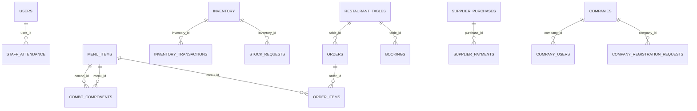

# Domain model and relationships

Discovery snapshot: 7 October 2026. **Source analysis, not live acceptance testing.** Application source was not modified. `IMPLEMENTED` means a source-backed implementation exists, not that production behavior was verified.

Declared foreign keys appear below. Tenant routing associates company records with separate databases; that architectural relationship is not a cross-database foreign key. Restaurant table `order_id` is a pointer whose relationship must not be confused with a guest stay.



## Tenant — settings

Edit business identity; native also exposes charge configuration

Important fields and defaults (runtime schema):

```sql
id INT PRIMARY KEY DEFAULT 1, hotel_name VARCHAR(120) NOT NULL, tax_rate DECIMAL(5,2) NOT NULL DEFAULT 2.5, cgst_rate DECIMAL(5,2) NOT NULL DEFAULT 2.5, service_charge DECIMAL(5,2) NOT NULL DEFAULT 18, currency VARCHAR(8) NOT NULL DEFAULT 'INR', updated_at TIMESTAMP DEFAULT CURRENT_TIMESTAMP ON UPDATE CURRENT_TIMESTAMP
```

Relationships: []

Related screens: W-SettingsPanel, M-AdminSettings

Evidence: [backend/src/database.js:39](../../backend/src/database.js#L39)

## Tenant — users

PIN authentication, identity and profile editing / Summarize floor, production, sales and staff / Manage login accounts, kitchen roster, compensation fields and shifts

Important fields and defaults (runtime schema):

```sql
id INT AUTO_INCREMENT PRIMARY KEY, name VARCHAR(120) NOT NULL, role ENUM('admin','waiter','chef','juicer') NOT NULL, pin VARCHAR(80) NOT NULL, phone VARCHAR(30) DEFAULT '', email VARCHAR(160) DEFAULT '', profile_image_url VARCHAR(500) NULL, profile_image_object VARCHAR(255) NULL, pay_type ENUM('daily','monthly') DEFAULT 'monthly', pay_rate DECIMAL(10,2) DEFAULT 0, active BOOLEAN DEFAULT TRUE, deleted_at DATETIME NULL, created_at TIMESTAMP DEFAULT CURRENT_TIMESTAMP
```

Relationships: []

Related screens: W-PublicLanding, W-Login, W-MasterLogin, W-CompanyRegistration, W-ProfileEditor, W-Admin, W-AdminOverview, W-OperationsCalendar, W-Staff, W-StaffManagement, W-AdminKitchenTeam, W-StaffEditor, W-RoleOverview, W-Waiter, W-ChefManagement, W-JuicerLoginEditor, W-KitchenStaffEditor, W-AttendancePanel, M-NativeLanding, M-RoleSelect, M-Login, M-Attendance, M-AdminOverview, M-AdminStaff, M-WaiterScreen, M-ChefJuicerManagement, M-OperationsCalendarMobile, M-AdminDrawer, M-AdminPeople, M-StaffEditor, M-ChefEditor, M-PremiumDashboard

Evidence: [backend/src/database.js:40](../../backend/src/database.js#L40)

## Tenant — kitchen_staff

Manage login accounts, kitchen roster, compensation fields and shifts

Important fields and defaults (runtime schema):

```sql
id INT AUTO_INCREMENT PRIMARY KEY, name VARCHAR(120) NOT NULL, designation VARCHAR(100) NOT NULL DEFAULT 'Chef', phone VARCHAR(30) DEFAULT '', specialization VARCHAR(120) DEFAULT '', pay_type ENUM('daily','monthly') DEFAULT 'monthly', pay_rate DECIMAL(10,2) DEFAULT 0, joined_on DATE NULL, notes VARCHAR(255) DEFAULT '', active BOOLEAN DEFAULT TRUE, created_by VARCHAR(120) DEFAULT 'Head Chef', created_at TIMESTAMP DEFAULT CURRENT_TIMESTAMP, updated_at TIMESTAMP DEFAULT CURRENT_TIMESTAMP ON UPDATE CURRENT_TIMESTAMP
```

Relationships: []

Related screens: W-Staff, W-StaffManagement, W-StaffEditor, W-ChefManagement, W-JuicerLoginEditor, W-KitchenStaffEditor, W-AttendancePanel, M-Attendance, M-AdminStaff, M-ChefJuicerManagement, M-AdminPeople, M-StaffEditor, M-ChefEditor

Evidence: [backend/src/database.js:41](../../backend/src/database.js#L41)

## Tenant — staff_attendance

Summarize floor, production, sales and staff / Manage login accounts, kitchen roster, compensation fields and shifts

Important fields and defaults (runtime schema):

```sql
id INT AUTO_INCREMENT PRIMARY KEY, user_id INT NOT NULL, check_in DATETIME NOT NULL, check_out DATETIME NULL, notes VARCHAR(255) DEFAULT '', created_at TIMESTAMP DEFAULT CURRENT_TIMESTAMP, FOREIGN KEY (user_id) REFERENCES users(id)
```

Relationships: [{"field": "user_id", "entity": "users", "target": "id"}]

Related screens: W-AdminOverview, W-Staff, W-StaffManagement, W-StaffEditor, W-RoleOverview, W-ChefManagement, W-JuicerLoginEditor, W-KitchenStaffEditor, W-AttendancePanel, M-Attendance, M-AdminOverview, M-AdminStaff, M-ChefJuicerManagement, M-AdminPeople, M-StaffEditor, M-ChefEditor, M-PremiumDashboard

Evidence: [backend/src/database.js:42](../../backend/src/database.js#L42)

## Tenant — restaurant_tables

Summarize floor, production, sales and staff / Create tables, inspect active service and change table state / Reserve a restaurant table for a dated time interval and phone contact / Take orders and additional rounds, coordinate handoff and settle bills

Important fields and defaults (runtime schema):

```sql
id INT AUTO_INCREMENT PRIMARY KEY, table_number INT NOT NULL UNIQUE, seats INT NOT NULL, area VARCHAR(80) NOT NULL, status ENUM('available','occupied','reserved','cleaning') DEFAULT 'available', guest_name VARCHAR(120) DEFAULT '', booking_time VARCHAR(10) DEFAULT '', order_id INT NULL, active BOOLEAN DEFAULT TRUE
```

Relationships: []

Related screens: W-AdminOverview, W-AdminTables, W-AdminTableDetails, W-TableEditor, W-AdminOrders, W-RoleOverview, W-Bookings, W-WaiterOrders, W-TableDrawer, W-OrderBuilder, W-Bill, W-AdminBillPopup, M-AdminOverview, M-AdminTables, M-MobileTableEditor, M-AdminBillingModal, M-TableList, M-OrderModal, M-OrderList, M-AdminBookings, M-AdminBookingEditor, M-AdminOrders, M-PremiumDashboard

Evidence: [backend/src/database.js:43](../../backend/src/database.js#L43)

## Tenant — menu_items

Take orders and additional rounds, coordinate handoff and settle bills / Create takeaway orders, record payment and coordinate collection / Manage dishes, images, prices, availability and combo composition / Prepare tickets and mark batches ready

Important fields and defaults (runtime schema):

```sql
id INT AUTO_INCREMENT PRIMARY KEY, name VARCHAR(160) NOT NULL, category VARCHAR(80) NOT NULL, description VARCHAR(500) DEFAULT '', price DECIMAL(10,2) NOT NULL, icon VARCHAR(20) DEFAULT '🍽️', image_url VARCHAR(500) NULL, image_object VARCHAR(255) NULL, is_combo BOOLEAN DEFAULT FALSE, available BOOLEAN DEFAULT TRUE, created_at TIMESTAMP DEFAULT CURRENT_TIMESTAMP
```

Relationships: []

Related screens: W-AdminOrders, W-FoodManager, W-MenuManager, W-DishEditor, W-ComboEditor, W-ParcelPanel, W-ParcelHandoffModal, W-ParcelPaymentModal, W-ParcelBuilder, W-WaiterOrders, W-OrderBuilder, W-Bill, W-AdminBillPopup, W-Chef, W-Juicer, W-ChefDishes, M-AdminMenu, M-AdminBillingModal, M-OrderList, M-ChefScreen, M-JuicerScreen, M-ChefDishes, M-AdminParcelsDay, M-AdminOrders, M-AdminParcels, M-ParcelEditor, M-AdminMenuManager, M-MenuEditor

Evidence: [backend/src/database.js:44](../../backend/src/database.js#L44)

## Tenant — combo_components

Manage dishes, images, prices, availability and combo composition

Important fields and defaults (runtime schema):

```sql
id INT AUTO_INCREMENT PRIMARY KEY, combo_id INT NOT NULL, menu_id INT NOT NULL, quantity INT NOT NULL DEFAULT 1, FOREIGN KEY (combo_id) REFERENCES menu_items(id) ON DELETE CASCADE, FOREIGN KEY (menu_id) REFERENCES menu_items(id)
```

Relationships: [{"field": "combo_id", "entity": "menu_items", "target": "id"}, {"field": "menu_id", "entity": "menu_items", "target": "id"}]

Related screens: W-FoodManager, W-MenuManager, W-DishEditor, W-ComboEditor, W-ChefDishes, M-AdminMenu, M-ChefDishes, M-AdminMenuManager, M-MenuEditor

Evidence: [backend/src/database.js:45](../../backend/src/database.js#L45)

## Tenant — orders

Summarize floor, production, sales and staff / Create tables, inspect active service and change table state / Take orders and additional rounds, coordinate handoff and settle bills / Create takeaway orders, record payment and coordinate collection / Prepare tickets and mark batches ready / Review daily closing, ledger, purchases, balances and reports

Important fields and defaults (runtime schema):

```sql
id INT AUTO_INCREMENT PRIMARY KEY, table_id INT NULL, order_type ENUM('dine_in','parcel') NOT NULL DEFAULT 'dine_in', guest_name VARCHAR(120), customer_phone VARCHAR(30) DEFAULT '', waiter VARCHAR(120), status ENUM('new','preparing','ready','collected','received','served','billing_requested','completed') DEFAULT 'new', payment_status ENUM('unpaid','paid') DEFAULT 'unpaid', payment_method VARCHAR(30) NULL, subtotal DECIMAL(10,2) NULL, tax DECIMAL(10,2) NULL, service_charge DECIMAL(10,2) NULL, total DECIMAL(10,2) NULL, created_at DATETIME NOT NULL, completed_at DATETIME NULL, FOREIGN KEY (table_id) REFERENCES restaurant_tables(id)
```

Relationships: [{"field": "table_id", "entity": "restaurant_tables", "target": "id"}]

Related screens: W-AdminOverview, W-AdminTables, W-AdminTableDetails, W-TableEditor, W-AdminOrders, W-ParcelPanel, W-ParcelHandoffModal, W-ParcelPaymentModal, W-ParcelBuilder, W-Finance, W-FinanceEntry, W-DailyFinance, W-FinanceCalendar, W-MonthlyRevenueReport, W-DailyFinanceDetails, W-SupplierPurchaseForm, W-DealerPaymentForm, W-RoleOverview, W-WaiterOrders, W-TableDrawer, W-OrderBuilder, W-Bill, W-AdminBillPopup, W-Chef, W-Juicer, M-AdminOverview, M-AdminTables, M-MobileTableEditor, M-AdminBillingModal, M-TableList, M-OrderModal, M-OrderList, M-ChefScreen, M-JuicerScreen, M-AdminParcelsDay, M-AdminOrders, M-AdminParcels, M-ParcelEditor, M-AdminFinance, M-FinanceDay, M-FinanceEntry, M-PurchaseEditor, M-DealerPayment, M-PremiumDashboard

Evidence: [backend/src/database.js:46](../../backend/src/database.js#L46)

## Tenant — order_items

Create tables, inspect active service and change table state / Take orders and additional rounds, coordinate handoff and settle bills / Create takeaway orders, record payment and coordinate collection / Prepare tickets and mark batches ready

Important fields and defaults (runtime schema):

```sql
id INT AUTO_INCREMENT PRIMARY KEY, order_id INT NOT NULL, menu_id INT NOT NULL, quantity INT NOT NULL, note VARCHAR(255) DEFAULT '', price DECIMAL(10,2) NOT NULL, production_status ENUM('new','preparing','ready') NOT NULL DEFAULT 'new', batch_no INT NOT NULL DEFAULT 1, handoff_status ENUM('pending','collected','received') NOT NULL DEFAULT 'pending', FOREIGN KEY (order_id) REFERENCES orders(id) ON DELETE CASCADE, FOREIGN KEY (menu_id) REFERENCES menu_items(id)
```

Relationships: [{"field": "order_id", "entity": "orders", "target": "id"}, {"field": "menu_id", "entity": "menu_items", "target": "id"}]

Related screens: W-AdminTables, W-AdminTableDetails, W-TableEditor, W-AdminOrders, W-ParcelPanel, W-ParcelHandoffModal, W-ParcelPaymentModal, W-ParcelBuilder, W-WaiterOrders, W-TableDrawer, W-OrderBuilder, W-Bill, W-AdminBillPopup, W-Chef, W-Juicer, M-AdminTables, M-MobileTableEditor, M-AdminBillingModal, M-TableList, M-OrderModal, M-OrderList, M-ChefScreen, M-JuicerScreen, M-AdminParcelsDay, M-AdminOrders, M-AdminParcels, M-ParcelEditor

Evidence: [backend/src/database.js:47](../../backend/src/database.js#L47)

## Tenant — inventory

Summarize floor, production, sales and staff / Track stock movements, minimums, planning and chef purchase requests

Important fields and defaults (runtime schema):

```sql
id INT AUTO_INCREMENT PRIMARY KEY, name VARCHAR(160) NOT NULL, category VARCHAR(80), quantity DECIMAL(10,2) NOT NULL, unit VARCHAR(20) NOT NULL, min_quantity DECIMAL(10,2) NOT NULL, cost DECIMAL(10,2) NOT NULL, updated_at TIMESTAMP DEFAULT CURRENT_TIMESTAMP ON UPDATE CURRENT_TIMESTAMP
```

Relationships: []

Related screens: W-AdminOverview, W-Stock, W-StockEditor, W-StockMovement, W-RoleOverview, W-ChefStockBooking, W-ChefStockRequestModal, M-AdminOverview, M-AdminStock, M-StockEditor, M-StockMovement, M-PremiumDashboard

Evidence: [backend/src/database.js:48](../../backend/src/database.js#L48)

## Tenant — inventory_transactions

Track stock movements, minimums, planning and chef purchase requests

Important fields and defaults (runtime schema):

```sql
id INT AUTO_INCREMENT PRIMARY KEY, inventory_id INT NOT NULL, movement_type ENUM('purchase','usage','adjustment','waste') NOT NULL, quantity DECIMAL(10,2) NOT NULL, unit_cost DECIMAL(10,2) NULL, note VARCHAR(255) DEFAULT '', created_by VARCHAR(120) DEFAULT 'Admin', created_at TIMESTAMP DEFAULT CURRENT_TIMESTAMP, FOREIGN KEY (inventory_id) REFERENCES inventory(id)
```

Relationships: [{"field": "inventory_id", "entity": "inventory", "target": "id"}]

Related screens: W-Stock, W-StockEditor, W-StockMovement, W-ChefStockBooking, W-ChefStockRequestModal, M-AdminStock, M-StockEditor, M-StockMovement

Evidence: [backend/src/database.js:49](../../backend/src/database.js#L49)

## Tenant — stock_requests

Track stock movements, minimums, planning and chef purchase requests

Important fields and defaults (runtime schema):

```sql
id INT AUTO_INCREMENT PRIMARY KEY, inventory_id INT NOT NULL, requested_quantity DECIMAL(10,2) NOT NULL, note VARCHAR(255) DEFAULT '', requested_by VARCHAR(120) NOT NULL, status ENUM('pending','ordered','resolved') NOT NULL DEFAULT 'pending', created_at TIMESTAMP DEFAULT CURRENT_TIMESTAMP, updated_at TIMESTAMP DEFAULT CURRENT_TIMESTAMP ON UPDATE CURRENT_TIMESTAMP, resolved_at DATETIME NULL, FOREIGN KEY (inventory_id) REFERENCES inventory(id), INDEX request_status (status,created_at)
```

Relationships: [{"field": "inventory_id", "entity": "inventory", "target": "id"}]

Related screens: W-Stock, W-StockEditor, W-StockMovement, W-ChefStockBooking, W-ChefStockRequestModal, M-AdminStock, M-StockEditor, M-StockMovement

Evidence: [backend/src/database.js:50](../../backend/src/database.js#L50)

## Tenant — finance_entries

Review daily closing, ledger, purchases, balances and reports

Important fields and defaults (runtime schema):

```sql
id INT AUTO_INCREMENT PRIMARY KEY, entry_type ENUM('income','expense') NOT NULL, category VARCHAR(100) NOT NULL, description VARCHAR(255) NOT NULL, amount DECIMAL(12,2) NOT NULL, payment_method VARCHAR(40) DEFAULT 'Cash', entry_date DATE NOT NULL, reference VARCHAR(100) DEFAULT '', created_by VARCHAR(120) DEFAULT 'Admin', created_at TIMESTAMP DEFAULT CURRENT_TIMESTAMP
```

Relationships: []

Related screens: W-Finance, W-FinanceEntry, W-DailyFinance, W-FinanceCalendar, W-MonthlyRevenueReport, W-DailyFinanceDetails, W-SupplierPurchaseForm, W-DealerPaymentForm, M-AdminFinance, M-FinanceDay, M-FinanceEntry, M-PurchaseEditor, M-DealerPayment

Evidence: [backend/src/database.js:51](../../backend/src/database.js#L51)

## Tenant — supplier_purchases

Review daily closing, ledger, purchases, balances and reports

Important fields and defaults (runtime schema):

```sql
id INT AUTO_INCREMENT PRIMARY KEY, supplier_name VARCHAR(160) NOT NULL, invoice_number VARCHAR(100) DEFAULT '', description VARCHAR(255) NOT NULL, purchase_date DATE NOT NULL, total_amount DECIMAL(12,2) NOT NULL, notes VARCHAR(255) DEFAULT '', created_by VARCHAR(120) DEFAULT 'Admin', created_at TIMESTAMP DEFAULT CURRENT_TIMESTAMP
```

Relationships: []

Related screens: W-Finance, W-FinanceEntry, W-DailyFinance, W-FinanceCalendar, W-MonthlyRevenueReport, W-DailyFinanceDetails, W-SupplierPurchaseForm, W-DealerPaymentForm, M-AdminFinance, M-FinanceDay, M-FinanceEntry, M-PurchaseEditor, M-DealerPayment

Evidence: [backend/src/database.js:52](../../backend/src/database.js#L52)

## Tenant — supplier_payments

Review daily closing, ledger, purchases, balances and reports

Important fields and defaults (runtime schema):

```sql
id INT AUTO_INCREMENT PRIMARY KEY, purchase_id INT NOT NULL, amount DECIMAL(12,2) NOT NULL, payment_method VARCHAR(40) DEFAULT 'Cash', payment_date DATE NOT NULL, reference VARCHAR(100) DEFAULT '', notes VARCHAR(255) DEFAULT '', created_by VARCHAR(120) DEFAULT 'Admin', created_at TIMESTAMP DEFAULT CURRENT_TIMESTAMP, FOREIGN KEY (purchase_id) REFERENCES supplier_purchases(id) ON DELETE CASCADE
```

Relationships: [{"field": "purchase_id", "entity": "supplier_purchases", "target": "id"}]

Related screens: W-Finance, W-FinanceEntry, W-DailyFinance, W-FinanceCalendar, W-MonthlyRevenueReport, W-DailyFinanceDetails, W-SupplierPurchaseForm, W-DealerPaymentForm, M-AdminFinance, M-FinanceDay, M-FinanceEntry, M-PurchaseEditor, M-DealerPayment

Evidence: [backend/src/database.js:53](../../backend/src/database.js#L53)

## Tenant — bookings

Reserve a restaurant table for a dated time interval and phone contact

Important fields and defaults (runtime schema):

```sql
id INT AUTO_INCREMENT PRIMARY KEY, table_id INT NOT NULL, guest_name VARCHAR(120) NOT NULL DEFAULT 'Customer', customer_phone VARCHAR(30) NOT NULL DEFAULT '', booking_date DATE NOT NULL, booking_time VARCHAR(10) NOT NULL, duration_minutes INT NOT NULL DEFAULT 90, status ENUM('confirmed','seated','cancelled') DEFAULT 'confirmed', notification_status ENUM('queued','sent','failed') DEFAULT 'queued', notification_message VARCHAR(500) DEFAULT '', created_at TIMESTAMP DEFAULT CURRENT_TIMESTAMP, FOREIGN KEY (table_id) REFERENCES restaurant_tables(id), INDEX booking_slot (table_id,booking_date,status)
```

Relationships: [{"field": "table_id", "entity": "restaurant_tables", "target": "id"}]

Related screens: W-Bookings, M-AdminBookings, M-AdminBookingEditor

Evidence: [backend/src/database.js:54](../../backend/src/database.js#L54)

## Master — master_users

PIN authentication, identity and profile editing

Important fields and defaults (runtime schema):

```sql
id INT AUTO_INCREMENT PRIMARY KEY,name VARCHAR(120) NOT NULL,pin VARCHAR(20) NOT NULL,active BOOLEAN DEFAULT TRUE,created_at TIMESTAMP DEFAULT CURRENT_TIMESTAMP
```

Relationships: []

Related screens: W-PublicLanding, W-Login, W-MasterLogin, W-CompanyRegistration, W-ProfileEditor, W-Admin, W-OperationsCalendar, W-AdminKitchenTeam, W-Waiter, M-NativeLanding, M-RoleSelect, M-Login, M-WaiterScreen, M-OperationsCalendarMobile, M-AdminDrawer

Evidence: [backend/src/master-server.js:89](../../backend/src/master-server.js#L89)

## Master — companies

Request a subscription, review it and activate a tenant / Operate tenant companies, logins, module access and SaaS invoices

Important fields and defaults (runtime schema):

```sql
id INT AUTO_INCREMENT PRIMARY KEY,company_name VARCHAR(160) NOT NULL UNIQUE,database_name VARCHAR(64) NOT NULL UNIQUE,cy_db VARCHAR(64) NULL UNIQUE,hotel_id CHAR(4) NULL UNIQUE,modules JSON NULL,admin_name VARCHAR(120) NOT NULL,email VARCHAR(160) DEFAULT '',phone VARCHAR(30) DEFAULT '',status ENUM('active','suspended') DEFAULT 'active',created_at TIMESTAMP DEFAULT CURRENT_TIMESTAMP
```

Relationships: []

Related screens: W-ApplicantOnboarding, W-SuperAdminApp, W-MasterRegistrationRequests, W-MasterRegistrationDetail, W-MasterNetworkOverview, W-MasterActionModal, W-CompanyWorkspaceOverview, W-CompanyControls, W-MasterUsers, W-MasterPinModal, W-MasterBilling, W-MasterPricingSlab, M-MasterMobile

Evidence: [backend/src/master-server.js:90](../../backend/src/master-server.js#L90)

## Master — company_users

PIN authentication, identity and profile editing / Operate tenant companies, logins, module access and SaaS invoices

Important fields and defaults (runtime schema):

```sql
id INT AUTO_INCREMENT PRIMARY KEY,company_id INT NOT NULL,tenant_user_id INT NOT NULL,name VARCHAR(120) NOT NULL,role ENUM('admin','waiter','chef','juicer') NOT NULL,pin VARCHAR(80) NOT NULL,phone VARCHAR(30) DEFAULT '',email VARCHAR(160) DEFAULT '',profile_image_url VARCHAR(500) NULL,active BOOLEAN DEFAULT TRUE,created_at TIMESTAMP DEFAULT CURRENT_TIMESTAMP,updated_at TIMESTAMP DEFAULT CURRENT_TIMESTAMP ON UPDATE CURRENT_TIMESTAMP,UNIQUE KEY company_tenant_user (company_id,tenant_user_id),UNIQUE KEY company_pin (company_id,pin),FOREIGN KEY (company_id) REFERENCES companies(id) ON DELETE CASCADE
```

Relationships: [{"field": "company_id", "entity": "companies", "target": "id"}]

Related screens: W-PublicLanding, W-Login, W-SuperAdminApp, W-MasterRegistrationRequests, W-MasterNetworkOverview, W-MasterActionModal, W-CompanyWorkspaceOverview, W-CompanyControls, W-MasterUsers, W-MasterPinModal, W-MasterBilling, W-MasterPricingSlab, W-MasterLogin, W-CompanyRegistration, W-ProfileEditor, W-Admin, W-OperationsCalendar, W-AdminKitchenTeam, W-Waiter, M-NativeLanding, M-RoleSelect, M-Login, M-MasterMobile, M-WaiterScreen, M-OperationsCalendarMobile, M-AdminDrawer

Evidence: [backend/src/master-server.js:91](../../backend/src/master-server.js#L91)

## Master — company_registration_requests

Request a subscription, review it and activate a tenant

Important fields and defaults (runtime schema):

```sql
id INT AUTO_INCREMENT PRIMARY KEY,company_name VARCHAR(160) NOT NULL,hotel_id CHAR(4) NULL,admin_name VARCHAR(120) NOT NULL,admin_pin VARCHAR(20) NULL,email VARCHAR(160) NOT NULL,phone VARCHAR(30) NOT NULL,status ENUM('pending','approved','rejected') NOT NULL DEFAULT 'pending',review_note VARCHAR(255) DEFAULT '',company_id INT NULL,created_at TIMESTAMP DEFAULT CURRENT_TIMESTAMP,reviewed_at DATETIME NULL,INDEX registration_status (status,created_at),FOREIGN KEY (company_id) REFERENCES companies(id) ON DELETE SET NULL
```

Relationships: [{"field": "company_id", "entity": "companies", "target": "id"}]

Related screens: W-ApplicantOnboarding, W-MasterRegistrationDetail

Evidence: [backend/src/master-server.js:96](../../backend/src/master-server.js#L96)

## Master — saas_invoices

Operate tenant companies, logins, module access and SaaS invoices

Important fields and defaults (runtime schema):

```sql
id INT AUTO_INCREMENT PRIMARY KEY,company_id INT NOT NULL,billing_month DATE NOT NULL,line_items JSON NOT NULL,subtotal DECIMAL(12,2) NOT NULL,tax_rate DECIMAL(5,2) NOT NULL DEFAULT 18,tax DECIMAL(12,2) NOT NULL,total DECIMAL(12,2) NOT NULL,status ENUM('due','paid') NOT NULL DEFAULT 'due',paid_at DATETIME NULL,generated_at TIMESTAMP DEFAULT CURRENT_TIMESTAMP,UNIQUE KEY company_billing_month(company_id,billing_month),INDEX invoice_month(billing_month,status),FOREIGN KEY(company_id) REFERENCES companies(id) ON DELETE CASCADE
```

Relationships: []

Related screens: W-SuperAdminApp, W-MasterRegistrationRequests, W-MasterNetworkOverview, W-MasterActionModal, W-CompanyWorkspaceOverview, W-CompanyControls, W-MasterUsers, W-MasterPinModal, W-MasterBilling, W-MasterPricingSlab, M-MasterMobile

Evidence: [backend/src/master-server.js:97](../../backend/src/master-server.js#L97)

## Master — notification_outbox

Request a subscription, review it and activate a tenant / Reserve a restaurant table for a dated time interval and phone contact / Booking/onboarding delivery attempts plus local notices

Important fields and defaults (runtime schema):

```sql
id INT AUTO_INCREMENT PRIMARY KEY,recipient VARCHAR(180) NOT NULL,channel ENUM('email','sms') NOT NULL,subject VARCHAR(180) DEFAULT '',message TEXT NOT NULL,status ENUM('queued','sent','failed') DEFAULT 'queued',created_at TIMESTAMP DEFAULT CURRENT_TIMESTAMP,sent_at DATETIME NULL
```

Relationships: []

Related screens: W-PublicCompanyRegistration, W-ApplicantOnboarding, W-MasterRegistrationDetail, W-Bookings, W-BookingModal, M-AdminBookings, M-AdminBookingEditor

Evidence: [backend/src/master-server.js:98](../../backend/src/master-server.js#L98)

## Master — tenant_subscriptions

Request a subscription, review it and activate a tenant

Important fields and defaults (runtime schema):

```sql
id INT AUTO_INCREMENT PRIMARY KEY,company_id INT NOT NULL,package_code VARCHAR(30) NOT NULL,period_months INT NOT NULL,started_at DATETIME NOT NULL,expires_at DATETIME NOT NULL,grace_ends_at DATETIME NOT NULL,status ENUM('active','grace','expired') DEFAULT 'active',last_reminder_at DATETIME NULL,created_at TIMESTAMP DEFAULT CURRENT_TIMESTAMP,FOREIGN KEY(company_id) REFERENCES companies(id) ON DELETE CASCADE
```

Relationships: []

Related screens: W-ApplicantOnboarding, W-MasterRegistrationDetail

Evidence: [backend/src/master-server.js:99](../../backend/src/master-server.js#L99)

## Master — usage_logins

Operate tenant companies, logins, module access and SaaS invoices

Important fields and defaults (runtime schema):

```sql
id BIGINT AUTO_INCREMENT PRIMARY KEY,company_id INT NOT NULL,user_id INT NOT NULL,role VARCHAR(30) NOT NULL,logged_in_at TIMESTAMP DEFAULT CURRENT_TIMESTAMP,INDEX company_login(company_id,logged_in_at),FOREIGN KEY(company_id) REFERENCES companies(id) ON DELETE CASCADE
```

Relationships: []

Related screens: W-SuperAdminApp, W-MasterRegistrationRequests, W-MasterNetworkOverview, W-MasterActionModal, W-CompanyWorkspaceOverview, W-CompanyControls, W-MasterUsers, W-MasterPinModal, W-MasterBilling, W-MasterPricingSlab, M-MasterMobile

Evidence: [backend/src/master-server.js:100](../../backend/src/master-server.js#L100)

## Master — module_pricing

Operate tenant companies, logins, module access and SaaS invoices

Important fields and defaults (runtime schema):

```sql
module_key VARCHAR(30) PRIMARY KEY,module_name VARCHAR(100) NOT NULL,monthly_price DECIMAL(12,2) NOT NULL,updated_at TIMESTAMP DEFAULT CURRENT_TIMESTAMP ON UPDATE CURRENT_TIMESTAMP
```

Relationships: []

Related screens: W-SuperAdminApp, W-MasterRegistrationRequests, W-MasterNetworkOverview, W-MasterActionModal, W-CompanyWorkspaceOverview, W-CompanyControls, W-MasterUsers, W-MasterPinModal, W-MasterBilling, W-MasterPricingSlab, M-MasterMobile

Evidence: [backend/src/master-server.js:101](../../backend/src/master-server.js#L101)


