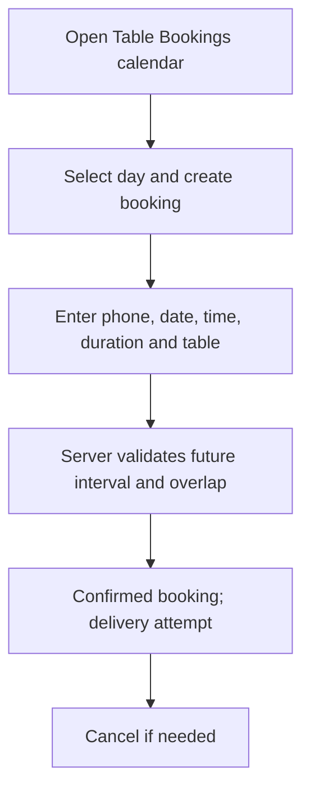
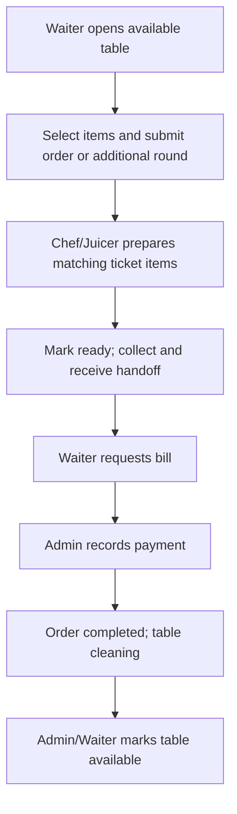
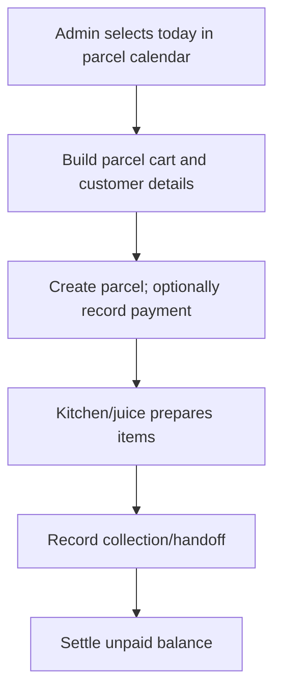
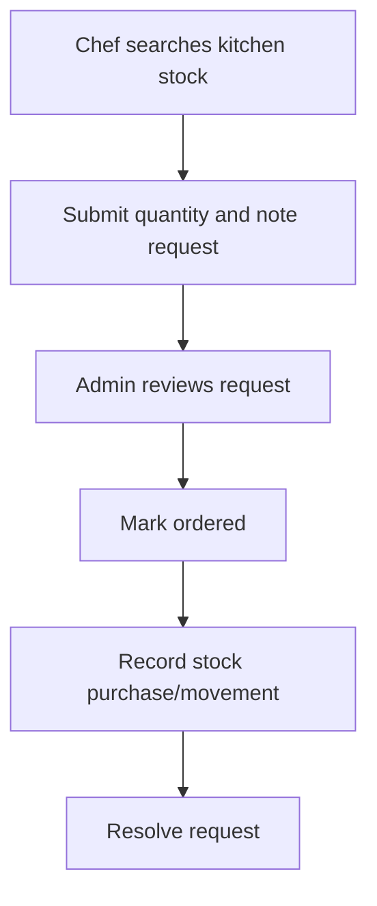
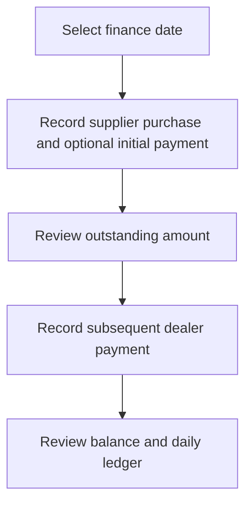
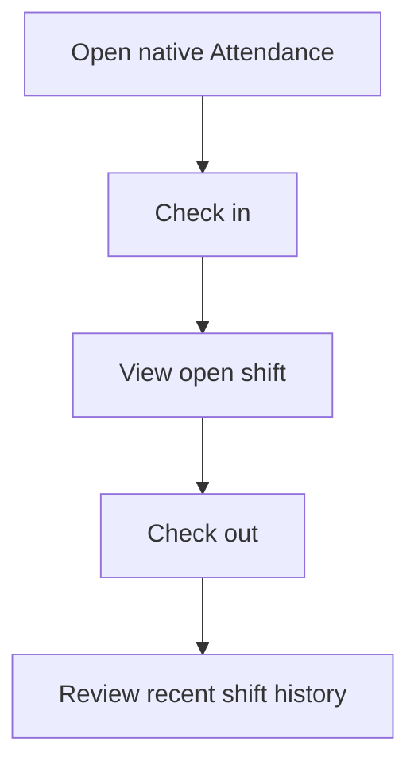
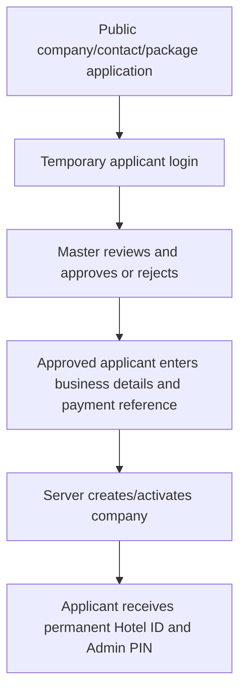
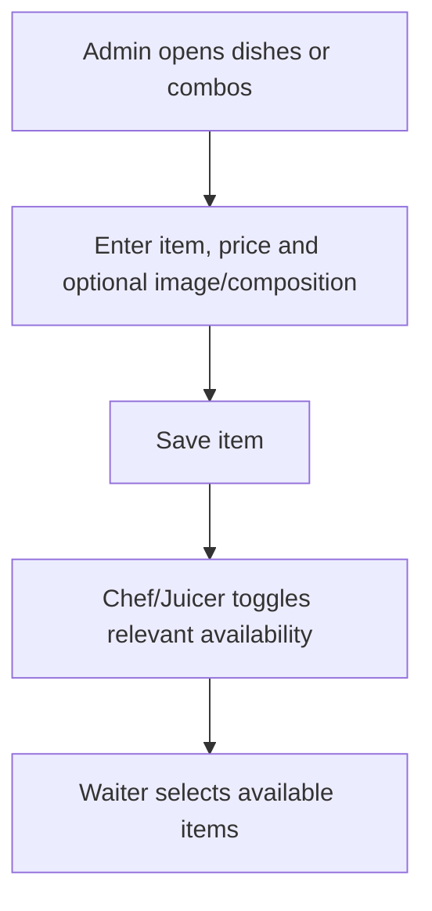

# Workflows and user actions

Discovery snapshot: 7 October 2026. **Source analysis, not live acceptance testing.** Application source was not modified. `IMPLEMENTED` means a source-backed implementation exists, not that production behavior was verified.

## Reserve a restaurant table

Actors: admin.

Limitations: No guest/room/rates/taxes/discount/deposit/special-request fields; no modification, seating, hotel check-in or hotel check-out. Active reservation blocks new table order without a consume/seat action.

Evidence: [frontend/src/App.jsx:4979](../../frontend/src/App.jsx#L4979); [frontend/src/App.jsx:5053](../../frontend/src/App.jsx#L5053); [backend/src/server.js:62](../../backend/src/server.js#L62); [backend/src/server.js:86](../../backend/src/server.js#L86)

## Dine-in service and settlement

Actors: waiter, chef, juicer, admin.

Limitations: Production, handoff and payment are separate states; do not collapse them into one status. No gateway confirmation.

Evidence: [frontend/src/App.jsx:5333](../../frontend/src/App.jsx#L5333); [frontend/src/App.jsx:5657](../../frontend/src/App.jsx#L5657); [frontend/src/App.jsx:5730](../../frontend/src/App.jsx#L5730); [backend/src/server.js:86](../../backend/src/server.js#L86)

## Parcel fulfillment

Actors: admin, chef, juicer.

Limitations: Payment can precede fulfillment. Historical day cannot create a new parcel in web UI.

Evidence: [frontend/src/App.jsx:2222](../../frontend/src/App.jsx#L2222); [frontend/src/App.jsx:2546](../../frontend/src/App.jsx#L2546); [frontend/src/App.jsx:2382](../../frontend/src/App.jsx#L2382)

## Kitchen request and replenishment

Actors: chef, admin.

Limitations: Request status does not itself purchase stock or prove delivery; native workflow is narrower.

Evidence: [frontend/src/App.jsx:5957](../../frontend/src/App.jsx#L5957); [frontend/src/App.jsx:2739](../../frontend/src/App.jsx#L2739); [backend/src/server.js:104](../../backend/src/server.js#L104)

## Supplier purchase and balance

Actors: admin.

Limitations: Server rejects payment above balance; purchase and general expense records are distinct.

Evidence: [frontend/src/App.jsx:4164](../../frontend/src/App.jsx#L4164); [frontend/src/App.jsx:4306](../../frontend/src/App.jsx#L4306); [backend/src/server.js:107](../../backend/src/server.js#L107); [backend/src/server.js:108](../../backend/src/server.js#L108)

## Staff shift timekeeping

Actors: waiter, chef, juicer.

Limitations: Web self-attendance component is dormant. No guest identity, room or housekeeping transition.

Evidence: [mobile/App.js:47](../../mobile/App.js#L47); [frontend/src/AttendancePanel.jsx:5](../../frontend/src/AttendancePanel.jsx#L5)

## Company onboarding

Actors: applicant, superadmin.

Limitations: Payment reference is not a verified payment integration; notification delivery may only be queued.

Evidence: [frontend/src/App.jsx:375](../../frontend/src/App.jsx#L375); [frontend/src/App.jsx:382](../../frontend/src/App.jsx#L382); [frontend/src/App.jsx:623](../../frontend/src/App.jsx#L623); [backend/src/master-server.js:1](../../backend/src/master-server.js#L1)

## Menu maintenance

Actors: admin, chef, juicer.

Limitations: Existing order item prices are snapshots; client display calculations need reconciliation with server bills.

Evidence: [frontend/src/App.jsx:1894](../../frontend/src/App.jsx#L1894); [frontend/src/App.jsx:2018](../../frontend/src/App.jsx#L2018); [frontend/src/App.jsx:2102](../../frontend/src/App.jsx#L2102); [backend/src/server.js:86](../../backend/src/server.js#L86)

## Booking detail checklist

| Concept | Actual behavior |
| --- | --- |
| Start | Admin calendar/day, create booking modal |
| Guest selection | Phone only; no guest profile selector/creation |
| Room selection / availability | NOT_FOUND; table selector and interval overlap checks only |
| Date/time | Future date/time and 30–240 minute duration validated server-side |
| Rates/taxes/discounts/deposit | NOT_FOUND in table booking |
| Additional guests / special requests | NOT_FOUND in booking form |
| Confirmation | Persist confirmed booking; attempt notification; not proof of delivered message |
| Modification | No edit endpoint/UI identified |
| Cancellation | Admin cancel with confirmation; booking becomes cancelled |
| Arrival/seating | No consume/seated transition found; current interval can block ordering |
| Hotel check-in/out | NOT_FOUND |
| Housekeeping trigger | NOT_FOUND; bill completion changes restaurant table state to cleaning |

Cross-midnight overlap handling needs review: current booking query compares the same booking date. Booking cancellation must not be presented as a normal substitute for seating without an explicit product decision.

## Action catalogue

Button handlers retain input, disabled preconditions and screen/API context. Labels such as icon/dynamic are extraction evidence, not invented action names. Server API request/error catalogue is in the forms document and JSON.

| Action | Screen / actors | Precondition | Handler / API context | Evidence |
| --- | --- | --- | --- | --- |
| KnockOUT HOSPITALITY OPERATING SYSTEM | W-PublicLanding / anonymous | {"disabled": false, "reachability": "Reachable component or nested view"} | () => window.scrollTo({top:0,behavior:"smooth"}); [] | [frontend/src/App.jsx:231](../../frontend/src/App.jsx#L231) |
| Register | W-PublicLanding / anonymous | {"disabled": false, "reachability": "Reachable component or nested view"} | register; [] | [frontend/src/App.jsx:232](../../frontend/src/App.jsx#L232) |
| Login | W-PublicLanding / anonymous | {"disabled": false, "reachability": "Reachable component or nested view"} | login; [] | [frontend/src/App.jsx:232](../../frontend/src/App.jsx#L232) |
| Continue to temporary login | W-PublicCompanyRegistration / anonymous | {"disabled": false, "reachability": "Reachable component or nested view"} | ()=>{history.pushState({},"","/login");location.reload()}; ["submitCompanyRegistration(form)"] | [frontend/src/App.jsx:379](../../frontend/src/App.jsx#L379) |
| Return to landing page | W-PublicCompanyRegistration / anonymous | {"disabled": false, "reachability": "Reachable component or nested view"} | back; ["submitCompanyRegistration(form)"] | [frontend/src/App.jsx:379](../../frontend/src/App.jsx#L379) |
| Back to landing page | W-PublicCompanyRegistration / anonymous | {"disabled": false, "reachability": "Reachable component or nested view"} | back; ["submitCompanyRegistration(form)"] | [frontend/src/App.jsx:379](../../frontend/src/App.jsx#L379) |
| <icon/dynamic> | W-PublicCompanyRegistration / anonymous | {"disabled": false, "reachability": "Reachable component or nested view"} | ()=>setForm({...form,packageCode:key}); ["submitCompanyRegistration(form)"] | [frontend/src/App.jsx:379](../../frontend/src/App.jsx#L379) |
| <icon/dynamic> | W-PublicCompanyRegistration / anonymous | {"disabled": false, "reachability": "Reachable component or nested view"} | ()=>setForm({...form,periodMonths:months}); ["submitCompanyRegistration(form)"] | [frontend/src/App.jsx:379](../../frontend/src/App.jsx#L379) |
| Login with permanent credentials | W-ApplicantOnboarding / applicant | {"disabled": false, "reachability": "Reachable component or nested view"} | logout; ["getOnboardingStatus(user.id,user.temporaryPin)", "completeCompanyRegistration({...form,id:user.id,pin:user.temporaryPin})"] | [frontend/src/App.jsx:388](../../frontend/src/App.jsx#L388) |
| Exit onboarding | W-ApplicantOnboarding / applicant | {"disabled": false, "reachability": "Reachable component or nested view"} | logout; ["getOnboardingStatus(user.id,user.temporaryPin)", "completeCompanyRegistration({...form,id:user.id,pin:user.temporaryPin})"] | [frontend/src/App.jsx:389](../../frontend/src/App.jsx#L389) |
| Companies | W-SuperAdminApp / superadmin | {"disabled": false, "reachability": "Reachable component or nested view"} | () => { setSelectedCompanyId(null);setSelectedRegistrationId(null); setCompanySection("overview"); }; ["api(\"/state\")", "api(`/companies/${company.id}/status`, { method: \"PATCH\", body: JSON.stringify({ status: company.status === \"active\" ? \"suspended\" : \"active\", }), })", "api(`/companies/${company.id}/modules`, {method:\"PATCH\",body:JSON.stringify({module,enabled})})", "api(`/saas-invoices/${invoice.id}/status`, {method:\"PATCH\",body:JSON.stringify({status})})", "api(`/companies/${action.company.id}`, { method: \"DELETE\", body: JSON.stringify({ companyName: typed }), })", "api(`/company-registrations/${request.id}/${status}`,{method:\"POST\",body:JSON.stringify({reviewNote:status===\"reject\"?\"Application declined by KnockOUT Master\":\"Approved by KnockOUT Master\"})})"] | [frontend/src/App.jsx:528](../../frontend/src/App.jsx#L528) |
| users | W-SuperAdminApp / superadmin | {"disabled": false, "reachability": "Reachable component or nested view"} | () => { setSelectedRegistrationId(null);setSelectedCompanyId(company.id); setCompanySection("overview"); }; ["api(\"/state\")", "api(`/companies/${company.id}/status`, { method: \"PATCH\", body: JSON.stringify({ status: company.status === \"active\" ? \"suspended\" : \"active\", }), })", "api(`/companies/${company.id}/modules`, {method:\"PATCH\",body:JSON.stringify({module,enabled})})", "api(`/saas-invoices/${invoice.id}/status`, {method:\"PATCH\",body:JSON.stringify({status})})", "api(`/companies/${action.company.id}`, { method: \"DELETE\", body: JSON.stringify({ companyName: typed }), })", "api(`/company-registrations/${request.id}/${status}`,{method:\"POST\",body:JSON.stringify({reviewNote:status===\"reject\"?\"Application declined by KnockOUT Master\":\"Approved by KnockOUT Master\"})})"] | [frontend/src/App.jsx:534](../../frontend/src/App.jsx#L534) |
| Pending registrations | W-SuperAdminApp / superadmin | {"disabled": false, "reachability": "Reachable component or nested view"} | ()=>{setSelectedCompanyId(null);setSelectedRegistrationId(pendingRegistrations[0]?.id\|\|null)}; ["api(\"/state\")", "api(`/companies/${company.id}/status`, { method: \"PATCH\", body: JSON.stringify({ status: company.status === \"active\" ? \"suspended\" : \"active\", }), })", "api(`/companies/${company.id}/modules`, {method:\"PATCH\",body:JSON.stringify({module,enabled})})", "api(`/saas-invoices/${invoice.id}/status`, {method:\"PATCH\",body:JSON.stringify({status})})", "api(`/companies/${action.company.id}`, { method: \"DELETE\", body: JSON.stringify({ companyName: typed }), })", "api(`/company-registrations/${request.id}/${status}`,{method:\"POST\",body:JSON.stringify({reviewNote:status===\"reject\"?\"Application declined by KnockOUT Master\":\"Approved by KnockOUT Master\"})})"] | [frontend/src/App.jsx:545](../../frontend/src/App.jsx#L545) |
| Logout | W-SuperAdminApp / superadmin | {"disabled": false, "reachability": "Reachable component or nested view"} | logoutMaster; ["api(\"/state\")", "api(`/companies/${company.id}/status`, { method: \"PATCH\", body: JSON.stringify({ status: company.status === \"active\" ? \"suspended\" : \"active\", }), })", "api(`/companies/${company.id}/modules`, {method:\"PATCH\",body:JSON.stringify({module,enabled})})", "api(`/saas-invoices/${invoice.id}/status`, {method:\"PATCH\",body:JSON.stringify({status})})", "api(`/companies/${action.company.id}`, { method: \"DELETE\", body: JSON.stringify({ companyName: typed }), })", "api(`/company-registrations/${request.id}/${status}`,{method:\"POST\",body:JSON.stringify({reviewNote:status===\"reject\"?\"Application declined by KnockOUT Master\":\"Approved by KnockOUT Master\"})})"] | [frontend/src/App.jsx:549](../../frontend/src/App.jsx#L549) |
| All companies | W-SuperAdminApp / superadmin | {"disabled": false, "reachability": "Reachable component or nested view"} | () => setSelectedCompanyId(null); ["api(\"/state\")", "api(`/companies/${company.id}/status`, { method: \"PATCH\", body: JSON.stringify({ status: company.status === \"active\" ? \"suspended\" : \"active\", }), })", "api(`/companies/${company.id}/modules`, {method:\"PATCH\",body:JSON.stringify({module,enabled})})", "api(`/saas-invoices/${invoice.id}/status`, {method:\"PATCH\",body:JSON.stringify({status})})", "api(`/companies/${action.company.id}`, { method: \"DELETE\", body: JSON.stringify({ companyName: typed }), })", "api(`/company-registrations/${request.id}/${status}`,{method:\"POST\",body:JSON.stringify({reviewNote:status===\"reject\"?\"Application declined by KnockOUT Master\":\"Approved by KnockOUT Master\"})})"] | [frontend/src/App.jsx:555](../../frontend/src/App.jsx#L555) |
| <icon/dynamic> | W-SuperAdminApp / superadmin | {"disabled": false, "reachability": "Reachable component or nested view"} | ()=>setCompanySection(id); ["api(\"/state\")", "api(`/companies/${company.id}/status`, { method: \"PATCH\", body: JSON.stringify({ status: company.status === \"active\" ? \"suspended\" : \"active\", }), })", "api(`/companies/${company.id}/modules`, {method:\"PATCH\",body:JSON.stringify({module,enabled})})", "api(`/saas-invoices/${invoice.id}/status`, {method:\"PATCH\",body:JSON.stringify({status})})", "api(`/companies/${action.company.id}`, { method: \"DELETE\", body: JSON.stringify({ companyName: typed }), })", "api(`/company-registrations/${request.id}/${status}`,{method:\"POST\",body:JSON.stringify({reviewNote:status===\"reject\"?\"Application declined by KnockOUT Master\":\"Approved by KnockOUT Master\"})})"] | [frontend/src/App.jsx:556](../../frontend/src/App.jsx#L556) |
| <icon/dynamic> | W-SuperAdminApp / superadmin | {"disabled": false, "reachability": "Reachable component or nested view"} | ()=>setCompanyFilter(id); ["api(\"/state\")", "api(`/companies/${company.id}/status`, { method: \"PATCH\", body: JSON.stringify({ status: company.status === \"active\" ? \"suspended\" : \"active\", }), })", "api(`/companies/${company.id}/modules`, {method:\"PATCH\",body:JSON.stringify({module,enabled})})", "api(`/saas-invoices/${invoice.id}/status`, {method:\"PATCH\",body:JSON.stringify({status})})", "api(`/companies/${action.company.id}`, { method: \"DELETE\", body: JSON.stringify({ companyName: typed }), })", "api(`/company-registrations/${request.id}/${status}`,{method:\"POST\",body:JSON.stringify({reviewNote:status===\"reject\"?\"Application declined by KnockOUT Master\":\"Approved by KnockOUT Master\"})})"] | [frontend/src/App.jsx:568](../../frontend/src/App.jsx#L568) |
| Open company workspace All details and controls | W-SuperAdminApp / superadmin | {"disabled": false, "reachability": "Reachable component or nested view"} | () => { setSelectedRegistrationId(null);setSelectedCompanyId(company.id); setCompanySection("overview"); }; ["api(\"/state\")", "api(`/companies/${company.id}/status`, { method: \"PATCH\", body: JSON.stringify({ status: company.status === \"active\" ? \"suspended\" : \"active\", }), })", "api(`/companies/${company.id}/modules`, {method:\"PATCH\",body:JSON.stringify({module,enabled})})", "api(`/saas-invoices/${invoice.id}/status`, {method:\"PATCH\",body:JSON.stringify({status})})", "api(`/companies/${action.company.id}`, { method: \"DELETE\", body: JSON.stringify({ companyName: typed }), })", "api(`/company-registrations/${request.id}/${status}`,{method:\"POST\",body:JSON.stringify({reviewNote:status===\"reject\"?\"Application declined by KnockOUT Master\":\"Approved by KnockOUT Master\"})})"] | [frontend/src/App.jsx:587](../../frontend/src/App.jsx#L587) |
| · month Requested FIRST ADMINISTRATOR · Review details | W-MasterRegistrationRequests / superadmin | {"disabled": false, "reachability": "Reachable component or nested view"} | ()=>open(request); [] | [frontend/src/App.jsx:620](../../frontend/src/App.jsx#L620) |
| · | W-MasterRegistrationRequests / superadmin | {"disabled": false, "reachability": "Reachable component or nested view"} | ()=>open(request); [] | [frontend/src/App.jsx:620](../../frontend/src/App.jsx#L620) |
| Waiting list | W-MasterRegistrationDetail / superadmin | {"disabled": false, "reachability": "Reachable component or nested view"} | back; [] | [frontend/src/App.jsx:625](../../frontend/src/App.jsx#L625) |
| Reject application | W-MasterRegistrationDetail / superadmin | {"disabled": "busy===request.id", "reachability": "Reachable component or nested view"} | ()=>review(request,'reject'); [] | [frontend/src/App.jsx:625](../../frontend/src/App.jsx#L625) |
| <icon/dynamic> | W-MasterRegistrationDetail / superadmin | {"disabled": "busy===request.id", "reachability": "Reachable component or nested view"} | ()=>review(request,'approve'); [] | [frontend/src/App.jsx:625](../../frontend/src/App.jsx#L625) |
| Cancel | W-MasterActionModal / superadmin | {"disabled": "busy", "reachability": "Reachable component or nested view"} | close; [] | [frontend/src/App.jsx:676](../../frontend/src/App.jsx#L676) |
| <icon/dynamic> | W-MasterActionModal / superadmin | {"disabled": "busy \|\| !matches", "reachability": "Reachable component or nested view"} | () => confirm(typed); [] | [frontend/src/App.jsx:679](../../frontend/src/App.jsx#L679) |
| Company users Manage declared accounts | W-CompanyWorkspaceOverview / superadmin | {"disabled": false, "reachability": "Reachable component or nested view"} | openUsers; [] | [frontend/src/App.jsx:703](../../frontend/src/App.jsx#L703) |
| SaaS billing Open module invoice and monthly report | W-CompanyWorkspaceOverview / superadmin | {"disabled": false, "reachability": "Reachable component or nested view"} | openRevenue; [] | [frontend/src/App.jsx:703](../../frontend/src/App.jsx#L703) |
| <icon/dynamic> | W-CompanyControls / superadmin | {"disabled": false, "reachability": "Reachable component or nested view"} | ()=>status(company); [] | [frontend/src/App.jsx:710](../../frontend/src/App.jsx#L710) |
| Delete company | W-CompanyControls / superadmin | {"disabled": false, "reachability": "Reachable component or nested view"} | ()=>setMasterAction({type:"company",company}); [] | [frontend/src/App.jsx:710](../../frontend/src/App.jsx#L710) |
| Change PIN | W-MasterUsers / superadmin | {"disabled": false, "reachability": "Reachable component or nested view"} | () => changePin({ company, user, isMaster }); [] | [frontend/src/App.jsx:759](../../frontend/src/App.jsx#L759) |
| Cancel | W-MasterPinModal / superadmin | {"disabled": "busy", "reachability": "Reachable component or nested view"} | close; ["api( isMaster ? `/master-users/${user.id}/pin` : `/companies/${company.id}/users/${user.id}/pin`, { method: \"PATCH\", body: JSON.stringify({ pin }) }, )"] | [frontend/src/App.jsx:834](../../frontend/src/App.jsx#L834) |
| Export monthly report | W-MasterBilling / superadmin | {"disabled": "!rows.length", "reachability": "Reachable component or nested view"} | exportReport; [] | [frontend/src/App.jsx:850](../../frontend/src/App.jsx#L850) |
| <icon/dynamic> | W-MasterBilling / superadmin | {"disabled": false, "reachability": "Reachable component or nested view"} | ()=>setStatus(invoice,invoice.status==='paid'?'due':'paid'); [] | [frontend/src/App.jsx:853](../../frontend/src/App.jsx#L853) |
| <icon/dynamic> | W-MasterPricingSlab / superadmin | {"disabled": false, "reachability": "Reachable component or nested view"} | ()=>setEditing(value=>!value); ["api('/module-pricing')", "api(`/module-pricing/${key}`,{method:'PATCH',body:JSON.stringify({price:Number(pricing[key].price)})})"] | [frontend/src/App.jsx:861](../../frontend/src/App.jsx#L861) |
| <icon/dynamic> | W-MasterPricingSlab / superadmin | {"disabled": "busy===key", "reachability": "Reachable component or nested view"} | ()=>save(key); ["api('/module-pricing')", "api(`/module-pricing/${key}`,{method:'PATCH',body:JSON.stringify({price:Number(pricing[key].price)})})"] | [frontend/src/App.jsx:861](../../frontend/src/App.jsx#L861) |
| <icon/dynamic> | W-Admin / admin | {"disabled": false, "reachability": "Reachable component or nested view"} | ()=>setPage("stock"); [] | [frontend/src/App.jsx:1162](../../frontend/src/App.jsx#L1162) |
| View all orders | W-AdminOverview / admin | {"disabled": false, "reachability": "Reachable component or nested view"} | () => setPage("orders"); [] | [frontend/src/App.jsx:1218](../../frontend/src/App.jsx#L1218) |
| View all → | W-AdminOverview / admin | {"disabled": false, "reachability": "Reachable component or nested view"} | () => setPage("orders"); [] | [frontend/src/App.jsx:1294](../../frontend/src/App.jsx#L1294) |
| Add table | W-AdminTables / admin | {"disabled": false, "reachability": "Reachable component or nested view"} | () => setCreating(true); [] | [frontend/src/App.jsx:1368](../../frontend/src/App.jsx#L1368) |
| Print bill | W-AdminTables / admin | {"disabled": false, "reachability": "Reachable component or nested view"} | openPrinter; [] | [frontend/src/App.jsx:1423](../../frontend/src/App.jsx#L1423) |
| Continue to payment | W-AdminTables / admin | {"disabled": false, "reachability": "Reachable component or nested view"} | () => { setBillOrder(null); setPayOrder(billOrder); }; [] | [frontend/src/App.jsx:1427](../../frontend/src/App.jsx#L1427) |
| Bill / Print | W-AdminTableDetails / admin | {"disabled": false, "reachability": "Reachable component or nested view"} | () => setBilling(true); ["api(`/tables/${table.id}`, { method: \"DELETE\" })"] | [frontend/src/App.jsx:1670](../../frontend/src/App.jsx#L1670) |
| Pay bill | W-AdminTableDetails / admin | {"disabled": false, "reachability": "Reachable component or nested view"} | () => setPaying(true); ["api(`/tables/${table.id}`, { method: \"DELETE\" })"] | [frontend/src/App.jsx:1674](../../frontend/src/App.jsx#L1674) |
| Delete table | W-AdminTableDetails / admin | {"disabled": "!!order", "reachability": "Reachable component or nested view"} | remove; ["api(`/tables/${table.id}`, { method: \"DELETE\" })"] | [frontend/src/App.jsx:1692](../../frontend/src/App.jsx#L1692) |
| Add table | W-TableEditor / admin | {"disabled": false, "reachability": "Reachable component or nested view"} | ; ["api(\"/tables\", { method: \"POST\", body: JSON.stringify(form) })"] | [frontend/src/App.jsx:1769](../../frontend/src/App.jsx#L1769) |
| <icon/dynamic> | W-OperationsCalendar / admin | {"disabled": false, "reachability": "Reachable component or nested view"} | () => setMonth(new Date(year, monthIndex - 1, 1)); [] | [frontend/src/App.jsx:1786](../../frontend/src/App.jsx#L1786) |
| Today | W-OperationsCalendar / admin | {"disabled": false, "reachability": "Reachable component or nested view"} | () => setMonth(new Date(today.getFullYear(), today.getMonth(), 1)); [] | [frontend/src/App.jsx:1787](../../frontend/src/App.jsx#L1787) |
| <icon/dynamic> | W-OperationsCalendar / admin | {"disabled": false, "reachability": "Reachable component or nested view"} | () => setMonth(new Date(year, monthIndex + 1, 1)); [] | [frontend/src/App.jsx:1788](../../frontend/src/App.jsx#L1788) |
| <icon/dynamic> | W-OperationsCalendar / admin | {"disabled": false, "reachability": "Reachable component or nested view"} | () => onSelect(key); [] | [frontend/src/App.jsx:1796](../../frontend/src/App.jsx#L1796) |
| Calendar | W-AdminOrders / admin | {"disabled": false, "reachability": "Reachable component or nested view"} | () => setSelectedDate(null); [] | [frontend/src/App.jsx:1826](../../frontend/src/App.jsx#L1826) |
| Remove | W-FoodManager / admin | {"disabled": false, "reachability": "Dormant/unlinked"} | () => remove(item); ["apiForm(`/menu/${item.id}/image`, form)", "api(`/menu/${item.id}/image`, { method: \"DELETE\" })"] | [frontend/src/App.jsx:1884](../../frontend/src/App.jsx#L1884) |
| Add | W-MenuManager / admin | {"disabled": false, "reachability": "Reachable component or nested view"} | () => setEditor({ type: tab === "combos" ? "combo" : "dish", item: null, }); ["apiForm(`/menu/${item.id}/image`, form)"] | [frontend/src/App.jsx:1923](../../frontend/src/App.jsx#L1923) |
| Dishes & Juices | W-MenuManager / admin | {"disabled": false, "reachability": "Reachable component or nested view"} | () => setTab("dishes"); ["apiForm(`/menu/${item.id}/image`, form)"] | [frontend/src/App.jsx:1937](../../frontend/src/App.jsx#L1937) |
| Combo Offers | W-MenuManager / admin | {"disabled": false, "reachability": "Reachable component or nested view"} | () => setTab("combos"); ["apiForm(`/menu/${item.id}/image`, form)"] | [frontend/src/App.jsx:1943](../../frontend/src/App.jsx#L1943) |
| Customize | W-MenuManager / admin | {"disabled": false, "reachability": "Reachable component or nested view"} | () => setEditor({ type: item.isCombo ? "combo" : "dish", item }); ["apiForm(`/menu/${item.id}/image`, form)"] | [frontend/src/App.jsx:1978](../../frontend/src/App.jsx#L1978) |
| · | W-ComboEditor / admin | {"disabled": false, "reachability": "Reachable component or nested view"} | () => toggle(d.id); ["api(item ? `/combos/${item.id}` : \"/combos\", { method: item ? \"PUT\" : \"POST\", body: JSON.stringify({ ...form, components: parts }), })"] | [frontend/src/App.jsx:2187](../../frontend/src/App.jsx#L2187) |
| Calendar | W-ParcelPanel / admin | {"disabled": false, "reachability": "Reachable component or nested view"} | () => setSelectedDate(null); ["api(`/orders/${order.id}/finalize`, { method: \"POST\", body: JSON.stringify({ paymentMethod: method }), })", "api(`/orders/${order.id}/mark-paid`, { method: \"POST\", body: JSON.stringify({ paymentMethod: method }), })"] | [frontend/src/App.jsx:2270](../../frontend/src/App.jsx#L2270) |
| New parcel order | W-ParcelPanel / admin | {"disabled": false, "reachability": "Reachable component or nested view"} | () => setCreating(true); ["api(`/orders/${order.id}/finalize`, { method: \"POST\", body: JSON.stringify({ paymentMethod: method }), })", "api(`/orders/${order.id}/mark-paid`, { method: \"POST\", body: JSON.stringify({ paymentMethod: method }), })"] | [frontend/src/App.jsx:2270](../../frontend/src/App.jsx#L2270) |
| Mark as paid now | W-ParcelPanel / admin | {"disabled": false, "reachability": "Reachable component or nested view"} | () => setPrepaying(o); ["api(`/orders/${order.id}/finalize`, { method: \"POST\", body: JSON.stringify({ paymentMethod: method }), })", "api(`/orders/${order.id}/mark-paid`, { method: \"POST\", body: JSON.stringify({ paymentMethod: method }), })"] | [frontend/src/App.jsx:2318](../../frontend/src/App.jsx#L2318) |
| Complete parcel handoff | W-ParcelPanel / admin | {"disabled": false, "reachability": "Reachable component or nested view"} | () => setPaying(o); ["api(`/orders/${order.id}/finalize`, { method: \"POST\", body: JSON.stringify({ paymentMethod: method }), })", "api(`/orders/${order.id}/mark-paid`, { method: \"POST\", body: JSON.stringify({ paymentMethod: method }), })"] | [frontend/src/App.jsx:2326](../../frontend/src/App.jsx#L2326) |
| View / print bill | W-ParcelPanel / admin | {"disabled": false, "reachability": "Reachable component or nested view"} | () => setPaying(o); ["api(`/orders/${order.id}/finalize`, { method: \"POST\", body: JSON.stringify({ paymentMethod: method }), })", "api(`/orders/${order.id}/mark-paid`, { method: \"POST\", body: JSON.stringify({ paymentMethod: method }), })"] | [frontend/src/App.jsx:2335](../../frontend/src/App.jsx#L2335) |
| Print bill | W-ParcelHandoffModal / admin | {"disabled": false, "reachability": "Reachable component or nested view"} | openPrinter; [] | [frontend/src/App.jsx:2434](../../frontend/src/App.jsx#L2434) |
| Continue to payment | W-ParcelHandoffModal / admin | {"disabled": false, "reachability": "Reachable component or nested view"} | () => setStep("payment"); [] | [frontend/src/App.jsx:2437](../../frontend/src/App.jsx#L2437) |
| Cash Cash payment received | W-ParcelHandoffModal / admin | {"disabled": false, "reachability": "Reachable component or nested view"} | () => setPaymentMethod("Cash"); [] | [frontend/src/App.jsx:2457](../../frontend/src/App.jsx#L2457) |
| Card / UPI Digital payment received | W-ParcelHandoffModal / admin | {"disabled": false, "reachability": "Reachable component or nested view"} | () => setPaymentMethod("Card / UPI"); [] | [frontend/src/App.jsx:2468](../../frontend/src/App.jsx#L2468) |
| <icon/dynamic> | W-ParcelHandoffModal / admin | {"disabled": "finishing \|\| (!alreadyPaid && !paymentMethod)", "reachability": "Reachable component or nested view"} | finish; [] | [frontend/src/App.jsx:2481](../../frontend/src/App.jsx#L2481) |
| Back to bill | W-ParcelHandoffModal / admin | {"disabled": false, "reachability": "Reachable component or nested view"} | () => setStep("bill"); [] | [frontend/src/App.jsx:2489](../../frontend/src/App.jsx#L2489) |
| Print final bill | W-ParcelHandoffModal / admin | {"disabled": false, "reachability": "Reachable component or nested view"} | openPrinter; [] | [frontend/src/App.jsx:2503](../../frontend/src/App.jsx#L2503) |
| Close | W-ParcelHandoffModal / admin | {"disabled": false, "reachability": "Reachable component or nested view"} | close; [] | [frontend/src/App.jsx:2506](../../frontend/src/App.jsx#L2506) |
| Cash Cash payment received | W-ParcelPaymentModal / admin | {"disabled": false, "reachability": "Reachable component or nested view"} | () => action(order, "Cash"); [] | [frontend/src/App.jsx:2524](../../frontend/src/App.jsx#L2524) |
| Card / UPI Digital payment received | W-ParcelPaymentModal / admin | {"disabled": false, "reachability": "Reachable component or nested view"} | () => action(order, "Card / UPI"); [] | [frontend/src/App.jsx:2535](../../frontend/src/App.jsx#L2535) |
| <icon/dynamic> | W-ParcelBuilder / admin | {"disabled": "!m.available", "reachability": "Reachable component or nested view"} | () => add(m.id); ["api(\"/parcels\", { method: \"POST\", body: JSON.stringify({ customerName: customer, customerPhone: phone, adminName: user.name, items: cart, paymentMethod: paymentMethod \|\| null, }), })"] | [frontend/src/App.jsx:2606](../../frontend/src/App.jsx#L2606) |
| <icon/dynamic> | W-ParcelBuilder / admin | {"disabled": false, "reachability": "Reachable component or nested view"} | () => change(i.menuId, -1); ["api(\"/parcels\", { method: \"POST\", body: JSON.stringify({ customerName: customer, customerPhone: phone, adminName: user.name, items: cart, paymentMethod: paymentMethod \|\| null, }), })"] | [frontend/src/App.jsx:2631](../../frontend/src/App.jsx#L2631) |
| <icon/dynamic> | W-ParcelBuilder / admin | {"disabled": false, "reachability": "Reachable component or nested view"} | () => change(i.menuId, 1); ["api(\"/parcels\", { method: \"POST\", body: JSON.stringify({ customerName: customer, customerPhone: phone, adminName: user.name, items: cart, paymentMethod: paymentMethod \|\| null, }), })"] | [frontend/src/App.jsx:2635](../../frontend/src/App.jsx#L2635) |
| Pay on handoff | W-ParcelBuilder / admin | {"disabled": false, "reachability": "Reachable component or nested view"} | () => setPaymentMethod(""); ["api(\"/parcels\", { method: \"POST\", body: JSON.stringify({ customerName: customer, customerPhone: phone, adminName: user.name, items: cart, paymentMethod: paymentMethod \|\| null, }), })"] | [frontend/src/App.jsx:2658](../../frontend/src/App.jsx#L2658) |
| Cash paid | W-ParcelBuilder / admin | {"disabled": false, "reachability": "Reachable component or nested view"} | () => setPaymentMethod("Cash"); ["api(\"/parcels\", { method: \"POST\", body: JSON.stringify({ customerName: customer, customerPhone: phone, adminName: user.name, items: cart, paymentMethod: paymentMethod \|\| null, }), })"] | [frontend/src/App.jsx:2664](../../frontend/src/App.jsx#L2664) |
| Card / UPI paid | W-ParcelBuilder / admin | {"disabled": false, "reachability": "Reachable component or nested view"} | () => setPaymentMethod("Card / UPI"); ["api(\"/parcels\", { method: \"POST\", body: JSON.stringify({ customerName: customer, customerPhone: phone, adminName: user.name, items: cart, paymentMethod: paymentMethod \|\| null, }), })"] | [frontend/src/App.jsx:2670](../../frontend/src/App.jsx#L2670) |
| Send parcel to kitchen | W-ParcelBuilder / admin | {"disabled": "!cart.length \|\| !customer", "reachability": "Reachable component or nested view"} | send; ["api(\"/parcels\", { method: \"POST\", body: JSON.stringify({ customerName: customer, customerPhone: phone, adminName: user.name, items: cart, paymentMethod: paymentMethod \|\| null, }), })"] | [frontend/src/App.jsx:2677](../../frontend/src/App.jsx#L2677) |
| Add stock item | W-Stock / admin | {"disabled": false, "reachability": "Reachable component or nested view"} | () => setEditing({}); ["api(`/stock-requests/${request.id}/status`, { method:\"PATCH\", body:JSON.stringify({status}) })"] | [frontend/src/App.jsx:2809](../../frontend/src/App.jsx#L2809) |
| <icon/dynamic> | W-Stock / admin | {"disabled": false, "reachability": "Reachable component or nested view"} | ()=>setMoving(item); ["api(`/stock-requests/${request.id}/status`, { method:\"PATCH\", body:JSON.stringify({status}) })"] | [frontend/src/App.jsx:2866](../../frontend/src/App.jsx#L2866) |
| Mark ordered | W-Stock / admin | {"disabled": false, "reachability": "Reachable component or nested view"} | ()=>updateRequest(request,"ordered"); ["api(`/stock-requests/${request.id}/status`, { method:\"PATCH\", body:JSON.stringify({status}) })"] | [frontend/src/App.jsx:2868](../../frontend/src/App.jsx#L2868) |
| Resolve | W-Stock / admin | {"disabled": false, "reachability": "Reachable component or nested view"} | ()=>updateRequest(request,"resolved"); ["api(`/stock-requests/${request.id}/status`, { method:\"PATCH\", body:JSON.stringify({status}) })"] | [frontend/src/App.jsx:2868](../../frontend/src/App.jsx#L2868) |
| Current inventory | W-Stock / admin | {"disabled": false, "reachability": "Reachable component or nested view"} | () => setTab("inventory"); ["api(`/stock-requests/${request.id}/status`, { method:\"PATCH\", body:JSON.stringify({status}) })"] | [frontend/src/App.jsx:2870](../../frontend/src/App.jsx#L2870) |
| Movement history | W-Stock / admin | {"disabled": false, "reachability": "Reachable component or nested view"} | () => setTab("activity"); ["api(`/stock-requests/${request.id}/status`, { method:\"PATCH\", body:JSON.stringify({status}) })"] | [frontend/src/App.jsx:2876](../../frontend/src/App.jsx#L2876) |
| Reorder & forecasting | W-Stock / admin | {"disabled": false, "reachability": "Reachable component or nested view"} | () => setTab("planning"); ["api(`/stock-requests/${request.id}/status`, { method:\"PATCH\", body:JSON.stringify({status}) })"] | [frontend/src/App.jsx:2882](../../frontend/src/App.jsx#L2882) |
| Edit details | W-Stock / admin | {"disabled": false, "reachability": "Reachable component or nested view"} | () => setEditing(item); ["api(`/stock-requests/${request.id}/status`, { method:\"PATCH\", body:JSON.stringify({status}) })"] | [frontend/src/App.jsx:2937](../../frontend/src/App.jsx#L2937) |
| Record movement | W-Stock / admin | {"disabled": false, "reachability": "Reachable component or nested view"} | () => setMoving(item); ["api(`/stock-requests/${request.id}/status`, { method:\"PATCH\", body:JSON.stringify({status}) })"] | [frontend/src/App.jsx:2938](../../frontend/src/App.jsx#L2938) |
| <icon/dynamic> | W-Stock / admin | {"disabled": false, "reachability": "Reachable component or nested view"} | ()=>setMovementFilter(x); ["api(`/stock-requests/${request.id}/status`, { method:\"PATCH\", body:JSON.stringify({status}) })"] | [frontend/src/App.jsx:2951](../../frontend/src/App.jsx#L2951) |
| Export CSV | W-Stock / admin | {"disabled": false, "reachability": "Reachable component or nested view"} | exportMovements; ["api(`/stock-requests/${request.id}/status`, { method:\"PATCH\", body:JSON.stringify({status}) })"] | [frontend/src/App.jsx:2952](../../frontend/src/App.jsx#L2952) |
| Add stock | W-Stock / admin | {"disabled": false, "reachability": "Reachable component or nested view"} | ()=>setMoving(item); ["api(`/stock-requests/${request.id}/status`, { method:\"PATCH\", body:JSON.stringify({status}) })"] | [frontend/src/App.jsx:3012](../../frontend/src/App.jsx#L3012) |
| Record movement | W-StockMovement / admin | {"disabled": "busy", "reachability": "Reachable component or nested view"} | ; ["api(`/inventory/${item.id}/movements`, { method: \"POST\", body: JSON.stringify({ ...form, createdBy: user.name }), })"] | [frontend/src/App.jsx:3231](../../frontend/src/App.jsx#L3231) |
| Add finance entry | W-Finance / admin | {"disabled": false, "reachability": "Dormant/unlinked"} | () => setCreating(true); ["api(`/finance/${entry.id}`, { method: \"DELETE\" })"] | [frontend/src/App.jsx:3268](../../frontend/src/App.jsx#L3268) |
| <icon/dynamic> | W-Finance / admin | {"disabled": false, "reachability": "Dormant/unlinked"} | () => remove(entry); ["api(`/finance/${entry.id}`, { method: \"DELETE\" })"] | [frontend/src/App.jsx:3345](../../frontend/src/App.jsx#L3345) |
| Save finance entry | W-FinanceEntry / admin | {"disabled": "busy", "reachability": "Reachable component or nested view"} | ; ["api(\"/finance\", { method: \"POST\", body: JSON.stringify({ ...form, createdBy: user.name }), })"] | [frontend/src/App.jsx:3499](../../frontend/src/App.jsx#L3499) |
| <icon/dynamic> | W-FinanceCalendar / admin | {"disabled": false, "reachability": "Reachable component or nested view"} | () => setMonth(new Date(year, monthIndex - 1, 1)); [] | [frontend/src/App.jsx:3601](../../frontend/src/App.jsx#L3601) |
| Today | W-FinanceCalendar / admin | {"disabled": false, "reachability": "Reachable component or nested view"} | () => setMonth(new Date(today.getFullYear(), today.getMonth(), 1)); [] | [frontend/src/App.jsx:3604](../../frontend/src/App.jsx#L3604) |
| <icon/dynamic> | W-FinanceCalendar / admin | {"disabled": false, "reachability": "Reachable component or nested view"} | () => setMonth(new Date(year, monthIndex + 1, 1)); [] | [frontend/src/App.jsx:3612](../../frontend/src/App.jsx#L3612) |
| <icon/dynamic> | W-FinanceCalendar / admin | {"disabled": false, "reachability": "Reachable component or nested view"} | () => selectDate(key); [] | [frontend/src/App.jsx:3631](../../frontend/src/App.jsx#L3631) |
| Export monthly CSV | W-MonthlyRevenueReport / admin | {"disabled": false, "reachability": "Reachable component or nested view"} | exportMonth; [] | [frontend/src/App.jsx:3701](../../frontend/src/App.jsx#L3701) |
| `${day.key}: ${money(day.total)} from ${day.bills} bills` | W-MonthlyRevenueReport / admin | {"disabled": false, "reachability": "Reachable component or nested view"} | ; [] | [frontend/src/App.jsx:3703](../../frontend/src/App.jsx#L3703) |
| Back to calendar | W-DailyFinanceDetails / admin | {"disabled": false, "reachability": "Reachable component or nested view"} | onBack; ["api(`/supplier-purchases/${purchase.id}`, { method: \"DELETE\" })"] | [frontend/src/App.jsx:3799](../../frontend/src/App.jsx#L3799) |
| Export report | W-DailyFinanceDetails / admin | {"disabled": false, "reachability": "Reachable component or nested view"} | exportDailyReport; ["api(`/supplier-purchases/${purchase.id}`, { method: \"DELETE\" })"] | [frontend/src/App.jsx:3812](../../frontend/src/App.jsx#L3812) |
| Daily closing | W-DailyFinanceDetails / admin | {"disabled": false, "reachability": "Reachable component or nested view"} | () => setTab("daily"); ["api(`/supplier-purchases/${purchase.id}`, { method: \"DELETE\" })"] | [frontend/src/App.jsx:3816](../../frontend/src/App.jsx#L3816) |
| Products & dealers | W-DailyFinanceDetails / admin | {"disabled": false, "reachability": "Reachable component or nested view"} | () => setTab("purchases"); ["api(`/supplier-purchases/${purchase.id}`, { method: \"DELETE\" })"] | [frontend/src/App.jsx:3822](../../frontend/src/App.jsx#L3822) |
| Income & expenses | W-DailyFinanceDetails / admin | {"disabled": false, "reachability": "Reachable component or nested view"} | () => setTab("ledger"); ["api(`/supplier-purchases/${purchase.id}`, { method: \"DELETE\" })"] | [frontend/src/App.jsx:3828](../../frontend/src/App.jsx#L3828) |
| 30-day analytics | W-DailyFinanceDetails / admin | {"disabled": false, "reachability": "Reachable component or nested view"} | () => setTab("analytics"); ["api(`/supplier-purchases/${purchase.id}`, { method: \"DELETE\" })"] | [frontend/src/App.jsx:3834](../../frontend/src/App.jsx#L3834) |
| View dealer balances | W-DailyFinanceDetails / admin | {"disabled": false, "reachability": "Reachable component or nested view"} | () => setTab("purchases"); ["api(`/supplier-purchases/${purchase.id}`, { method: \"DELETE\" })"] | [frontend/src/App.jsx:3957](../../frontend/src/App.jsx#L3957) |
| Add product purchase | W-DailyFinanceDetails / admin | {"disabled": false, "reachability": "Reachable component or nested view"} | () => setCreatingPurchase(true); ["api(`/supplier-purchases/${purchase.id}`, { method: \"DELETE\" })"] | [frontend/src/App.jsx:3969](../../frontend/src/App.jsx#L3969) |
| Pay dealer | W-DailyFinanceDetails / admin | {"disabled": false, "reachability": "Reachable component or nested view"} | () => setPaying(p); ["api(`/supplier-purchases/${purchase.id}`, { method: \"DELETE\" })"] | [frontend/src/App.jsx:4025](../../frontend/src/App.jsx#L4025) |
| <icon/dynamic> | W-DailyFinanceDetails / admin | {"disabled": false, "reachability": "Reachable component or nested view"} | () => removePurchase(p); ["api(`/supplier-purchases/${purchase.id}`, { method: \"DELETE\" })"] | [frontend/src/App.jsx:4029](../../frontend/src/App.jsx#L4029) |
| Add income / expense | W-DailyFinanceDetails / admin | {"disabled": false, "reachability": "Reachable component or nested view"} | () => setCreatingEntry(true); ["api(`/supplier-purchases/${purchase.id}`, { method: \"DELETE\" })"] | [frontend/src/App.jsx:4053](../../frontend/src/App.jsx#L4053) |
| Record dealer payment | W-DealerPaymentForm / admin | {"disabled": "busy", "reachability": "Reachable component or nested view"} | ; ["api(`/supplier-purchases/${purchase.id}/payments`, { method: \"POST\", body: JSON.stringify({ ...form, createdBy: user.name }), })"] | [frontend/src/App.jsx:4391](../../frontend/src/App.jsx#L4391) |
| Add staff login | W-StaffManagement / admin | {"disabled": false, "reachability": "Reachable component or nested view"} | () => setEditor({}); ["api(`/staff/${staff.id}/${shift ? \"check-out\" : \"check-in\"}`, { method: \"POST\", body: JSON.stringify({ notes: note }), })"] | [frontend/src/App.jsx:4455](../../frontend/src/App.jsx#L4455) |
| Staff Accounts | W-StaffManagement / admin | {"disabled": false, "reachability": "Reachable component or nested view"} | () => setTab("team"); ["api(`/staff/${staff.id}/${shift ? \"check-out\" : \"check-in\"}`, { method: \"POST\", body: JSON.stringify({ notes: note }), })"] | [frontend/src/App.jsx:4487](../../frontend/src/App.jsx#L4487) |
| Kitchen Team ( ) | W-StaffManagement / admin | {"disabled": false, "reachability": "Reachable component or nested view"} | () => setTab("kitchen"); ["api(`/staff/${staff.id}/${shift ? \"check-out\" : \"check-in\"}`, { method: \"POST\", body: JSON.stringify({ notes: note }), })"] | [frontend/src/App.jsx:4493](../../frontend/src/App.jsx#L4493) |
| Working Time History | W-StaffManagement / admin | {"disabled": false, "reachability": "Reachable component or nested view"} | () => setTab("history"); ["api(`/staff/${staff.id}/${shift ? \"check-out\" : \"check-in\"}`, { method: \"POST\", body: JSON.stringify({ notes: note }), })"] | [frontend/src/App.jsx:4499](../../frontend/src/App.jsx#L4499) |
| Edit details | W-StaffManagement / admin | {"disabled": false, "reachability": "Reachable component or nested view"} | () => setEditor(staff); ["api(`/staff/${staff.id}/${shift ? \"check-out\" : \"check-in\"}`, { method: \"POST\", body: JSON.stringify({ notes: note }), })"] | [frontend/src/App.jsx:4528](../../frontend/src/App.jsx#L4528) |
| Add chef | W-AdminKitchenTeam / admin | {"disabled": false, "reachability": "Reachable component or nested view"} | () => setEditor({}); ["api(`/kitchen-staff/${member.id}`, { method: \"DELETE\" })"] | [frontend/src/App.jsx:4670](../../frontend/src/App.jsx#L4670) |
| <icon/dynamic> | W-StaffEditor / admin | {"disabled": "disabled", "reachability": "Reachable component or nested view"} | () => setForm({ ...form, role: value }); ["api(staff ? `/staff/${staff.id}` : \"/staff\", { method: staff ? \"PUT\" : \"POST\", body: JSON.stringify(form), })", "api(`/staff/${staff.id}`, { method: \"DELETE\" })"] | [frontend/src/App.jsx:4750](../../frontend/src/App.jsx#L4750) |
| <icon/dynamic> | W-StaffEditor / admin | {"disabled": false, "reachability": "Reachable component or nested view"} | ()=>setForm({...form,payType:value}); ["api(staff ? `/staff/${staff.id}` : \"/staff\", { method: staff ? \"PUT\" : \"POST\", body: JSON.stringify(form), })", "api(`/staff/${staff.id}`, { method: \"DELETE\" })"] | [frontend/src/App.jsx:4781](../../frontend/src/App.jsx#L4781) |
| Delete staff | W-StaffEditor / admin | {"disabled": false, "reachability": "Reachable component or nested view"} | () => setDeleteArmed(true); ["api(staff ? `/staff/${staff.id}` : \"/staff\", { method: staff ? \"PUT\" : \"POST\", body: JSON.stringify(form), })", "api(`/staff/${staff.id}`, { method: \"DELETE\" })"] | [frontend/src/App.jsx:4808](../../frontend/src/App.jsx#L4808) |
| Cancel | W-StaffEditor / admin | {"disabled": false, "reachability": "Reachable component or nested view"} | () => setDeleteArmed(false); ["api(staff ? `/staff/${staff.id}` : \"/staff\", { method: staff ? \"PUT\" : \"POST\", body: JSON.stringify(form), })", "api(`/staff/${staff.id}`, { method: \"DELETE\" })"] | [frontend/src/App.jsx:4809](../../frontend/src/App.jsx#L4809) |
| <icon/dynamic> | W-StaffEditor / admin | {"disabled": "deleting", "reachability": "Reachable component or nested view"} | removeStaff; ["api(staff ? `/staff/${staff.id}` : \"/staff\", { method: staff ? \"PUT\" : \"POST\", body: JSON.stringify(form), })", "api(`/staff/${staff.id}`, { method: \"DELETE\" })"] | [frontend/src/App.jsx:4809](../../frontend/src/App.jsx#L4809) |
| Save changes | W-SettingsPanel / admin | {"disabled": false, "reachability": "Reachable component or nested view"} | save; ["api(\"/settings\", { method: \"PUT\", body: JSON.stringify(s) })"] | [frontend/src/App.jsx:4829](../../frontend/src/App.jsx#L4829) |
| <icon/dynamic> | W-RoleOverview / waiter,chef,juicer | {"disabled": false, "reachability": "Reachable component or nested view"} | ()=>setPage(config.primary[0]); [] | [frontend/src/App.jsx:4915](../../frontend/src/App.jsx#L4915) |
| <icon/dynamic> | W-RoleOverview / waiter,chef,juicer | {"disabled": false, "reachability": "Reachable component or nested view"} | ()=>setPage(config.secondary[0]); [] | [frontend/src/App.jsx:4915](../../frontend/src/App.jsx#L4915) |
| Calendar | W-Bookings / admin | {"disabled": false, "reachability": "Reachable component or nested view"} | () => setSelectedDate(null); ["api(`/bookings/${id}`, { method: \"DELETE\" })"] | [frontend/src/App.jsx:5000](../../frontend/src/App.jsx#L5000) |
| Add booking | W-Bookings / admin | {"disabled": false, "reachability": "Reachable component or nested view"} | () => open(selectedDate); ["api(`/bookings/${id}`, { method: \"DELETE\" })"] | [frontend/src/App.jsx:5000](../../frontend/src/App.jsx#L5000) |
| <icon/dynamic> | W-Bookings / admin | {"disabled": false, "reachability": "Reachable component or nested view"} | () => cancelBooking(booking.id); ["api(`/bookings/${id}`, { method: \"DELETE\" })"] | [frontend/src/App.jsx:5008](../../frontend/src/App.jsx#L5008) |
| Add booking | W-Bookings / admin | {"disabled": false, "reachability": "Reachable component or nested view"} | () => open(dateKey(today)); ["api(`/bookings/${id}`, { method: \"DELETE\" })"] | [frontend/src/App.jsx:5013](../../frontend/src/App.jsx#L5013) |
| <icon/dynamic> | W-Bookings / admin | {"disabled": false, "reachability": "Reachable component or nested view"} | () => setMonth(new Date(year, monthIndex - 1, 1)); ["api(`/bookings/${id}`, { method: \"DELETE\" })"] | [frontend/src/App.jsx:5016](../../frontend/src/App.jsx#L5016) |
| Today | W-Bookings / admin | {"disabled": false, "reachability": "Reachable component or nested view"} | () => setMonth(new Date(today.getFullYear(), today.getMonth(), 1)); ["api(`/bookings/${id}`, { method: \"DELETE\" })"] | [frontend/src/App.jsx:5017](../../frontend/src/App.jsx#L5017) |
| <icon/dynamic> | W-Bookings / admin | {"disabled": false, "reachability": "Reachable component or nested view"} | () => setMonth(new Date(year, monthIndex + 1, 1)); ["api(`/bookings/${id}`, { method: \"DELETE\" })"] | [frontend/src/App.jsx:5018](../../frontend/src/App.jsx#L5018) |
| <icon/dynamic> | W-Bookings / admin | {"disabled": false, "reachability": "Reachable component or nested view"} | () => setSelectedDate(key); ["api(`/bookings/${id}`, { method: \"DELETE\" })"] | [frontend/src/App.jsx:5024](../../frontend/src/App.jsx#L5024) |
| Calendar | W-WaiterOrders / waiter | {"disabled": false, "reachability": "Reachable component or nested view"} | () => setSelectedDate(null); [] | [frontend/src/App.jsx:5048](../../frontend/src/App.jsx#L5048) |
| View orders | W-TableDrawer / waiter | {"disabled": false, "reachability": "Reachable component or nested view"} | () => setMode("history"); ["api(`/orders/${order.id}/batches/${batchNo}/handoff`, { method: \"PATCH\", body: JSON.stringify({ status }), })"] | [frontend/src/App.jsx:5151](../../frontend/src/App.jsx#L5151) |
| Add new order | W-TableDrawer / waiter | {"disabled": false, "reachability": "Reachable component or nested view"} | () => setMode("order"); ["api(`/orders/${order.id}/batches/${batchNo}/handoff`, { method: \"PATCH\", body: JSON.stringify({ status }), })"] | [frontend/src/App.jsx:5157](../../frontend/src/App.jsx#L5157) |
| Bill | W-TableDrawer / waiter | {"disabled": false, "reachability": "Reachable component or nested view"} | () => setMode("bill"); ["api(`/orders/${order.id}/batches/${batchNo}/handoff`, { method: \"PATCH\", body: JSON.stringify({ status }), })"] | [frontend/src/App.jsx:5164](../../frontend/src/App.jsx#L5164) |
| <icon/dynamic> | W-TableDrawer / waiter | {"disabled": "handoffBusy", "reachability": "Reachable component or nested view"} | () => updateHandoff("received"); ["api(`/orders/${order.id}/batches/${batchNo}/handoff`, { method: \"PATCH\", body: JSON.stringify({ status }), })"] | [frontend/src/App.jsx:5217](../../frontend/src/App.jsx#L5217) |
| More order | W-TableDrawer / waiter | {"disabled": false, "reachability": "Reachable component or nested view"} | () => setMode("order"); ["api(`/orders/${order.id}/batches/${batchNo}/handoff`, { method: \"PATCH\", body: JSON.stringify({ status }), })"] | [frontend/src/App.jsx:5227](../../frontend/src/App.jsx#L5227) |
| Complete & billing | W-TableDrawer / waiter | {"disabled": false, "reachability": "Reachable component or nested view"} | () => setMode("bill"); ["api(`/orders/${order.id}/batches/${batchNo}/handoff`, { method: \"PATCH\", body: JSON.stringify({ status }), })"] | [frontend/src/App.jsx:5228](../../frontend/src/App.jsx#L5228) |
| <icon/dynamic> | W-OrderBuilder / waiter | {"disabled": false, "reachability": "Reachable component or nested view"} | () => setCat(c); ["api(existing ? `/orders/${existing.id}/items` : \"/orders\", { method: \"POST\", body: JSON.stringify( existing ? { items: cart } : { tableId: table.id, guestName: table.guestName \|\| \"Walk-in Guest\", waiter: user.name.split(\" \")[0], items: cart, }, ), })"] | [frontend/src/App.jsx:5384](../../frontend/src/App.jsx#L5384) |
| <icon/dynamic> | W-OrderBuilder / waiter | {"disabled": "!m.available", "reachability": "Reachable component or nested view"} | () => add(m.id); ["api(existing ? `/orders/${existing.id}/items` : \"/orders\", { method: \"POST\", body: JSON.stringify( existing ? { items: cart } : { tableId: table.id, guestName: table.guestName \|\| \"Walk-in Guest\", waiter: user.name.split(\" \")[0], items: cart, }, ), })"] | [frontend/src/App.jsx:5397](../../frontend/src/App.jsx#L5397) |
| <icon/dynamic> | W-OrderBuilder / waiter | {"disabled": false, "reachability": "Reachable component or nested view"} | () => qty(i.menuId, -1); ["api(existing ? `/orders/${existing.id}/items` : \"/orders\", { method: \"POST\", body: JSON.stringify( existing ? { items: cart } : { tableId: table.id, guestName: table.guestName \|\| \"Walk-in Guest\", waiter: user.name.split(\" \")[0], items: cart, }, ), })"] | [frontend/src/App.jsx:5442](../../frontend/src/App.jsx#L5442) |
| <icon/dynamic> | W-OrderBuilder / waiter | {"disabled": false, "reachability": "Reachable component or nested view"} | () => qty(i.menuId, 1); ["api(existing ? `/orders/${existing.id}/items` : \"/orders\", { method: \"POST\", body: JSON.stringify( existing ? { items: cart } : { tableId: table.id, guestName: table.guestName \|\| \"Walk-in Guest\", waiter: user.name.split(\" \")[0], items: cart, }, ), })"] | [frontend/src/App.jsx:5446](../../frontend/src/App.jsx#L5446) |
|   | W-OrderBuilder / waiter | {"disabled": "!cart.length \|\| sending", "reachability": "Reachable component or nested view"} | send; ["api(existing ? `/orders/${existing.id}/items` : \"/orders\", { method: \"POST\", body: JSON.stringify( existing ? { items: cart } : { tableId: table.id, guestName: table.guestName \|\| \"Walk-in Guest\", waiter: user.name.split(\" \")[0], items: cart, }, ), })"] | [frontend/src/App.jsx:5477](../../frontend/src/App.jsx#L5477) |
| <icon/dynamic> | W-Bill / waiter | {"disabled": "!ready \|\| sending", "reachability": "Reachable component or nested view"} | requestBill; ["api(`/orders/${order.id}/request-bill`, { method: \"POST\", body: \"{}\", })"] | [frontend/src/App.jsx:5711](../../frontend/src/App.jsx#L5711) |
| Card / UPI Record digital payment | W-AdminBillPopup / admin | {"disabled": "paying", "reachability": "Reachable component or nested view"} | () => finish("Card / UPI"); ["api(`/orders/${order.id}/finalize`, { method: \"POST\", body: JSON.stringify({ paymentMethod: method }), })"] | [frontend/src/App.jsx:5772](../../frontend/src/App.jsx#L5772) |
| Cash Record cash payment | W-AdminBillPopup / admin | {"disabled": "paying", "reachability": "Reachable component or nested view"} | () => finish("Cash"); ["api(`/orders/${order.id}/finalize`, { method: \"POST\", body: JSON.stringify({ paymentMethod: method }), })"] | [frontend/src/App.jsx:5784](../../frontend/src/App.jsx#L5784) |
| Book this stock | W-ChefStockBooking / chef | {"disabled": false, "reachability": "Reachable component or nested view"} | ()=>setBooking(item); [] | [frontend/src/App.jsx:5964](../../frontend/src/App.jsx#L5964) |
| Cancel | W-ChefStockRequestModal / chef | {"disabled": "busy", "reachability": "Reachable component or nested view"} | close; ["api(\"/stock-requests\",{method:\"POST\",body:JSON.stringify({inventoryId:item.id,requestedQuantity:Number(quantity),note,requestedBy:user.name})})"] | [frontend/src/App.jsx:5973](../../frontend/src/App.jsx#L5973) |
| Mark completed | W-ChefDishes / chef,juicer | {"disabled": false, "reachability": "Reachable component or nested view"} | () => setAvailability(item, false); ["api(`/menu/${item.id}/availability`, { method: \"PATCH\", body: JSON.stringify({ available }) })"] | [frontend/src/App.jsx:6019](../../frontend/src/App.jsx#L6019) |
| Make available | W-ChefDishes / chef,juicer | {"disabled": false, "reachability": "Reachable component or nested view"} | () => setAvailability(item, true); ["api(`/menu/${item.id}/availability`, { method: \"PATCH\", body: JSON.stringify({ available }) })"] | [frontend/src/App.jsx:6019](../../frontend/src/App.jsx#L6019) |
| <icon/dynamic> | W-ChefManagement / chef | {"disabled": "!!juicer", "reachability": "Reachable component or nested view"} | () => setJuicerEditor(true); ["api(\"/juicer-login\")", "api(`/kitchen-staff/${id}`, { method: \"DELETE\" })"] | [frontend/src/App.jsx:6046](../../frontend/src/App.jsx#L6046) |
| Add chef | W-ChefManagement / chef | {"disabled": false, "reachability": "Reachable component or nested view"} | () => setEditor({}); ["api(\"/juicer-login\")", "api(`/kitchen-staff/${id}`, { method: \"DELETE\" })"] | [frontend/src/App.jsx:6046](../../frontend/src/App.jsx#L6046) |
| <icon/dynamic> | W-KitchenStaffEditor / admin,chef | {"disabled": false, "reachability": "Reachable component or nested view"} | ()=>setForm({...form,payType:value}); ["api(member ? `/kitchen-staff/${member.id}` : \"/kitchen-staff\", { method: member ? \"PUT\" : \"POST\", body: JSON.stringify(form), })"] | [frontend/src/App.jsx:6176](../../frontend/src/App.jsx#L6176) |
| <icon/dynamic> | W-AttendancePanel / waiter,chef,juicer | {"disabled": "busy", "reachability": "Dormant/unlinked"} | toggle; ["api(`/attendance/${user.id}`)", "api(`/attendance/${user.id}/${active?'check-out':'check-in'}`,{method:'POST',body:'{}'})"] | [frontend/src/AttendancePanel.jsx:19](../../frontend/src/AttendancePanel.jsx#L19) |
| Login | M-NativeLanding / anonymous | {"disabled": false, "reachability": "Reachable component or nested view"} | login; [] | [mobile/App.js:31](../../mobile/App.js#L31) |
| Call to order | M-NativeLanding / anonymous | {"disabled": false, "reachability": "Reachable component or nested view"} | ()=>Linking.openURL('tel:+917904951736'); [] | [mobile/App.js:31](../../mobile/App.js#L31) |
| Instagram | M-NativeLanding / anonymous | {"disabled": false, "reachability": "Reachable component or nested view"} | ()=>Linking.openURL('https://www.instagram.com/knock_out_azhagiyamandabam/'); [] | [mobile/App.js:31](../../mobile/App.js#L31) |
| 0 | M-RoleSelect / admin | {"disabled": false, "reachability": "Dormant/unlinked"} | ()=>select(item.id); [] | [mobile/App.js:35](../../mobile/App.js#L35) |
| <icon/dynamic> | M-Login / anonymous | {"disabled": false, "reachability": "Reachable component or nested view"} | ()=>input.current?.focus(); ["fetch(`http://${host}:${unifiedApiPort}/api/public/resolve-login`,{method:'POST',headers:{'Content-Type':'application/json'},body:JSON.stringify({hotelId,pin})})"] | [mobile/App.js:36](../../mobile/App.js#L36) |
| <icon/dynamic> | M-MasterMobile / superadmin | {"disabled": false, "reachability": "Reachable component or nested view"} | logout; ["api('/state')"] | [mobile/App.js:45](../../mobile/App.js#L45) |
| busy?'Please wait…':active?'Check out now':'Check in now' | M-Attendance / waiter,chef,juicer | {"disabled": "busy", "reachability": "Reachable component or nested view"} | toggle; ["api(`/attendance/${user.id}`)", "api(`/attendance/${user.id}/${active?'check-out':'check-in'}`,{method:'POST',body:'{}'})"] | [mobile/App.js:47](../../mobile/App.js#L47) |
| <icon/dynamic> | M-AdminTables / admin | {"disabled": false, "reachability": "Reachable component or nested view"} | ()=>setCreating(true); ["api(`/tables/${table.id}`,{method:'DELETE'})"] | [mobile/App.js:54](../../mobile/App.js#L54) |
| T seats · | M-AdminTables / admin | {"disabled": false, "reachability": "Reachable component or nested view"} | ()=>setSelected(item.id); ["api(`/tables/${table.id}`,{method:'DELETE'})"] | [mobile/App.js:54](../../mobile/App.js#L54) |
| <icon/dynamic> | M-AdminTables / admin | {"disabled": false, "reachability": "Reachable component or nested view"} | ()=>setSelected(null); ["api(`/tables/${table.id}`,{method:'DELETE'})"] | [mobile/App.js:54](../../mobile/App.js#L54) |
| Delete table | M-AdminTables / admin | {"disabled": "!!order", "reachability": "Reachable component or nested view"} | remove; ["api(`/tables/${table.id}`,{method:'DELETE'})"] | [mobile/App.js:54](../../mobile/App.js#L54) |
| <icon/dynamic> | M-MobileTableEditor / admin | {"disabled": false, "reachability": "Reachable component or nested view"} | close; ["api('/tables',{method:'POST',body:JSON.stringify({number,seats,area})})"] | [mobile/App.js:55](../../mobile/App.js#L55) |
| Add table | M-MobileTableEditor / admin | {"disabled": "busy\|\|!number\|\|!seats\|\|!area", "reachability": "Reachable component or nested view"} | save; ["api('/tables',{method:'POST',body:JSON.stringify({number,seats,area})})"] | [mobile/App.js:55](../../mobile/App.js#L55) |
| Card / UPI payment | M-AdminBillingModal / admin | {"disabled": false, "reachability": "Reachable component or nested view"} | ()=>finish('Card / UPI'); ["api(`/orders/${order.id}/finalize`,{method:'POST',body:JSON.stringify({paymentMethod:method})})"] | [mobile/App.js:59](../../mobile/App.js#L59) |
| Cash payment | M-AdminBillingModal / admin | {"disabled": false, "reachability": "Reachable component or nested view"} | ()=>finish('Cash'); ["api(`/orders/${order.id}/finalize`,{method:'POST',body:JSON.stringify({paymentMethod:method})})"] | [mobile/App.js:59](../../mobile/App.js#L59) |
| T seats · | M-TableList / waiter | {"disabled": false, "reachability": "Reachable component or nested view"} | ()=>setSelected(item); [] | [mobile/App.js:63](../../mobile/App.js#L63) |
| <icon/dynamic> | M-OrderModal / waiter | {"disabled": false, "reachability": "Reachable component or nested view"} | close; ["api(existing?`/orders/${existing.id}/items`:'/orders',{method:'POST',body:JSON.stringify(existing?{items:cart}:{tableId:table.id,guestName:table.guestName\|\|'Walk-in Guest',waiter:'Mobile Waiter',items:cart})})", "api(`/tables/${table.id}/status`,{method:'PATCH',body:JSON.stringify({status:next})})", "api(`/orders/${existing.id}/request-bill`,{method:'POST',body:'{}'})", "api(`/orders/${existing.id}/batches/${batchNo}/handoff`,{method:'PATCH',body:JSON.stringify({status:'received'})})"] | [mobile/App.js:75](../../mobile/App.js#L75) |
| <icon/dynamic> | M-OrderModal / waiter | {"disabled": "busy", "reachability": "Reachable component or nested view"} | ()=>status(x); ["api(existing?`/orders/${existing.id}/items`:'/orders',{method:'POST',body:JSON.stringify(existing?{items:cart}:{tableId:table.id,guestName:table.guestName\|\|'Walk-in Guest',waiter:'Mobile Waiter',items:cart})})", "api(`/tables/${table.id}/status`,{method:'PATCH',body:JSON.stringify({status:next})})", "api(`/orders/${existing.id}/request-bill`,{method:'POST',body:'{}'})", "api(`/orders/${existing.id}/batches/${batchNo}/handoff`,{method:'PATCH',body:JSON.stringify({status:'received'})})"] | [mobile/App.js:75](../../mobile/App.js#L75) |
| <icon/dynamic> | M-OrderModal / waiter | {"disabled": false, "reachability": "Reachable component or nested view"} | ()=>setCategory(c); ["api(existing?`/orders/${existing.id}/items`:'/orders',{method:'POST',body:JSON.stringify(existing?{items:cart}:{tableId:table.id,guestName:table.guestName\|\|'Walk-in Guest',waiter:'Mobile Waiter',items:cart})})", "api(`/tables/${table.id}/status`,{method:'PATCH',body:JSON.stringify({status:next})})", "api(`/orders/${existing.id}/request-bill`,{method:'POST',body:'{}'})", "api(`/orders/${existing.id}/batches/${batchNo}/handoff`,{method:'PATCH',body:JSON.stringify({status:'received'})})"] | [mobile/App.js:77](../../mobile/App.js#L77) |
| <icon/dynamic> | M-OrderModal / waiter | {"disabled": "!item.available\|\|selectedQty>0", "reachability": "Reachable component or nested view"} | ()=>add(item.id); ["api(existing?`/orders/${existing.id}/items`:'/orders',{method:'POST',body:JSON.stringify(existing?{items:cart}:{tableId:table.id,guestName:table.guestName\|\|'Walk-in Guest',waiter:'Mobile Waiter',items:cart})})", "api(`/tables/${table.id}/status`,{method:'PATCH',body:JSON.stringify({status:next})})", "api(`/orders/${existing.id}/request-bill`,{method:'POST',body:'{}'})", "api(`/orders/${existing.id}/batches/${batchNo}/handoff`,{method:'PATCH',body:JSON.stringify({status:'received'})})"] | [mobile/App.js:77](../../mobile/App.js#L77) |
| <icon/dynamic> | M-OrderModal / waiter | {"disabled": false, "reachability": "Reachable component or nested view"} | ()=>qty(item.id,-1); ["api(existing?`/orders/${existing.id}/items`:'/orders',{method:'POST',body:JSON.stringify(existing?{items:cart}:{tableId:table.id,guestName:table.guestName\|\|'Walk-in Guest',waiter:'Mobile Waiter',items:cart})})", "api(`/tables/${table.id}/status`,{method:'PATCH',body:JSON.stringify({status:next})})", "api(`/orders/${existing.id}/request-bill`,{method:'POST',body:'{}'})", "api(`/orders/${existing.id}/batches/${batchNo}/handoff`,{method:'PATCH',body:JSON.stringify({status:'received'})})"] | [mobile/App.js:77](../../mobile/App.js#L77) |
| <icon/dynamic> | M-OrderModal / waiter | {"disabled": false, "reachability": "Reachable component or nested view"} | ()=>qty(item.id,1); ["api(existing?`/orders/${existing.id}/items`:'/orders',{method:'POST',body:JSON.stringify(existing?{items:cart}:{tableId:table.id,guestName:table.guestName\|\|'Walk-in Guest',waiter:'Mobile Waiter',items:cart})})", "api(`/tables/${table.id}/status`,{method:'PATCH',body:JSON.stringify({status:next})})", "api(`/orders/${existing.id}/request-bill`,{method:'POST',body:'{}'})", "api(`/orders/${existing.id}/batches/${batchNo}/handoff`,{method:'PATCH',body:JSON.stringify({status:'received'})})"] | [mobile/App.js:77](../../mobile/App.js#L77) |
| Preview order | M-OrderModal / waiter | {"disabled": "!cart.length\|\|busy", "reachability": "Reachable component or nested view"} | ()=>setPreviewing(true); ["api(existing?`/orders/${existing.id}/items`:'/orders',{method:'POST',body:JSON.stringify(existing?{items:cart}:{tableId:table.id,guestName:table.guestName\|\|'Walk-in Guest',waiter:'Mobile Waiter',items:cart})})", "api(`/tables/${table.id}/status`,{method:'PATCH',body:JSON.stringify({status:next})})", "api(`/orders/${existing.id}/request-bill`,{method:'POST',body:'{}'})", "api(`/orders/${existing.id}/batches/${batchNo}/handoff`,{method:'PATCH',body:JSON.stringify({status:'received'})})"] | [mobile/App.js:77](../../mobile/App.js#L77) |
| Edit order | M-OrderModal / waiter | {"disabled": "busy", "reachability": "Reachable component or nested view"} | ()=>setPreviewing(false); ["api(existing?`/orders/${existing.id}/items`:'/orders',{method:'POST',body:JSON.stringify(existing?{items:cart}:{tableId:table.id,guestName:table.guestName\|\|'Walk-in Guest',waiter:'Mobile Waiter',items:cart})})", "api(`/tables/${table.id}/status`,{method:'PATCH',body:JSON.stringify({status:next})})", "api(`/orders/${existing.id}/request-bill`,{method:'POST',body:'{}'})", "api(`/orders/${existing.id}/batches/${batchNo}/handoff`,{method:'PATCH',body:JSON.stringify({status:'received'})})"] | [mobile/App.js:78](../../mobile/App.js#L78) |
| <icon/dynamic> | M-OrderModal / waiter | {"disabled": "busy", "reachability": "Reachable component or nested view"} | send; ["api(existing?`/orders/${existing.id}/items`:'/orders',{method:'POST',body:JSON.stringify(existing?{items:cart}:{tableId:table.id,guestName:table.guestName\|\|'Walk-in Guest',waiter:'Mobile Waiter',items:cart})})", "api(`/tables/${table.id}/status`,{method:'PATCH',body:JSON.stringify({status:next})})", "api(`/orders/${existing.id}/request-bill`,{method:'POST',body:'{}'})", "api(`/orders/${existing.id}/batches/${batchNo}/handoff`,{method:'PATCH',body:JSON.stringify({status:'received'})})"] | [mobile/App.js:78](../../mobile/App.js#L78) |
| <icon/dynamic> | M-OrderModal / waiter | {"disabled": false, "reachability": "Reachable component or nested view"} | previewing?()=>setPreviewing(false):close; ["api(existing?`/orders/${existing.id}/items`:'/orders',{method:'POST',body:JSON.stringify(existing?{items:cart}:{tableId:table.id,guestName:table.guestName\|\|'Walk-in Guest',waiter:'Mobile Waiter',items:cart})})", "api(`/tables/${table.id}/status`,{method:'PATCH',body:JSON.stringify({status:next})})", "api(`/orders/${existing.id}/request-bill`,{method:'POST',body:'{}'})", "api(`/orders/${existing.id}/batches/${batchNo}/handoff`,{method:'PATCH',body:JSON.stringify({status:'received'})})"] | [mobile/App.js:79](../../mobile/App.js#L79) |
| <icon/dynamic> | M-OrderModal / waiter | {"disabled": "!!existing\|\|busy", "reachability": "Reachable component or nested view"} | ()=>status(x); ["api(existing?`/orders/${existing.id}/items`:'/orders',{method:'POST',body:JSON.stringify(existing?{items:cart}:{tableId:table.id,guestName:table.guestName\|\|'Walk-in Guest',waiter:'Mobile Waiter',items:cart})})", "api(`/tables/${table.id}/status`,{method:'PATCH',body:JSON.stringify({status:next})})", "api(`/orders/${existing.id}/request-bill`,{method:'POST',body:'{}'})", "api(`/orders/${existing.id}/batches/${batchNo}/handoff`,{method:'PATCH',body:JSON.stringify({status:'received'})})"] | [mobile/App.js:79](../../mobile/App.js#L79) |
| Add a new order | M-OrderModal / waiter | {"disabled": false, "reachability": "Reachable component or nested view"} | ()=>{setCart([]);setPreviewing(false);setAdding(true)}; ["api(existing?`/orders/${existing.id}/items`:'/orders',{method:'POST',body:JSON.stringify(existing?{items:cart}:{tableId:table.id,guestName:table.guestName\|\|'Walk-in Guest',waiter:'Mobile Waiter',items:cart})})", "api(`/tables/${table.id}/status`,{method:'PATCH',body:JSON.stringify({status:next})})", "api(`/orders/${existing.id}/request-bill`,{method:'POST',body:'{}'})", "api(`/orders/${existing.id}/batches/${batchNo}/handoff`,{method:'PATCH',body:JSON.stringify({status:'received'})})"] | [mobile/App.js:79](../../mobile/App.js#L79) |
| Complete order — send bill | M-OrderModal / waiter | {"disabled": "busy\|\|!['received','served'].includes(existing.status)", "reachability": "Reachable component or nested view"} | requestBill; ["api(existing?`/orders/${existing.id}/items`:'/orders',{method:'POST',body:JSON.stringify(existing?{items:cart}:{tableId:table.id,guestName:table.guestName\|\|'Walk-in Guest',waiter:'Mobile Waiter',items:cart})})", "api(`/tables/${table.id}/status`,{method:'PATCH',body:JSON.stringify({status:next})})", "api(`/orders/${existing.id}/request-bill`,{method:'POST',body:'{}'})", "api(`/orders/${existing.id}/batches/${batchNo}/handoff`,{method:'PATCH',body:JSON.stringify({status:'received'})})"] | [mobile/App.js:79](../../mobile/App.js#L79) |
| Calendar · | M-OrderList / waiter | {"disabled": false, "reachability": "Reachable component or nested view"} | ()=>setSelectedDate(null); [] | [mobile/App.js:81](../../mobile/App.js#L81) |
| <icon/dynamic> | M-ChefDishes / chef,juicer | {"disabled": false, "reachability": "Reachable component or nested view"} | ()=>toggle(item); ["api(`/menu/${item.id}/availability`,{method:'PATCH',body:JSON.stringify({available:!item.available})})"] | [mobile/App.js:85](../../mobile/App.js#L85) |
| Create Juicer login | M-ChefJuicerManagement / chef | {"disabled": false, "reachability": "Reachable component or nested view"} | ()=>setShow(true); ["api('/juicer-login')", "api('/juicer-login',{method:'POST',body:JSON.stringify(form)})"] | [mobile/App.js:86](../../mobile/App.js#L86) |
| <icon/dynamic> | M-ChefJuicerManagement / chef | {"disabled": false, "reachability": "Reachable component or nested view"} | ()=>setShow(false); ["api('/juicer-login')", "api('/juicer-login',{method:'POST',body:JSON.stringify(form)})"] | [mobile/App.js:86](../../mobile/App.js#L86) |
| Daily salary | M-ChefJuicerManagement / chef | {"disabled": false, "reachability": "Reachable component or nested view"} | ()=>setForm({...form,payType:'daily'}); ["api('/juicer-login')", "api('/juicer-login',{method:'POST',body:JSON.stringify(form)})"] | [mobile/App.js:86](../../mobile/App.js#L86) |
| Monthly salary | M-ChefJuicerManagement / chef | {"disabled": false, "reachability": "Reachable component or nested view"} | ()=>setForm({...form,payType:'monthly'}); ["api('/juicer-login')", "api('/juicer-login',{method:'POST',body:JSON.stringify(form)})"] | [mobile/App.js:86](../../mobile/App.js#L86) |
| busy?'Creating…':'Create login' | M-ChefJuicerManagement / chef | {"disabled": "busy\|\|!form.name.trim()", "reachability": "Reachable component or nested view"} | create; ["api('/juicer-login')", "api('/juicer-login',{method:'POST',body:JSON.stringify(form)})"] | [mobile/App.js:86](../../mobile/App.js#L86) |
| chevron-back | M-OperationsCalendarMobile / admin | {"disabled": false, "reachability": "Reachable component or nested view"} | ()=>setMonth(new Date(year,mi-1,1)); [] | [mobile/AdminModules.js:38](../../mobile/AdminModules.js#L38) |
| chevron-forward | M-OperationsCalendarMobile / admin | {"disabled": false, "reachability": "Reachable component or nested view"} | ()=>setMonth(new Date(year,mi+1,1)); [] | [mobile/AdminModules.js:38](../../mobile/AdminModules.js#L38) |
| <icon/dynamic> | M-OperationsCalendarMobile / admin | {"disabled": false, "reachability": "Reachable component or nested view"} | ()=>onSelect(key(day)); [] | [mobile/AdminModules.js:38](../../mobile/AdminModules.js#L38) |
| KnockOUT PROPERTY MANAGEMENT Administrator | M-AdminDrawer / admin | {"disabled": false, "reachability": "Reachable component or nested view"} | ()=>{}; [] | [mobile/AdminModules.js:42](../../mobile/AdminModules.js#L42) |
| <icon/dynamic> | M-AdminDrawer / admin | {"disabled": false, "reachability": "Reachable component or nested view"} | ()=>{select(id);close()}; [] | [mobile/AdminModules.js:42](../../mobile/AdminModules.js#L42) |
| <icon/dynamic> | M-AdminDrawer / admin | {"disabled": false, "reachability": "Reachable component or nested view"} | logout; [] | [mobile/AdminModules.js:42](../../mobile/AdminModules.js#L42) |
| <icon/dynamic> | M-AdminDrawer / admin | {"disabled": false, "reachability": "Reachable component or nested view"} | close; [] | [mobile/AdminModules.js:42](../../mobile/AdminModules.js#L42) |
| add | M-AdminBookings / admin | {"disabled": false, "reachability": "Reachable component or nested view"} | ()=>setCreating(true); ["request(`/bookings/${item.id}`,{method:'DELETE'})"] | [mobile/AdminModules.js:49](../../mobile/AdminModules.js#L49) |
| trash-outline | M-AdminBookings / admin | {"disabled": false, "reachability": "Reachable component or nested view"} | ()=>cancel(item); ["request(`/bookings/${item.id}`,{method:'DELETE'})"] | [mobile/AdminModules.js:49](../../mobile/AdminModules.js#L49) |
| Back to calendar | M-AdminBookings / admin | {"disabled": false, "reachability": "Reachable component or nested view"} | ()=>setSelectedDate(null); ["request(`/bookings/${item.id}`,{method:'DELETE'})"] | [mobile/AdminModules.js:49](../../mobile/AdminModules.js#L49) |
| chevron-back | M-AdminBookings / admin | {"disabled": false, "reachability": "Reachable component or nested view"} | ()=>setMonth(new Date(year,mi-1,1)); ["request(`/bookings/${item.id}`,{method:'DELETE'})"] | [mobile/AdminModules.js:50](../../mobile/AdminModules.js#L50) |
| chevron-forward | M-AdminBookings / admin | {"disabled": false, "reachability": "Reachable component or nested view"} | ()=>setMonth(new Date(year,mi+1,1)); ["request(`/bookings/${item.id}`,{method:'DELETE'})"] | [mobile/AdminModules.js:50](../../mobile/AdminModules.js#L50) |
| <icon/dynamic> | M-AdminBookings / admin | {"disabled": false, "reachability": "Reachable component or nested view"} | ()=>setSelectedDate(key(day)); ["request(`/bookings/${item.id}`,{method:'DELETE'})"] | [mobile/AdminModules.js:50](../../mobile/AdminModules.js#L50) |
| `${value} min` | M-AdminBookingEditor / admin | {"disabled": false, "reachability": "Reachable component or nested view"} | ()=>{setDuration(value);setTableId(null)}; ["request('/bookings',{method:'POST',body:JSON.stringify({tableId,customerPhone,bookingDate,bookingTime,durationMinutes})})"] | [mobile/AdminModules.js:56](../../mobile/AdminModules.js#L56) |
| `Table ${item.number}${locked(item.id)?' · locked':''}` | M-AdminBookingEditor / admin | {"disabled": "locked(item.id)", "reachability": "Reachable component or nested view"} | ()=>setTableId(item.id); ["request('/bookings',{method:'POST',body:JSON.stringify({tableId,customerPhone,bookingDate,bookingTime,durationMinutes})})"] | [mobile/AdminModules.js:56](../../mobile/AdminModules.js#L56) |
| busy?'Locking…':'Confirm & send SMS' | M-AdminBookingEditor / admin | {"disabled": "busy\|\|!tableId\|\|!customerPhone\|\|!bookingDate\|\|!bookingTime", "reachability": "Reachable component or nested view"} | save; ["request('/bookings',{method:'POST',body:JSON.stringify({tableId,customerPhone,bookingDate,bookingTime,durationMinutes})})"] | [mobile/AdminModules.js:56](../../mobile/AdminModules.js#L56) |
| add | M-AdminParcelsDay / admin | {"disabled": false, "reachability": "Reachable component or nested view"} | ()=>setCreating(true); ["request(`/orders/${order.id}/finalize`,{method:'POST',body:JSON.stringify({paymentMethod:method})})", "request(`/orders/${order.id}/mark-paid`,{method:'POST',body:JSON.stringify({paymentMethod:method})})"] | [mobile/AdminModules.js:59](../../mobile/AdminModules.js#L59) |
| Mark Cash paid | M-AdminParcelsDay / admin | {"disabled": false, "reachability": "Reachable component or nested view"} | ()=>markPaid(item,'Cash'); ["request(`/orders/${order.id}/finalize`,{method:'POST',body:JSON.stringify({paymentMethod:method})})", "request(`/orders/${order.id}/mark-paid`,{method:'POST',body:JSON.stringify({paymentMethod:method})})"] | [mobile/AdminModules.js:59](../../mobile/AdminModules.js#L59) |
| Mark UPI paid | M-AdminParcelsDay / admin | {"disabled": false, "reachability": "Reachable component or nested view"} | ()=>markPaid(item,'Card / UPI'); ["request(`/orders/${order.id}/finalize`,{method:'POST',body:JSON.stringify({paymentMethod:method})})", "request(`/orders/${order.id}/mark-paid`,{method:'POST',body:JSON.stringify({paymentMethod:method})})"] | [mobile/AdminModules.js:59](../../mobile/AdminModules.js#L59) |
| item.paymentStatus==='paid'?'Complete — already paid':'Complete parcel' | M-AdminParcelsDay / admin | {"disabled": false, "reachability": "Reachable component or nested view"} | ()=>item.paymentStatus==='paid'?finish(item):setPaying(item); ["request(`/orders/${order.id}/finalize`,{method:'POST',body:JSON.stringify({paymentMethod:method})})", "request(`/orders/${order.id}/mark-paid`,{method:'POST',body:JSON.stringify({paymentMethod:method})})"] | [mobile/AdminModules.js:59](../../mobile/AdminModules.js#L59) |
| Cash | M-AdminParcelsDay / admin | {"disabled": false, "reachability": "Reachable component or nested view"} | ()=>finish(paying,'Cash'); ["request(`/orders/${order.id}/finalize`,{method:'POST',body:JSON.stringify({paymentMethod:method})})", "request(`/orders/${order.id}/mark-paid`,{method:'POST',body:JSON.stringify({paymentMethod:method})})"] | [mobile/AdminModules.js:59](../../mobile/AdminModules.js#L59) |
| Card / UPI | M-AdminParcelsDay / admin | {"disabled": false, "reachability": "Reachable component or nested view"} | ()=>finish(paying,'Card / UPI'); ["request(`/orders/${order.id}/finalize`,{method:'POST',body:JSON.stringify({paymentMethod:method})})", "request(`/orders/${order.id}/mark-paid`,{method:'POST',body:JSON.stringify({paymentMethod:method})})"] | [mobile/AdminModules.js:59](../../mobile/AdminModules.js#L59) |
| `Calendar · ${selectedDate.split('-').reverse().join('-')}` | M-AdminOrders / admin | {"disabled": false, "reachability": "Reachable component or nested view"} | ()=>setSelectedDate(null); [] | [mobile/AdminModules.js:64](../../mobile/AdminModules.js#L64) |
| `Calendar · ${selectedDate.split('-').reverse().join('-')}` | M-AdminParcels / admin | {"disabled": false, "reachability": "Reachable component or nested view"} | ()=>setSelectedDate(null); [] | [mobile/AdminModules.js:71](../../mobile/AdminModules.js#L71) |
| Pay later | M-ParcelEditor / admin | {"disabled": false, "reachability": "Reachable component or nested view"} | ()=>setPayment('unpaid'); ["request('/parcels',{method:'POST',body:JSON.stringify({customerName:name,customerPhone:phone,adminName:user.name,items,paymentMethod:payment==='unpaid'?null:payment})})"] | [mobile/AdminModules.js:74](../../mobile/AdminModules.js#L74) |
| Cash paid | M-ParcelEditor / admin | {"disabled": false, "reachability": "Reachable component or nested view"} | ()=>setPayment('Cash'); ["request('/parcels',{method:'POST',body:JSON.stringify({customerName:name,customerPhone:phone,adminName:user.name,items,paymentMethod:payment==='unpaid'?null:payment})})"] | [mobile/AdminModules.js:74](../../mobile/AdminModules.js#L74) |
| Card / UPI | M-ParcelEditor / admin | {"disabled": false, "reachability": "Reachable component or nested view"} | ()=>setPayment('Card / UPI'); ["request('/parcels',{method:'POST',body:JSON.stringify({customerName:name,customerPhone:phone,adminName:user.name,items,paymentMethod:payment==='unpaid'?null:payment})})"] | [mobile/AdminModules.js:74](../../mobile/AdminModules.js#L74) |
| remove | M-ParcelEditor / admin | {"disabled": false, "reachability": "Reachable component or nested view"} | ()=>remove(item.id); ["request('/parcels',{method:'POST',body:JSON.stringify({customerName:name,customerPhone:phone,adminName:user.name,items,paymentMethod:payment==='unpaid'?null:payment})})"] | [mobile/AdminModules.js:74](../../mobile/AdminModules.js#L74) |
| add | M-ParcelEditor / admin | {"disabled": false, "reachability": "Reachable component or nested view"} | ()=>add(item.id); ["request('/parcels',{method:'POST',body:JSON.stringify({customerName:name,customerPhone:phone,adminName:user.name,items,paymentMethod:payment==='unpaid'?null:payment})})"] | [mobile/AdminModules.js:74](../../mobile/AdminModules.js#L74) |
| busy?'Creating…':'Send to kitchen' | M-ParcelEditor / admin | {"disabled": "busy\|\|!name\|\|!items.length", "reachability": "Reachable component or nested view"} | save; ["request('/parcels',{method:'POST',body:JSON.stringify({customerName:name,customerPhone:phone,adminName:user.name,items,paymentMethod:payment==='unpaid'?null:payment})})"] | [mobile/AdminModules.js:74](../../mobile/AdminModules.js#L74) |
| add | M-AdminMenuManager / admin | {"disabled": false, "reachability": "Reachable component or nested view"} | ()=>setEditing({}); ["request(`/menu/${item.id}`,{method:'DELETE'})"] | [mobile/AdminModules.js:76](../../mobile/AdminModules.js#L76) |
| <icon/dynamic> | M-AdminMenuManager / admin | {"disabled": false, "reachability": "Reachable component or nested view"} | ()=>setEditing(item); ["request(`/menu/${item.id}`,{method:'DELETE'})"] | [mobile/AdminModules.js:76](../../mobile/AdminModules.js#L76) |
| eye-off-outline | M-AdminMenuManager / admin | {"disabled": false, "reachability": "Reachable component or nested view"} | ()=>hide(item); ["request(`/menu/${item.id}`,{method:'DELETE'})"] | [mobile/AdminModules.js:76](../../mobile/AdminModules.js#L76) |
| Dish / drink | M-MenuEditor / admin | {"disabled": false, "reachability": "Reachable component or nested view"} | ()=>setCombo(false); ["request(path,{method:item?'PUT':'POST',body:JSON.stringify(combo?{name:form.name,description:form.description,price:form.price,icon:form.icon,components}:{...form})})"] | [mobile/AdminModules.js:78](../../mobile/AdminModules.js#L78) |
| Combo offer | M-MenuEditor / admin | {"disabled": false, "reachability": "Reachable component or nested view"} | ()=>setCombo(true); ["request(path,{method:item?'PUT':'POST',body:JSON.stringify(combo?{name:form.name,description:form.description,price:form.price,icon:form.icon,components}:{...form})})"] | [mobile/AdminModules.js:78](../../mobile/AdminModules.js#L78) |
| remove | M-MenuEditor / admin | {"disabled": false, "reachability": "Reachable component or nested view"} | ()=>bump(food.id,-1); ["request(path,{method:item?'PUT':'POST',body:JSON.stringify(combo?{name:form.name,description:form.description,price:form.price,icon:form.icon,components}:{...form})})"] | [mobile/AdminModules.js:78](../../mobile/AdminModules.js#L78) |
| add | M-MenuEditor / admin | {"disabled": false, "reachability": "Reachable component or nested view"} | ()=>bump(food.id,1); ["request(path,{method:item?'PUT':'POST',body:JSON.stringify(combo?{name:form.name,description:form.description,price:form.price,icon:form.icon,components}:{...form})})"] | [mobile/AdminModules.js:78](../../mobile/AdminModules.js#L78) |
| item.imageUrl?'Replace food photo':'Upload food photo' | M-MenuEditor / admin | {"disabled": false, "reachability": "Reachable component or nested view"} | photo; ["request(path,{method:item?'PUT':'POST',body:JSON.stringify(combo?{name:form.name,description:form.description,price:form.price,icon:form.icon,components}:{...form})})"] | [mobile/AdminModules.js:78](../../mobile/AdminModules.js#L78) |
| busy?'Saving…':'Save menu item' | M-MenuEditor / admin | {"disabled": "busy\|\|!form.name\|\|!form.price\|\|(combo&&!components.length)", "reachability": "Reachable component or nested view"} | save; ["request(path,{method:item?'PUT':'POST',body:JSON.stringify(combo?{name:form.name,description:form.description,price:form.price,icon:form.icon,components}:{...form})})"] | [mobile/AdminModules.js:78](../../mobile/AdminModules.js#L78) |
| add | M-AdminStock / admin | {"disabled": false, "reachability": "Reachable component or nested view"} | ()=>setEditing({}); [] | [mobile/AdminModules.js:82](../../mobile/AdminModules.js#L82) |
| x | M-AdminStock / admin | {"disabled": false, "reachability": "Reachable component or nested view"} | ()=>setView(x); [] | [mobile/AdminModules.js:82](../../mobile/AdminModules.js#L82) |
| Move stock | M-AdminStock / admin | {"disabled": false, "reachability": "Reachable component or nested view"} | ()=>setMoving(item); [] | [mobile/AdminModules.js:82](../../mobile/AdminModules.js#L82) |
| Edit | M-AdminStock / admin | {"disabled": false, "reachability": "Reachable component or nested view"} | ()=>setEditing(item); [] | [mobile/AdminModules.js:82](../../mobile/AdminModules.js#L82) |
| Record purchase | M-AdminStock / admin | {"disabled": false, "reachability": "Reachable component or nested view"} | ()=>setMoving(item); [] | [mobile/AdminModules.js:82](../../mobile/AdminModules.js#L82) |
| busy?'Saving…':'Save stock item' | M-StockEditor / admin | {"disabled": "busy\|\|!form.name\|\|!form.unit", "reachability": "Reachable component or nested view"} | save; ["request(item?`/inventory/${item.id}`:'/inventory',{method:item?'PUT':'POST',body:JSON.stringify({...form,createdBy:user.name})})"] | [mobile/AdminModules.js:84](../../mobile/AdminModules.js#L84) |
| x | M-StockMovement / admin | {"disabled": false, "reachability": "Reachable component or nested view"} | ()=>setType(x); ["request(`/inventory/${item.id}/movements`,{method:'POST',body:JSON.stringify({movementType:type,quantity,unitCost,note,adjustmentDirection:direction,createdBy:user.name})})"] | [mobile/AdminModules.js:85](../../mobile/AdminModules.js#L85) |
| Increase | M-StockMovement / admin | {"disabled": false, "reachability": "Reachable component or nested view"} | ()=>setDirection(1); ["request(`/inventory/${item.id}/movements`,{method:'POST',body:JSON.stringify({movementType:type,quantity,unitCost,note,adjustmentDirection:direction,createdBy:user.name})})"] | [mobile/AdminModules.js:85](../../mobile/AdminModules.js#L85) |
| Decrease | M-StockMovement / admin | {"disabled": false, "reachability": "Reachable component or nested view"} | ()=>setDirection(-1); ["request(`/inventory/${item.id}/movements`,{method:'POST',body:JSON.stringify({movementType:type,quantity,unitCost,note,adjustmentDirection:direction,createdBy:user.name})})"] | [mobile/AdminModules.js:85](../../mobile/AdminModules.js#L85) |
| busy?'Saving…':'Record movement' | M-StockMovement / admin | {"disabled": "busy\|\|!Number(quantity)", "reachability": "Reachable component or nested view"} | save; ["request(`/inventory/${item.id}/movements`,{method:'POST',body:JSON.stringify({movementType:type,quantity,unitCost,note,adjustmentDirection:direction,createdBy:user.name})})"] | [mobile/AdminModules.js:85](../../mobile/AdminModules.js#L85) |
| chevron-back | M-AdminFinance / admin | {"disabled": false, "reachability": "Reachable component or nested view"} | ()=>setMonth(new Date(year,mi-1,1)); [] | [mobile/AdminModules.js:89](../../mobile/AdminModules.js#L89) |
| chevron-forward | M-AdminFinance / admin | {"disabled": false, "reachability": "Reachable component or nested view"} | ()=>setMonth(new Date(year,mi+1,1)); [] | [mobile/AdminModules.js:89](../../mobile/AdminModules.js#L89) |
| <icon/dynamic> | M-AdminFinance / admin | {"disabled": false, "reachability": "Reachable component or nested view"} | ()=>setSelectedDate(key(day)); [] | [mobile/AdminModules.js:89](../../mobile/AdminModules.js#L89) |
| arrow-back | M-FinanceDay / admin | {"disabled": false, "reachability": "Reachable component or nested view"} | back; ["request(`/finance/${id}`,{method:'DELETE'})"] | [mobile/AdminModules.js:91](../../mobile/AdminModules.js#L91) |
| Income / expense | M-FinanceDay / admin | {"disabled": false, "reachability": "Reachable component or nested view"} | ()=>setEntry(true); ["request(`/finance/${id}`,{method:'DELETE'})"] | [mobile/AdminModules.js:91](../../mobile/AdminModules.js#L91) |
| Dealer purchase | M-FinanceDay / admin | {"disabled": false, "reachability": "Reachable component or nested view"} | ()=>setPurchase(true); ["request(`/finance/${id}`,{method:'DELETE'})"] | [mobile/AdminModules.js:91](../../mobile/AdminModules.js#L91) |
| trash-outline | M-FinanceDay / admin | {"disabled": false, "reachability": "Reachable component or nested view"} | ()=>Alert.alert('Delete entry?',x.description,[{text:'Cancel'},{text:'Delete',style:'destructive',onPress:()=>remove(x.id)}]); ["request(`/finance/${id}`,{method:'DELETE'})"] | [mobile/AdminModules.js:91](../../mobile/AdminModules.js#L91) |
| Record dealer payment | M-FinanceDay / admin | {"disabled": false, "reachability": "Reachable component or nested view"} | ()=>setPaying({...x,due}); ["request(`/finance/${id}`,{method:'DELETE'})"] | [mobile/AdminModules.js:91](../../mobile/AdminModules.js#L91) |
| Expense | M-FinanceEntry / admin | {"disabled": false, "reachability": "Reachable component or nested view"} | ()=>setType('expense'); ["request('/finance',{method:'POST',body:JSON.stringify({entryType:type,category,description,amount,paymentMethod:method,entryDate:date,reference,createdBy:user.name})})"] | [mobile/AdminModules.js:92](../../mobile/AdminModules.js#L92) |
| Income | M-FinanceEntry / admin | {"disabled": false, "reachability": "Reachable component or nested view"} | ()=>setType('income'); ["request('/finance',{method:'POST',body:JSON.stringify({entryType:type,category,description,amount,paymentMethod:method,entryDate:date,reference,createdBy:user.name})})"] | [mobile/AdminModules.js:92](../../mobile/AdminModules.js#L92) |
| Cash | M-FinanceEntry / admin | {"disabled": false, "reachability": "Reachable component or nested view"} | ()=>setMethod('Cash'); ["request('/finance',{method:'POST',body:JSON.stringify({entryType:type,category,description,amount,paymentMethod:method,entryDate:date,reference,createdBy:user.name})})"] | [mobile/AdminModules.js:92](../../mobile/AdminModules.js#L92) |
| Card / UPI | M-FinanceEntry / admin | {"disabled": false, "reachability": "Reachable component or nested view"} | ()=>setMethod('Card / UPI'); ["request('/finance',{method:'POST',body:JSON.stringify({entryType:type,category,description,amount,paymentMethod:method,entryDate:date,reference,createdBy:user.name})})"] | [mobile/AdminModules.js:92](../../mobile/AdminModules.js#L92) |
| Bank | M-FinanceEntry / admin | {"disabled": false, "reachability": "Reachable component or nested view"} | ()=>setMethod('Bank Transfer'); ["request('/finance',{method:'POST',body:JSON.stringify({entryType:type,category,description,amount,paymentMethod:method,entryDate:date,reference,createdBy:user.name})})"] | [mobile/AdminModules.js:92](../../mobile/AdminModules.js#L92) |
| busy?'Saving…':'Save entry' | M-FinanceEntry / admin | {"disabled": "busy\|\|!description\|\|!Number(amount)", "reachability": "Reachable component or nested view"} | save; ["request('/finance',{method:'POST',body:JSON.stringify({entryType:type,category,description,amount,paymentMethod:method,entryDate:date,reference,createdBy:user.name})})"] | [mobile/AdminModules.js:92](../../mobile/AdminModules.js#L92) |
| busy?'Saving…':'Save purchase' | M-PurchaseEditor / admin | {"disabled": "busy\|\|!supplierName\|\|!description\|\|!Number(totalAmount)", "reachability": "Reachable component or nested view"} | save; ["request('/supplier-purchases',{method:'POST',body:JSON.stringify({supplierName,description,invoiceNumber,purchaseDate:date,totalAmount,paidAmount,paymentMethod:'Cash',createdBy:user.name})})"] | [mobile/AdminModules.js:93](../../mobile/AdminModules.js#L93) |
| Cash | M-DealerPayment / admin | {"disabled": false, "reachability": "Reachable component or nested view"} | ()=>setMethod('Cash'); ["request(`/supplier-purchases/${purchase.id}/payments`,{method:'POST',body:JSON.stringify({amount,paymentDate:date,paymentMethod:method,createdBy:user.name})})"] | [mobile/AdminModules.js:94](../../mobile/AdminModules.js#L94) |
| Card / UPI | M-DealerPayment / admin | {"disabled": false, "reachability": "Reachable component or nested view"} | ()=>setMethod('Card / UPI'); ["request(`/supplier-purchases/${purchase.id}/payments`,{method:'POST',body:JSON.stringify({amount,paymentDate:date,paymentMethod:method,createdBy:user.name})})"] | [mobile/AdminModules.js:94](../../mobile/AdminModules.js#L94) |
| Bank | M-DealerPayment / admin | {"disabled": false, "reachability": "Reachable component or nested view"} | ()=>setMethod('Bank Transfer'); ["request(`/supplier-purchases/${purchase.id}/payments`,{method:'POST',body:JSON.stringify({amount,paymentDate:date,paymentMethod:method,createdBy:user.name})})"] | [mobile/AdminModules.js:94](../../mobile/AdminModules.js#L94) |
| busy?'Saving…':'Record payment' | M-DealerPayment / admin | {"disabled": "busy\|\|!Number(amount)\|\|Number(amount)>purchase.due", "reachability": "Reachable component or nested view"} | save; ["request(`/supplier-purchases/${purchase.id}/payments`,{method:'POST',body:JSON.stringify({amount,paymentDate:date,paymentMethod:method,createdBy:user.name})})"] | [mobile/AdminModules.js:94](../../mobile/AdminModules.js#L94) |
| person-add-outline | M-AdminPeople / admin | {"disabled": false, "reachability": "Reachable component or nested view"} | ()=>mode==='accounts'?setStaff({}):setChef({}); [] | [mobile/AdminModules.js:96](../../mobile/AdminModules.js#L96) |
| Portal accounts | M-AdminPeople / admin | {"disabled": false, "reachability": "Reachable component or nested view"} | ()=>setMode('accounts'); [] | [mobile/AdminModules.js:96](../../mobile/AdminModules.js#L96) |
| Kitchen team | M-AdminPeople / admin | {"disabled": false, "reachability": "Reachable component or nested view"} | ()=>setMode('kitchen'); [] | [mobile/AdminModules.js:96](../../mobile/AdminModules.js#L96) |
| · / | M-AdminPeople / admin | {"disabled": false, "reachability": "Reachable component or nested view"} | ()=>mode==='accounts'?setStaff(item):setChef(item); [] | [mobile/AdminModules.js:96](../../mobile/AdminModules.js#L96) |
| unavailable(value)?`${label} · created`:label | M-StaffEditor / admin | {"disabled": "unavailable(value)", "reachability": "Reachable component or nested view"} | ()=>patch('role',value); ["request('/state')", "request(item?`/staff/${item.id}`:'/staff',{method:item?'PUT':'POST',body:JSON.stringify(form)})", "request(`/staff/${item.id}`,{method:'DELETE'})"] | [mobile/AdminModules.js:104](../../mobile/AdminModules.js#L104) |
| Daily | M-StaffEditor / admin | {"disabled": false, "reachability": "Reachable component or nested view"} | ()=>patch('payType','daily'); ["request('/state')", "request(item?`/staff/${item.id}`:'/staff',{method:item?'PUT':'POST',body:JSON.stringify(form)})", "request(`/staff/${item.id}`,{method:'DELETE'})"] | [mobile/AdminModules.js:104](../../mobile/AdminModules.js#L104) |
| Monthly | M-StaffEditor / admin | {"disabled": false, "reachability": "Reachable component or nested view"} | ()=>patch('payType','monthly'); ["request('/state')", "request(item?`/staff/${item.id}`:'/staff',{method:item?'PUT':'POST',body:JSON.stringify(form)})", "request(`/staff/${item.id}`,{method:'DELETE'})"] | [mobile/AdminModules.js:104](../../mobile/AdminModules.js#L104) |
| busy?'Saving…':'Save staff login' | M-StaffEditor / admin | {"disabled": "busy\|\|!form.name\|\|String(form.pin).length!==6\|\|unavailable(form.role)", "reachability": "Reachable component or nested view"} | save; ["request('/state')", "request(item?`/staff/${item.id}`:'/staff',{method:item?'PUT':'POST',body:JSON.stringify(form)})", "request(`/staff/${item.id}`,{method:'DELETE'})"] | [mobile/AdminModules.js:104](../../mobile/AdminModules.js#L104) |
| Delete staff | M-StaffEditor / admin | {"disabled": "busy", "reachability": "Reachable component or nested view"} | ()=>setDeleteArmed(true); ["request('/state')", "request(item?`/staff/${item.id}`:'/staff',{method:item?'PUT':'POST',body:JSON.stringify(form)})", "request(`/staff/${item.id}`,{method:'DELETE'})"] | [mobile/AdminModules.js:104](../../mobile/AdminModules.js#L104) |
| Cancel | M-StaffEditor / admin | {"disabled": "busy", "reachability": "Reachable component or nested view"} | ()=>setDeleteArmed(false); ["request('/state')", "request(item?`/staff/${item.id}`:'/staff',{method:item?'PUT':'POST',body:JSON.stringify(form)})", "request(`/staff/${item.id}`,{method:'DELETE'})"] | [mobile/AdminModules.js:104](../../mobile/AdminModules.js#L104) |
| busy?'Deleting…':'Confirm delete' | M-StaffEditor / admin | {"disabled": "busy", "reachability": "Reachable component or nested view"} | remove; ["request('/state')", "request(item?`/staff/${item.id}`:'/staff',{method:item?'PUT':'POST',body:JSON.stringify(form)})", "request(`/staff/${item.id}`,{method:'DELETE'})"] | [mobile/AdminModules.js:104](../../mobile/AdminModules.js#L104) |
| Daily | M-ChefEditor / admin | {"disabled": false, "reachability": "Reachable component or nested view"} | ()=>patch('payType','daily'); ["request(item?`/kitchen-staff/${item.id}`:'/kitchen-staff',{method:item?'PUT':'POST',body:JSON.stringify(form)})"] | [mobile/AdminModules.js:107](../../mobile/AdminModules.js#L107) |
| Monthly | M-ChefEditor / admin | {"disabled": false, "reachability": "Reachable component or nested view"} | ()=>patch('payType','monthly'); ["request(item?`/kitchen-staff/${item.id}`:'/kitchen-staff',{method:item?'PUT':'POST',body:JSON.stringify(form)})"] | [mobile/AdminModules.js:107](../../mobile/AdminModules.js#L107) |
| busy?'Saving…':'Save chef' | M-ChefEditor / admin | {"disabled": "busy\|\|!form.name\|\|!form.designation", "reachability": "Reachable component or nested view"} | save; ["request(item?`/kitchen-staff/${item.id}`:'/kitchen-staff',{method:item?'PUT':'POST',body:JSON.stringify(form)})"] | [mobile/AdminModules.js:107](../../mobile/AdminModules.js#L107) |
| busy?'Saving…':'Save changes' | M-AdminSettings / admin | {"disabled": "busy\|\|!form.hotelName", "reachability": "Reachable component or nested view"} | save; ["request('/settings',{method:'PUT',body:JSON.stringify(form)})"] | [mobile/AdminModules.js:110](../../mobile/AdminModules.js#L110) |
| <icon/dynamic> | M-PremiumDashboard / admin | {"disabled": false, "reachability": "Reachable component or nested view"} | ()=>onNavigate(id); [] | [mobile/PremiumDashboard.js:38](../../mobile/PremiumDashboard.js#L38) |
| View all → | M-PremiumDashboard / admin | {"disabled": false, "reachability": "Reachable component or nested view"} | ()=>onNavigate('orders'); [] | [mobile/PremiumDashboard.js:40](../../mobile/PremiumDashboard.js#L40) |

## Exact handoff responsibility

For dine-in batches, **Chef confirms collected** after every item in the batch is ready; **Waiter confirms received** after collection. Juicer marks juice production ready but does not have the Chef collection permission. Waiter requests the bill only after received/served/billing_requested state. Admin finalizes payment, completing the order and moving its table to cleaning. Additional rounds reset the order to new while preserving batch history.

Evidence: [server.js:94](../../backend/src/server.js#L94), [server.js:96](../../backend/src/server.js#L96), [server.js:98](../../backend/src/server.js#L98), [server.js:87](../../backend/src/server.js#L87).
