# Current sitemap and screen relationships

Discovery snapshot: 7 October 2026. **Source analysis, not live acceptance testing.** Application source was not modified. `IMPLEMENTED` means a source-backed implementation exists, not that production behavior was verified.

This diagram maps stateful destinations, not URL routes. Full role labels and every nested view are in the navigation/screen inventories. Web staff attendance is deliberately excluded from reachable web destinations.

```mermaid
flowchart TD
    App["KnockOUT"] --> Public["Landing / Login / Register"]
    Public --> Applicant["Applicant status and activation"]
    App --> Master["Superadmin companies"]
    Master --> Requests["Registration review"]
    Master --> Company["Company overview / users / SaaS billing / controls"]
    App --> admin["admin workspace"]
    admin --> admin_overview["Overview"]
    admin --> admin_tables["Tables"]
    admin --> admin_bookings["Table Bookings"]
    admin --> admin_orders["Orders & Billing"]
    admin --> admin_parcels["Parcel Orders"]
    admin --> admin_menu["Food & Photos"]
    admin --> admin_stock["Stock Management"]
    admin --> admin_finance["Finance Management"]
    admin --> admin_staff["Staff"]
    admin --> admin_settings["Settings"]
    App --> waiter["waiter workspace"]
    waiter --> waiter_overview["Overview"]
    waiter --> waiter_floor["Tables"]
    waiter --> waiter_orders["My Orders"]
    App --> chef["chef workspace"]
    chef --> chef_overview["Overview"]
    chef --> chef_team["Chef Management"]
    chef --> chef_stock_booking["Book Kitchen Stock"]
    chef --> chef_dishes["Dishes"]
    chef --> chef_kitchen["Table Orders"]
    chef --> chef_parcels["Parcel Queue"]
    chef --> chef_ready["Ready to Serve"]
    App --> juicer["juicer workspace"]
    juicer --> juicer_overview["Overview"]
    juicer --> juicer_juices["Juices"]
    juicer --> juicer_queue["Table Orders"]
    juicer --> juicer_parcel_queue["Parcel Queue"]
    juicer --> juicer_ready["Ready Juices"]
    admin_bookings --> BookingDay["Day list → booking modal"]
    admin_orders --> OrderDay["Day orders → bill/payment"]
    admin_parcels --> ParcelDay["Day parcels → cart / handoff / payment"]
    admin_finance --> FinanceDay["Day closing / purchases / ledger / analytics"]
    waiter_floor --> Drawer["Table drawer → cart / rounds / bill"]
    App --> Native["Native local tabs"]
    Native --> NativeAdmin["Admin grouped drawer + five-item dock"]
    Native --> NativeStaff["Staff Attendance + role tabs"]
    Native --> NativeMaster["Reduced company overview"]
```

| Parent screen | Reachable child / overlay components | Evidence |
| --- | --- | --- |
| W-Login | PublicLanding, PublicCompanyRegistration | [frontend/src/App.jsx:274](../../frontend/src/App.jsx#L274) |
| W-SuperAdminApp | MasterLogin, MasterRegistrationDetail, CompanyWorkspaceOverview, MasterUsers, MasterBilling, CompanyControls, MasterRegistrationRequests, MasterNetworkOverview, MasterActionModal, MasterPinModal | [frontend/src/App.jsx:392](../../frontend/src/App.jsx#L392) |
| W-MasterBilling | MasterPricingSlab | [frontend/src/App.jsx:846](../../frontend/src/App.jsx#L846) |
| W-Admin | AdminOverview, AdminTables, Bookings, AdminOrders, ParcelPanel, MenuManager, Stock, DailyFinance, StaffManagement, SettingsPanel, BookingModal | [frontend/src/App.jsx:1150](../../frontend/src/App.jsx#L1150) |
| W-AdminTables | AdminTableDetails, TableEditor, AdminBillPopup | [frontend/src/App.jsx:1355](../../frontend/src/App.jsx#L1355) |
| W-AdminTableDetails | AdminBillPopup | [frontend/src/App.jsx:1590](../../frontend/src/App.jsx#L1590) |
| W-AdminOrders | OperationsCalendar | [frontend/src/App.jsx:1822](../../frontend/src/App.jsx#L1822) |
| W-MenuManager | DishEditor, ComboEditor | [frontend/src/App.jsx:1894](../../frontend/src/App.jsx#L1894) |
| W-ParcelPanel | OperationsCalendar, ParcelBuilder, ParcelPaymentModal, ParcelHandoffModal | [frontend/src/App.jsx:2222](../../frontend/src/App.jsx#L2222) |
| W-Stock | StockEditor, StockMovement | [frontend/src/App.jsx:2739](../../frontend/src/App.jsx#L2739) |
| W-Finance | FinanceEntry | [frontend/src/App.jsx:3238](../../frontend/src/App.jsx#L3238) |
| W-DailyFinance | DailyFinanceDetails, FinanceCalendar | [frontend/src/App.jsx:3513](../../frontend/src/App.jsx#L3513) |
| W-FinanceCalendar | MonthlyRevenueReport | [frontend/src/App.jsx:3525](../../frontend/src/App.jsx#L3525) |
| W-DailyFinanceDetails | FinanceEntry, SupplierPurchaseForm, DealerPaymentForm | [frontend/src/App.jsx:3706](../../frontend/src/App.jsx#L3706) |
| W-StaffManagement | AdminKitchenTeam, StaffEditor | [frontend/src/App.jsx:4424](../../frontend/src/App.jsx#L4424) |
| W-AdminKitchenTeam | KitchenStaffEditor | [frontend/src/App.jsx:4654](../../frontend/src/App.jsx#L4654) |
| W-Waiter | RoleOverview, WaiterOrders, TableDrawer | [frontend/src/App.jsx:4920](../../frontend/src/App.jsx#L4920) |
| W-WaiterOrders | OperationsCalendar | [frontend/src/App.jsx:5033](../../frontend/src/App.jsx#L5033) |
| W-TableDrawer | OrderBuilder, Bill | [frontend/src/App.jsx:5119](../../frontend/src/App.jsx#L5119) |
| W-Chef | RoleOverview, ChefManagement, ChefStockBooking, ChefDishes | [frontend/src/App.jsx:5829](../../frontend/src/App.jsx#L5829) |
| W-ChefStockBooking | ChefStockRequestModal | [frontend/src/App.jsx:5957](../../frontend/src/App.jsx#L5957) |
| W-Juicer | RoleOverview, ChefDishes | [frontend/src/App.jsx:5976](../../frontend/src/App.jsx#L5976) |
| W-ChefManagement | KitchenStaffEditor, JuicerLoginEditor | [frontend/src/App.jsx:6024](../../frontend/src/App.jsx#L6024) |
| M-AdminTables | MobileTableEditor | [mobile/App.js:54](../../mobile/App.js#L54) |
| M-WaiterScreen | OrderList, TableList | [mobile/App.js:61](../../mobile/App.js#L61) |
| M-TableList | OrderModal | [mobile/App.js:63](../../mobile/App.js#L63) |
| M-OrderList | OperationsCalendarMobile | [mobile/App.js:81](../../mobile/App.js#L81) |
| M-ChefScreen | ChefJuicerManagement, ChefDishes | [mobile/App.js:83](../../mobile/App.js#L83) |
| M-JuicerScreen | ChefDishes | [mobile/App.js:84](../../mobile/App.js#L84) |
| M-AdminBookings | AdminBookingEditor | [mobile/AdminModules.js:44](../../mobile/AdminModules.js#L44) |
| M-AdminParcelsDay | ParcelEditor | [mobile/AdminModules.js:59](../../mobile/AdminModules.js#L59) |
| M-AdminOrders | OperationsCalendarMobile | [mobile/AdminModules.js:61](../../mobile/AdminModules.js#L61) |
| M-AdminParcels | OperationsCalendarMobile, AdminParcelsDay | [mobile/AdminModules.js:67](../../mobile/AdminModules.js#L67) |
| M-AdminMenuManager | MenuEditor | [mobile/AdminModules.js:76](../../mobile/AdminModules.js#L76) |
| M-AdminStock | StockEditor, StockMovement | [mobile/AdminModules.js:80](../../mobile/AdminModules.js#L80) |
| M-AdminFinance | FinanceDay | [mobile/AdminModules.js:89](../../mobile/AdminModules.js#L89) |
| M-FinanceDay | FinanceEntry, PurchaseEditor, DealerPayment | [mobile/AdminModules.js:91](../../mobile/AdminModules.js#L91) |
| M-AdminPeople | StaffEditor, ChefEditor | [mobile/AdminModules.js:96](../../mobile/AdminModules.js#L96) |

## Separate legacy prototype

Root localStorage app: dashboard, tables, billing, inventory, orders, reports, admin. FRONTEND_ONLY; not a child of the authenticated React app.

Evidence: [app.js:1](../../app.js#L1); [frontend/src/App.jsx:1006](../../frontend/src/App.jsx#L1006); [mobile/App.js:43](../../mobile/App.js#L43)
