# Recommended information architecture

**RECOMMENDATION ONLY — no implementation or navigation change was made.** This groups discovered tasks. It does not add rooms, guests, stays or housekeeping. Feature gates and role scopes still apply; do not expose every section to every role.

| Section | Primary users | Children | Common actions |
| --- | --- | --- | --- |
| Service | Admin, Waiter | Floor; table bookings; dine-in orders; parcels; settlement | Open table, take order, coordinate handoff, record payment |
| Production | Chef, Juicer | Food queue; juice queue; ready/handoff; availability | Start preparation, mark ready, collect/receive |
| Resources | Admin, Chef | Menu and combos; stock; kitchen requests; workforce | Maintain availability, replenish stock, manage roster |
| Finance | Admin | Daily closing; supplier purchases/balances; ledger; existing reports | Review day, record purchase/payment, export |
| My work | Waiter, Chef, Juicer | Role overview; attendance; profile | Review queue, record shift, maintain profile |
| Administration | Admin | Business settings; staff login accounts | Maintain identity and access |
| Company network | Superadmin | Applications; companies; company users; subscriptions/invoices; controls | Review application, manage company access |
| Get started | Applicant | Application; review status; activation | Apply, check outcome, complete activation |

```mermaid
flowchart TD
    Root["Recommended task-based IA"]
    Root --> S0["Service"]
    S0 --> S0_0["Floor"]
    S0 --> S0_1["table bookings"]
    S0 --> S0_2["dine-in orders"]
    S0 --> S0_3["parcels"]
    S0 --> S0_4["settlement"]
    Root --> S1["Production"]
    S1 --> S1_0["Food queue"]
    S1 --> S1_1["juice queue"]
    S1 --> S1_2["ready/handoff"]
    S1 --> S1_3["availability"]
    Root --> S2["Resources"]
    S2 --> S2_0["Menu and combos"]
    S2 --> S2_1["stock"]
    S2 --> S2_2["kitchen requests"]
    S2 --> S2_3["workforce"]
    Root --> S3["Finance"]
    S3 --> S3_0["Daily closing"]
    S3 --> S3_1["supplier purchases/balances"]
    S3 --> S3_2["ledger"]
    S3 --> S3_3["existing reports"]
    Root --> S4["My work"]
    S4 --> S4_0["Role overview"]
    S4 --> S4_1["attendance"]
    S4 --> S4_2["profile"]
    Root --> S5["Administration"]
    S5 --> S5_0["Business settings"]
    S5 --> S5_1["staff login accounts"]
    Root --> S6["Company network"]
    S6 --> S6_0["Applications"]
    S6 --> S6_1["companies"]
    S6 --> S6_2["company users"]
    S6 --> S6_3["subscriptions/invoices"]
    S6 --> S6_4["controls"]
    Root --> S7["Get started"]
    S7 --> S7_0["Application"]
    S7 --> S7_1["review status"]
    S7 --> S7_2["activation"]
```

Keep the live service queue within one step of the role landing page. Preserve separate production, handoff and settlement states. Use consistent labels across native/web, but adapt dock/sidebar density to platform. Keep company-network administration separate from restaurant operations. Define deep links, filter persistence and permission-denied states as future design/engineering requirements. Resolve booking seating and payment truthfulness before prototyping them as completed functionality.

Basis: current navigation in 06, source-backed screen inventory in 05 and issues in 14. These recommendations reorganize tasks; backend gaps are explicitly new decisions.
