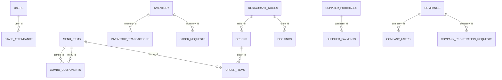

# UX DESIGN HANDOFF

## Product summary

KnockOUT supports restaurant and takeaway operations within separately administered companies. Admins manage tables, timed table bookings, parcels, menu, stock, finance and staff. Waiters submit dine-in orders and request bills. Chefs and juicers prepare their assigned items and mark them ready. Item handoff and payment are separate stages. Staff attendance is available in the native app, while the corresponding web staff navigation is dormant. Superadmins review company applications and manage company access and SaaS billing. This is not a lodging PMS: rooms, stays, guest profiles, hotel check-in/out and housekeeping were not found. Payment recording and notification attempts must not be presented as verified gateway settlement or guaranteed delivery.

This handoff describes source on 7 October 2026; visual appearance, runtime behavior and external services were not exercised. Current behavior and recommendations are separated below.

## Users and goals

| Role | Goal | Daily tasks | Current pain points |
| --- | --- | --- | --- |
| admin | Keep restaurant operations and cash records coordinated | Monitor floor; create parcels and bookings; settle bills; update stock and suppliers; manage staff | Ten ungrouped web links; bookings cannot be seated; web/native settings differ |
| waiter | Move table service from order to paid bill | Choose table; submit rounds; collect/receive prepared items; request bill; record own shift on mobile | My Orders relies on name matching; web attendance hidden |
| chef | Prepare food and coordinate kitchen resources | Review batches; start preparation; mark ready; toggle dishes; request stock on web; maintain roster | Native roster/stock tools have reduced coverage |
| juicer | Prepare and hand off juice items | Review juice queue; prepare; mark ready; control juice availability; record own shift | Ready web navigation uses kitchen gate; mobile parcel grouping differs |
| superadmin | Operate the multi-company subscription network | Review applicants; inspect companies/users; manage access and SaaS invoices | Technical database names and credentials visible; mobile is much narrower |
| applicant | Register and activate a company | Submit business/contact/package; await review; enter activation details; receive permanent credentials | Payment and message wording suggests more integration than is implemented |

## Existing modules

| Module | Purpose | Status |
| --- | --- | --- |
| Access and profile | PIN authentication, identity and profile editing | IMPLEMENTED |
| Company registration and activation | Request a subscription, review it and activate a tenant | PARTIALLY_IMPLEMENTED |
| Company administration | Operate tenant companies, logins, module access and SaaS invoices | PARTIALLY_IMPLEMENTED |
| Operational dashboards | Summarize floor, production, sales and staff | IMPLEMENTED |
| Restaurant floor | Create tables, inspect active service and change table state | IMPLEMENTED |
| Table bookings | Reserve a restaurant table for a dated time interval and phone contact | PARTIALLY_IMPLEMENTED |
| Dine-in orders and billing | Take orders and additional rounds, coordinate handoff and settle bills | IMPLEMENTED |
| Parcel orders | Create takeaway orders, record payment and coordinate collection | IMPLEMENTED |
| Menu and combos | Manage dishes, images, prices, availability and combo composition | IMPLEMENTED |
| Kitchen and juice production | Prepare tickets and mark batches ready | IMPLEMENTED |
| Inventory and kitchen requests | Track stock movements, minimums, planning and chef purchase requests | PARTIALLY_IMPLEMENTED |
| Finance and suppliers | Review daily closing, ledger, purchases, balances and reports | IMPLEMENTED |
| Staff and attendance | Manage login accounts, kitchen roster, compensation fields and shifts | PARTIALLY_IMPLEMENTED |
| Business settings | Edit business identity; native also exposes charge configuration | PARTIALLY_IMPLEMENTED |
| Messages and feedback | Booking/onboarding delivery attempts plus local notices | PARTIALLY_IMPLEMENTED |

## Current navigation

Public URLs are `/`, `/login`, `/register`. All authenticated pages, tabs, selected dates and modals use local state; do not label invented URLs as current routes.

| Role | Web destinations |
| --- | --- |
| admin | Overview → Tables → Table Bookings → Orders & Billing → Parcel Orders → Food & Photos → Stock Management → Finance Management → Staff → Settings |
| waiter | Overview → Tables → My Orders |
| chef | Overview → Chef Management → Book Kitchen Stock → Dishes → Table Orders → Parcel Queue → Ready to Serve |
| juicer | Overview → Juices → Table Orders → Parcel Queue → Ready Juices |

Native Admin has the same broad operational areas in a grouped drawer and a five-item dock. Native Waiter: Attendance, Tables, Orders. Native Chef: Attendance, Juicer, Dishes, Dine-in, Parcels. Native Juicer: Attendance, Juices, Queue, Ready. Native master is a reduced company/user overview. Web header profile works; search and bell are placeholders.

## Recommended navigation — proposed only

| Section | Users | Children | Actions |
| --- | --- | --- | --- |
| Service | Admin, Waiter | Floor; table bookings; dine-in orders; parcels; settlement | Open table, take order, coordinate handoff, record payment |
| Production | Chef, Juicer | Food queue; juice queue; ready/handoff; availability | Start preparation, mark ready, collect/receive |
| Resources | Admin, Chef | Menu and combos; stock; kitchen requests; workforce | Maintain availability, replenish stock, manage roster |
| Finance | Admin | Daily closing; supplier purchases/balances; ledger; existing reports | Review day, record purchase/payment, export |
| My work | Waiter, Chef, Juicer | Role overview; attendance; profile | Review queue, record shift, maintain profile |
| Administration | Admin | Business settings; staff login accounts | Maintain identity and access |
| Company network | Superadmin | Applications; companies; company users; subscriptions/invoices; controls | Review application, manage company access |
| Get started | Applicant | Application; review status; activation | Apply, check outcome, complete activation |

## Screens requiring design

Each row is a view/state rather than necessarily a full page. Platform prefixes W/M mean web/mobile. Include the linked source-informed purpose and nested overlays in design scope. Dormant alternatives are listed separately.

| ID / name | Role | Purpose / hierarchy | Priority |
| --- | --- | --- | --- |
| W-PublicLanding — Public Landing | anonymous | PIN authentication, identity and profile editing through Public Landing. | P0 |
| W-Login — Login | anonymous | Web supports tenant Hotel ID + PIN and no-Hotel-ID master/applicant path. Native requires four-digit Hotel ID and six-digit PIN, so it does not expose the same login paths. | P0 |
| W-PublicCompanyRegistration — Public Company Registration | anonymous | Company/admin/contact fields → package → period → submitted/temporary credential preview. “Sent” wording exceeds verified delivery evidence. | P2 |
| W-ApplicantOnboarding — Applicant Onboarding | applicant | Pending, rejected, approved activation and completed credential states. “Pay & activate” accepts a reference string; a verified payment gateway is not implemented. | P2 |
| W-SuperAdminApp — Super Admin App | superadmin | Network summary → company directory / registration requests → selected company tabs Overview, Users, SaaS Billing, Controls. No route changes for selection. | P2 |
| W-MasterRegistrationRequests — Master Registration Requests | superadmin | Operate tenant companies, logins, module access and SaaS invoices through Master Registration Requests. | P2 |
| W-MasterRegistrationDetail — Master Registration Detail | superadmin | Request a subscription, review it and activate a tenant through Master Registration Detail. | P2 |
| W-MasterNetworkOverview — Master Network Overview | superadmin | Operate tenant companies, logins, module access and SaaS invoices through Master Network Overview. | P2 |
| W-MasterActionModal — Master Action Modal | superadmin | Operate tenant companies, logins, module access and SaaS invoices through Master Action Modal. | P2 |
| W-CompanyWorkspaceOverview — Company Workspace Overview | superadmin | Operate tenant companies, logins, module access and SaaS invoices through Company Workspace Overview. | P2 |
| W-CompanyControls — Company Controls | superadmin | Operate tenant companies, logins, module access and SaaS invoices through Company Controls. | P2 |
| W-MasterUsers — Master Users | superadmin | Operate tenant companies, logins, module access and SaaS invoices through Master Users. | P2 |
| W-MasterPinModal — Master Pin Modal | superadmin | Operate tenant companies, logins, module access and SaaS invoices through Master Pin Modal. | P2 |
| W-MasterBilling — Master Billing | superadmin | Operate tenant companies, logins, module access and SaaS invoices through Master Billing. | P2 |
| W-MasterPricingSlab — Master Pricing Slab | superadmin | Operate tenant companies, logins, module access and SaaS invoices through Master Pricing Slab. | P2 |
| W-MasterLogin — Master Login | anonymous | PIN authentication, identity and profile editing through Master Login. | P0 |
| W-ProfileEditor — Profile Editor | admin,waiter,chef,juicer | Name, phone, email and profile image edit. Web profile load failure falls back to session identity. | P0 |
| W-Admin — Admin | admin | PIN authentication, identity and profile editing through Admin. | P0 |
| W-AdminOverview — Admin Overview | admin | Revenue and operational KPIs → occupancy/status graphic → recent orders and stock alerts. Metrics use loaded state rather than an unlimited historical dataset. | P1 |
| W-AdminTables — Admin Tables | admin | Create tables, inspect active service and change table state through Admin Tables. | P0 |
| W-AdminTableDetails — Admin Table Details | admin | Create tables, inspect active service and change table state through Admin Table Details. | P0 |
| W-TableEditor — Table Editor | admin | Create tables, inspect active service and change table state through Table Editor. | P0 |
| W-OperationsCalendar — Operations Calendar | admin | PIN authentication, identity and profile editing through Operations Calendar. | P0 |
| W-AdminOrders — Admin Orders | admin | Take orders and additional rounds, coordinate handoff and settle bills through Admin Orders. | P0 |
| W-MenuManager — Menu Manager | admin | Dishes / combos tabs → cards → editor. Combos reference menu items; image upload supported. No general text search found here. | P2 |
| W-DishEditor — Dish Editor | admin | Manage dishes, images, prices, availability and combo composition through Dish Editor. | P2 |
| W-ComboEditor — Combo Editor | admin | Manage dishes, images, prices, availability and combo composition through Combo Editor. | P2 |
| W-ParcelPanel — Parcel Panel | admin | Calendar → selected day → parcel list. Create only for today; detail/handoff, prepayment and final payment are separate modal states. | P0 |
| W-ParcelHandoffModal — Parcel Handoff Modal | admin | Create takeaway orders, record payment and coordinate collection through Parcel Handoff Modal. | P0 |
| W-ParcelPaymentModal — Parcel Payment Modal | admin | Create takeaway orders, record payment and coordinate collection through Parcel Payment Modal. | P0 |
| W-ParcelBuilder — Parcel Builder | admin | Create takeaway orders, record payment and coordinate collection through Parcel Builder. | P0 |
| W-Stock — Stock | admin | Inventory / activity / planning views. Name/category query, category and health filters combine. Forecast derives from recorded usage/waste, not automatic ingredient consumption. | P1 |
| W-StockEditor — Stock Editor | admin | Track stock movements, minimums, planning and chef purchase requests through Stock Editor. | P1 |
| W-StockMovement — Stock Movement | admin | Track stock movements, minimums, planning and chef purchase requests through Stock Movement. | P1 |
| W-FinanceEntry — Finance Entry | admin | Review daily closing, ledger, purchases, balances and reports through Finance Entry. | P1 |
| W-DailyFinance — Daily Finance | admin | Review daily closing, ledger, purchases, balances and reports through Daily Finance. | P1 |
| W-FinanceCalendar — Finance Calendar | admin | Review daily closing, ledger, purchases, balances and reports through Finance Calendar. | P1 |
| W-MonthlyRevenueReport — Monthly Revenue Report | admin | Review daily closing, ledger, purchases, balances and reports through Monthly Revenue Report. | P1 |
| W-DailyFinanceDetails — Daily Finance Details | admin | Selected day → closing KPIs → daily / purchases / ledger / analytics tabs. Includes supplier balances, paid bills, transactions and trailing 30-day analytics. | P1 |
| W-SupplierPurchaseForm — Supplier Purchase Form | admin | Review daily closing, ledger, purchases, balances and reports through Supplier Purchase Form. | P1 |
| W-DealerPaymentForm — Dealer Payment Form | admin | Review daily closing, ledger, purchases, balances and reports through Dealer Payment Form. | P1 |
| W-StaffManagement — Staff Management | admin | Team accounts → kitchen roster → attendance history. Compensation fields support daily/monthly pay; this is not a payroll processing system. | P2 |
| W-AdminKitchenTeam — Admin Kitchen Team | admin | PIN authentication, identity and profile editing through Admin Kitchen Team. | P0 |
| W-StaffEditor — Staff Editor | admin | Manage login accounts, kitchen roster, compensation fields and shifts through Staff Editor. | P2 |
| W-SettingsPanel — Settings Panel | admin | Web business name editable; currency disabled; tax/service inputs commented out. | P3 |
| W-RoleOverview — Role Overview | waiter,chef,juicer | Role-specific queue KPIs → primary queue shortcut → four recent items. Waiter attribution uses name matching, not stable staff IDs. | P1 |
| W-Waiter — Waiter | waiter | PIN authentication, identity and profile editing through Waiter. | P0 |
| W-Bookings — Bookings | admin | Calendar → selected day → confirmed table bookings → create or cancel. No booking edit or seating action. Past/cancelled records are not returned by the current state feed. | P1 |
| W-WaiterOrders — Waiter Orders | waiter | Take orders and additional rounds, coordinate handoff and settle bills through Waiter Orders. | P0 |
| W-BookingModal — Booking Modal | admin | Phone, date, time, duration and available table. This reserves a restaurant table, not a room. API rejects past times and overlaps. No guest account, rate, deposit or stay. | P2 |
| W-TableDrawer — Table Drawer | waiter | Create tables, inspect active service and change table state through Table Drawer. | P0 |
| W-OrderBuilder — Order Builder | waiter | Category choices → menu cards → quantities/cart → submit. New order or additional batch depends on table order. No web special-request input identified. | P0 |
| W-Bill — Bill | waiter | Take orders and additional rounds, coordinate handoff and settle bills through Bill. | P0 |
| W-AdminBillPopup — Admin Bill Popup | admin | Take orders and additional rounds, coordinate handoff and settle bills through Admin Bill Popup. | P0 |
| W-Chef — Chef | chef | Prepare tickets and mark batches ready through Chef. | P0 |
| W-ChefStockBooking — Chef Stock Booking | chef | Track stock movements, minimums, planning and chef purchase requests through Chef Stock Booking. | P1 |
| W-ChefStockRequestModal — Chef Stock Request Modal | chef | Track stock movements, minimums, planning and chef purchase requests through Chef Stock Request Modal. | P1 |
| W-Juicer — Juicer | juicer | Prepare tickets and mark batches ready through Juicer. | P0 |
| W-ChefDishes — Chef Dishes | chef,juicer | Manage dishes, images, prices, availability and combo composition through Chef Dishes. | P2 |
| W-ChefManagement — Chef Management | chef | Manage login accounts, kitchen roster, compensation fields and shifts through Chef Management. | P2 |
| W-JuicerLoginEditor — Juicer Login Editor | chef | Manage login accounts, kitchen roster, compensation fields and shifts through Juicer Login Editor. | P2 |
| W-KitchenStaffEditor — Kitchen Staff Editor | admin,chef | Manage login accounts, kitchen roster, compensation fields and shifts through Kitchen Staff Editor. | P2 |
| M-NativeLanding — Native Landing | anonymous | PIN authentication, identity and profile editing through Native Landing. | P0 |
| M-Login — Login | anonymous | Web supports tenant Hotel ID + PIN and no-Hotel-ID master/applicant path. Native requires four-digit Hotel ID and six-digit PIN, so it does not expose the same login paths. | P0 |
| M-MasterMobile — Master Mobile | superadmin | Read-oriented company/user and revenue overview; no parity with web approval, company controls or SaaS billing management. | P2 |
| M-Attendance — Attendance | waiter,chef,juicer | Native staff landing tab: check in/out and recent eight shifts. This is employee timekeeping, not guest arrival/departure. | P2 |
| M-AdminTables — Admin Tables | admin | Create tables, inspect active service and change table state through Admin Tables. | P0 |
| M-MobileTableEditor — Mobile Table Editor | admin | Create tables, inspect active service and change table state through Mobile Table Editor. | P0 |
| M-AdminBillingModal — Admin Billing Modal | admin | Take orders and additional rounds, coordinate handoff and settle bills through Admin Billing Modal. | P0 |
| M-WaiterScreen — Waiter Screen | waiter | PIN authentication, identity and profile editing through Waiter Screen. | P0 |
| M-TableList — Table List | waiter | Create tables, inspect active service and change table state through Table List. | P0 |
| M-OrderModal — Order Modal | waiter | Create tables, inspect active service and change table state through Order Modal. | P0 |
| M-OrderList — Order List | waiter | Take orders and additional rounds, coordinate handoff and settle bills through Order List. | P0 |
| M-ChefScreen — Chef Screen | chef | Prepare tickets and mark batches ready through Chef Screen. | P0 |
| M-JuicerScreen — Juicer Screen | juicer | Prepare tickets and mark batches ready through Juicer Screen. | P0 |
| M-ChefDishes — Chef Dishes | chef,juicer | Manage dishes, images, prices, availability and combo composition through Chef Dishes. | P2 |
| M-ChefJuicerManagement — Chef Juicer Management | chef | Manage login accounts, kitchen roster, compensation fields and shifts through Chef Juicer Management. | P2 |
| M-OperationsCalendarMobile — Operations Calendar Mobile | admin | PIN authentication, identity and profile editing through Operations Calendar Mobile. | P0 |
| M-AdminDrawer — Admin Drawer | admin | PIN authentication, identity and profile editing through Admin Drawer. | P0 |
| M-AdminBookings — Admin Bookings | admin | Reserve a restaurant table for a dated time interval and phone contact through Admin Bookings. | P1 |
| M-AdminBookingEditor — Admin Booking Editor | admin | Reserve a restaurant table for a dated time interval and phone contact through Admin Booking Editor. | P1 |
| M-AdminParcelsDay — Admin Parcels Day | admin | Create takeaway orders, record payment and coordinate collection through Admin Parcels Day. | P0 |
| M-AdminOrders — Admin Orders | admin | Take orders and additional rounds, coordinate handoff and settle bills through Admin Orders. | P0 |
| M-AdminParcels — Admin Parcels | admin | Create takeaway orders, record payment and coordinate collection through Admin Parcels. | P0 |
| M-ParcelEditor — Parcel Editor | admin | Create takeaway orders, record payment and coordinate collection through Parcel Editor. | P0 |
| M-AdminMenuManager — Admin Menu Manager | admin | Manage dishes, images, prices, availability and combo composition through Admin Menu Manager. | P2 |
| M-MenuEditor — Menu Editor | admin | Manage dishes, images, prices, availability and combo composition through Menu Editor. | P2 |
| M-AdminStock — Admin Stock | admin | Track stock movements, minimums, planning and chef purchase requests through Admin Stock. | P1 |
| M-StockEditor — Stock Editor | admin | Track stock movements, minimums, planning and chef purchase requests through Stock Editor. | P1 |
| M-StockMovement — Stock Movement | admin | Track stock movements, minimums, planning and chef purchase requests through Stock Movement. | P1 |
| M-AdminFinance — Admin Finance | admin | Review daily closing, ledger, purchases, balances and reports through Admin Finance. | P1 |
| M-FinanceDay — Finance Day | admin | Selected day’s financial summary and ledger/purchase/payment controls. Native does not reproduce all web analytics/report controls. | P1 |
| M-FinanceEntry — Finance Entry | admin | Review daily closing, ledger, purchases, balances and reports through Finance Entry. | P1 |
| M-PurchaseEditor — Purchase Editor | admin | Review daily closing, ledger, purchases, balances and reports through Purchase Editor. | P1 |
| M-DealerPayment — Dealer Payment | admin | Review daily closing, ledger, purchases, balances and reports through Dealer Payment. | P1 |
| M-AdminPeople — Admin People | admin | Native accounts/kitchen toggle. No equivalent web history tab identified. | P2 |
| M-StaffEditor — Staff Editor | admin | Manage login accounts, kitchen roster, compensation fields and shifts through Staff Editor. | P2 |
| M-ChefEditor — Chef Editor | admin | Manage login accounts, kitchen roster, compensation fields and shifts through Chef Editor. | P2 |
| M-AdminSettings — Admin Settings | admin | Native exposes business name, currency, GST, CGST and service charge. Server billing currently sets charge totals to zero. | P3 |
| M-PremiumDashboard — Premium Dashboard | admin | Today’s paid revenue hero → active orders, occupied tables and on-duty staff → permission-filtered shortcuts → floor summary → four recent orders. | P1 |

Dormant/out-of-current-scope: W-CompanyRegistration, W-FoodManager, W-Finance, W-Staff, W-AttendancePanel, M-RoleSelect, M-AdminOverview, M-AdminMenu, M-AdminStaff. Shared cards, badges, calendars, tickets and receipt components still need reusable design treatment.

## Critical workflows

### Reserve a restaurant table

Open Table Bookings calendar → Select day and create booking → Enter phone, date, time, duration and table → Server validates future interval and overlap → Confirmed booking; delivery attempt → Cancel if needed.

Constraint: No guest/room/rates/taxes/discount/deposit/special-request fields; no modification, seating, hotel check-in or hotel check-out. Active reservation blocks new table order without a consume/seat action.

### Dine-in service and settlement

Waiter opens available table → Select items and submit order or additional round → Chef/Juicer prepares matching ticket items → Mark ready; collect and receive handoff → Waiter requests bill → Admin records payment → Order completed; table cleaning → Admin/Waiter marks table available.

Constraint: Production, handoff and payment are separate states; do not collapse them into one status. No gateway confirmation.

### Parcel fulfillment

Admin selects today in parcel calendar → Build parcel cart and customer details → Create parcel; optionally record payment → Kitchen/juice prepares items → Record collection/handoff → Settle unpaid balance.

Constraint: Payment can precede fulfillment. Historical day cannot create a new parcel in web UI.

### Kitchen request and replenishment

Chef searches kitchen stock → Submit quantity and note request → Admin reviews request → Mark ordered → Record stock purchase/movement → Resolve request.

Constraint: Request status does not itself purchase stock or prove delivery; native workflow is narrower.

### Supplier purchase and balance

Select finance date → Record supplier purchase and optional initial payment → Review outstanding amount → Record subsequent dealer payment → Review balance and daily ledger.

Constraint: Server rejects payment above balance; purchase and general expense records are distinct.

### Staff shift timekeeping

Open native Attendance → Check in → View open shift → Check out → Review recent shift history.

Constraint: Web self-attendance component is dormant. No guest identity, room or housekeeping transition.

### Company onboarding

Public company/contact/package application → Temporary applicant login → Master reviews and approves or rejects → Approved applicant enters business details and payment reference → Server creates/activates company → Applicant receives permanent Hotel ID and Admin PIN.

Constraint: Payment reference is not a verified payment integration; notification delivery may only be queued.

### Menu maintenance

Admin opens dishes or combos → Enter item, price and optional image/composition → Save item → Chef/Juicer toggles relevant availability → Waiter selects available items.

Constraint: Existing order item prices are snapshots; client display calculations need reconciliation with server bills.

## Data and relationships

Company administration is separate from each tenant’s operational database. Restaurant tables have orders; orders contain menu-linked items with snapshot prices, batches, production and handoff states. Combos reference menu items. Bookings reference tables and store contact phone/time intervals, not guest stays. Inventory has movement history and chef requests. Supplier purchases have payments; general finance entries are a separate ledger. Staff login users have attendance; kitchen roster members are a separate entity. Master records include applicants, companies, users, SaaS invoices, subscriptions, usage and notification outbox.

## Status system

| State family | Values | Transition caveat |
| --- | --- | --- |
| users.role | admin, waiter, chef, juicer | See mutation API catalogue; schema enum alone does not prove a transition action. |
| users.pay_type | daily, monthly | See mutation API catalogue; schema enum alone does not prove a transition action. |
| kitchen_staff.pay_type | daily, monthly | See mutation API catalogue; schema enum alone does not prove a transition action. |
| restaurant_tables.status | available, occupied, reserved, cleaning | available/reserved/cleaning via guarded table action; order creation → occupied; settlement releases active order and sets cleaning. No guest stay involved. |
| orders.order_type | dine_in, parcel | See mutation API catalogue; schema enum alone does not prove a transition action. |
| orders.status | new, preparing, ready, collected, received, served, billing_requested, completed | new → preparing → ready through production; handoff collected/received; billing_requested → completed on Admin payment. served exists in enum but no dedicated transition found. Mixed item states aggregate at order level. |
| orders.payment_status | unpaid, paid | unpaid → paid by Admin; no refund/reversal workflow found. |
| order_items.production_status | new, preparing, ready | new → preparing → ready; role and item type constrain production. |
| order_items.handoff_status | pending, collected, received | pending → collected → received; batch/item handoff tracked independently from payment. |
| inventory_transactions.movement_type | purchase, usage, adjustment, waste | See mutation API catalogue; schema enum alone does not prove a transition action. |
| stock_requests.status | pending, ordered, resolved | Admin may set pending/ordered/resolved; not a strictly enforced one-way state machine. |
| finance_entries.entry_type | income, expense | See mutation API catalogue; schema enum alone does not prove a transition action. |
| bookings.status | confirmed, seated, cancelled | confirmed → cancelled; seated is schema-only, no seating endpoint found. |
| bookings.notification_status | queued, sent, failed | See mutation API catalogue; schema enum alone does not prove a transition action. |
| companies.status | active, suspended | See mutation API catalogue; schema enum alone does not prove a transition action. |
| company_users.role | admin, waiter, chef, juicer | See mutation API catalogue; schema enum alone does not prove a transition action. |
| company_registration_requests.status | pending, approved, rejected | pending → approved or rejected; activation completion uses completed_at rather than another status value. |
| saas_invoices.status | due, paid | See mutation API catalogue; schema enum alone does not prove a transition action. |
| notification_outbox.channel | email, sms | See mutation API catalogue; schema enum alone does not prove a transition action. |
| notification_outbox.status | queued, sent, failed | See mutation API catalogue; schema enum alone does not prove a transition action. |
| tenant_subscriptions.status | active, grace, expired | See mutation API catalogue; schema enum alone does not prove a transition action. |

## Forms requiring design

Field labels fall back to bindings where source uses dynamic controls. Explicit required flags alone are not the full server validation contract. Date/time, amount and availability errors must be visible next to the action; full error strings are retained in 08.

| Form / screen | Fields | Defaults and dependencies |
| --- | --- | --- |
| Login controls / W-Login | 4-DIGIT HOTEL ID NOT REQUIRED FOR SUPER ADMIN, pin | [mode,setMode]=useState(routeFromPath); [hotelId,setHotelId]=useState(""); [pin, setPin] = useState(""); [error, setError] = useState(""); [busy, setBusy] = useState(false); [verified, setVerified] = useState(false) |
| Public Company Registration controls / W-PublicCompanyRegistration | HOTEL / BUSINESS NAME, ADMINISTRATOR NAME, ADMIN EMAIL, PHONE NUMBER | [form,setForm]=useState({companyName:"",adminName:"",email:"",phone:"",packageCode:"starter",periodMonths:1}); [busy,setBusy]=useState(false); [error,setError]=useState(""); [submitted,setSubmitted]=useState(null) |
| Applicant Onboarding controls / W-ApplicantOnboarding | BUSINESS TYPE Restaurant Café Hotel Cloud Kitchen Food Court, GST NUMBER (OPTIONAL), BUSINESS ADDRESS, PAYMENT REFERENCE Payment gateway reference confirms the selected package purchase. | [status,setStatus]=useState(null); [form,setForm]=useState({businessType:"Restaurant",address:"",gstNumber:"",paymentReference:""}); [busy,setBusy]=useState(false); [error,setError]=useState(""); [complete,setComplete]=useState(null) |
| Super Admin App controls / W-SuperAdminApp | Search company, database or admin | [user, setUser] = useState( () => authenticatedUser \|\| (() => { try { return JSON.parse( sessionStorage.getItem("knockout-master-user") \|\| "null", ); } catch { return null; } })(), ); [data, setData] = useState(null); [masterAction, setMasterAction] = useState(null); [pinUser, setPinUser] = useState(null); [selectedCompanyId, setSelectedCompanyId] = useState(null); [selectedRegistrationId,setSelectedRegistrationId]=useState(null); [companySection, setCompanySection] = useState("overview"); [companySearch, setCompanySearch] = useState(""); [companyFilter, setCompanyFilter] = useState("all"); [reviewBusy,setReviewBusy]=useState(null); [actionBusy, setActionBusy] = useState(false); [notice, setNotice] = useState("") |
| Master Action Modal controls / W-MasterActionModal | TYPE TO CONFIRM | [typed, setTyped] = useState("") |
| Company Controls controls / W-CompanyControls | input |  |
| Master Pin Modal controls / W-MasterPinModal | NEW 6-DIGIT PIN | [pin, setPin] = useState(""); [busy, setBusy] = useState(false); [error, setError] = useState("") |
| Master Billing controls / W-MasterBilling | Billing month | [month,setMonth]=useState(months[0]\|\|new Date().toISOString().slice(0,7)) |
| Master Pricing Slab controls / W-MasterPricingSlab | Per tenant / month | [pricing,setPricing]=useState(null); [editing,setEditing]=useState(false); [busy,setBusy]=useState("") |
| Master Login controls / W-MasterLogin | 6-digit Master PIN | [pin, setPin] = useState(""); [error, setError] = useState(""); [busy, setBusy] = useState(false) |
| Profile Editor controls / W-ProfileEditor | Change photo, FULL NAME, MOBILE NUMBER, EMAIL ADDRESS | [form,setForm]=useState({name:user.name\|\|"",phone:user.phone\|\|"",email:user.email\|\|""}); [image,setImage]=useState(null); [preview,setPreview]=useState(user.profileImageUrl\|\|""); [busy,setBusy]=useState(false); [error,setError]=useState("") |
| Table Editor controls / W-TableEditor | Table number, Number of seats, Service area | [form, setForm] = useState({ number: "", seats: 4, area: "Main Hall" }); [error, setError] = useState("") |
| Menu Manager controls / W-MenuManager | input | [tab, setTab] = useState("dishes"); [editor, setEditor] = useState(null); [uploading, setUploading] = useState(null) |
| Dish Editor controls / W-DishEditor | Food name, Category, Icon, Description, Amount / selling price,   Available for ordering | [form, setForm] = useState({ name: item?.name \|\| "", category: item?.category \|\| "Mains", description: item?.description \|\| "", price: item?.price \|\| "", icon: item?.icon \|\| "🍽️", available: item?.available ?? true, }) |
| Combo Editor controls / W-ComboEditor | Combo name, Combo amount, Icon, Description, Qty | [form, setForm] = useState({ name: item?.name \|\| "", description: item?.description \|\| "", price: item?.price \|\| "", icon: item?.icon \|\| "🎁", }); [parts, setParts] = useState( item?.components?.map((c) => ({ menuId: c.menuId, quantity: c.quantity, })) \|\| [], ) |
| Parcel Builder controls / W-ParcelBuilder | Customer name, Phone number | [cart, setCart] = useState([]); [customer, setCustomer] = useState(""); [phone, setPhone] = useState(""); [paymentMethod, setPaymentMethod] = useState("") |
| Stock controls / W-Stock | Search item or category…, category, health | [editing, setEditing] = useState(null); [moving, setMoving] = useState(null); [tab, setTab] = useState("inventory"); [query, setQuery] = useState(""); [category, setCategory] = useState("all"); [health, setHealth] = useState("all"); [movementFilter, setMovementFilter] = useState("all") |
| Stock Editor controls / W-StockEditor | Ingredient / item name, Category, Unit, Opening quantity, Minimum level, Unit cost | [form, setForm] = useState( item ? { name: item.name, category: item.category, quantity: item.quantity, unit: item.unit, min: item.min, cost: item.cost, } : { name: "", category: "", quantity: 0, unit: "kg", min: 0, cost: 0 }, ); [busy, setBusy] = useState(false); [error, setError] = useState("") |
| Stock Movement controls / W-StockMovement | Movement type, Adjustment direction, Quantity ( ), Unit cost, Notes | [form, setForm] = useState({ movementType: "purchase", quantity: "", unitCost: item.cost, note: "", adjustmentDirection: 1, }); [busy, setBusy] = useState(false); [error, setError] = useState("") |
| Finance Entry controls / W-FinanceEntry | Entry type, Category, Description, Amount, Payment method, Date, Reference | [form, setForm] = useState({ entryType: "expense", category: "Purchases", description: "", amount: "", paymentMethod: "Cash", entryDate: today, reference: "", }); [busy, setBusy] = useState(false); [error, setError] = useState("") |
| Finance Calendar controls / W-FinanceCalendar | REPORT MONTH | [month, setMonth] = useState( () => new Date(today.getFullYear(), today.getMonth(), 1), ) |
| Supplier Purchase Form controls / W-SupplierPurchaseForm | Shop or dealer name, Invoice number, Purchase date, Products / description, Total invoice amount, Amount paid now, Payment method, Payment reference, Notes | [form, setForm] = useState({ supplierName: "", invoiceNumber: "", description: "", purchaseDate: date, totalAmount: "", paidAmount: 0, paymentMethod: "Cash", reference: "", notes: "", }); [busy, setBusy] = useState(false); [error, setError] = useState("") |
| Dealer Payment Form controls / W-DealerPaymentForm | Amount to pay, Payment date, Payment method, Reference, Notes | [form, setForm] = useState({ amount: purchase.due, paymentMethod: "Cash", paymentDate: date, reference: "", notes: "", }); [busy, setBusy] = useState(false); [error, setError] = useState("") |
| Staff Editor controls / W-StaffEditor | Full name, 6-digit login PIN, Phone, form.payRate,   Login account active | [form, setForm] = useState({ name: staff?.name \|\| "", role: staff?.role \|\| "waiter", pin: staff?.pin \|\| "", phone: staff?.phone \|\| "", payType: staff?.payType \|\| "monthly", payRate: staff?.payRate \|\| 0, active: staff?.active ?? true, }); [error, setError] = useState(""); [deleteArmed, setDeleteArmed] = useState(false); [deleting, setDeleting] = useState(false) |
| Settings Panel controls / W-SettingsPanel | Business name, Currency | [s, setS] = useState(data.settings) |
| Booking Modal controls / W-BookingModal | Customer mobile number, Booking date, Booking time, Reservation duration, Available table for this time | [form, setForm] = useState({ tableId: "", customerPhone: "", bookingDate: initialDate \|\| dateKey(new Date()), bookingTime: "18:00", durationMinutes: 90, }); [error, setError] = useState(""); [busy, setBusy] = useState(false) |
| Chef Stock Booking controls / W-ChefStockBooking | Search ingredient or category | [query,setQuery]=useState(""); [booking,setBooking]=useState(null) |
| Chef Stock Request Modal controls / W-ChefStockRequestModal | QUANTITY REQUIRED, NOTE / REASON | [quantity,setQuantity]=useState(String(suggested)); [note,setNote]=useState(""); [busy,setBusy]=useState(false); [error,setError]=useState("") |
| Chef Dishes controls / W-ChefDishes | Search dishes… | [query, setQuery] = useState("") |
| Juicer Login Editor controls / W-JuicerLoginEditor | Full name, Phone, Salary basis Daily Monthly, Salary amount | [form,setForm]=useState({name:"",phone:"",payType:"monthly",payRate:0}); [busy,setBusy]=useState(false) |
| Kitchen Staff Editor controls / W-KitchenStaffEditor | Full name, Designation, Phone, Specialization, Joining date, form.payRate, Notes, Active kitchen employee | [form, setForm] = useState({ name: member?.name \|\| "", designation: member?.designation \|\| "Chef", phone: member?.phone \|\| "", specialization: member?.specialization \|\| "", payType: member?.payType \|\| "monthly", payRate: member?.payRate \|\| 0, joinedOn: member?.joinedOn ? String(member.joinedOn).slice(0, 10) : "", notes: member?.notes \|\| "", active: member?.active ?? true, createdBy: user?.name \|\| "Admin", }); [error, setError] = useState("") |
| Login controls / M-Login | 4-digit Hotel ID, pin | [hotelId,setHotelId]=useState(''); [pin,setPin]=useState(''); [busy,setBusy]=useState(false); [error,setError]=useState(''); [verified,setVerified]=useState(false) |
| Mobile Table Editor controls / M-MobileTableEditor | Table number, Seats, Service area | [number,setNumber]=useState(''); [seats,setSeats]=useState('4'); [area,setArea]=useState('Main Hall'); [busy,setBusy]=useState(false) |
| Chef Juicer Management controls / M-ChefJuicerManagement | Full name, Phone, Salary amount | [juicer,setJuicer]=useState(undefined); [show,setShow]=useState(false); [busy,setBusy]=useState(false); [form,setForm]=useState({name:'',phone:'',payType:'monthly',payRate:'0'}) |
| Admin Booking Editor controls / M-AdminBookingEditor | Customer mobile number, Booking date (YYYY-MM-DD), Booking time (24-hour HH:MM) | [tableId,setTableId]=useState(null); [customerPhone,setPhone]=useState(''); [bookingDate,setDate]=useState(initialDate\|\|today()); [bookingTime,setTime]=useState('18:00'); [durationMinutes,setDuration]=useState(90); [busy,setBusy]=useState(false) |
| Parcel Editor controls / M-ParcelEditor | Customer name, Phone | [name,setName]=useState(''); [phone,setPhone]=useState(''); [payment,setPayment]=useState('unpaid'); [items,setItems]=useState([]); [busy,setBusy]=useState(false) |
| Menu Editor controls / M-MenuEditor | Name, Category, Price, Icon / emoji, Description / customization | [combo,setCombo]=useState(!!item?.isCombo); [form,setForm]=useState(item?{name:item.name,category:item.category,description:item.description\|\|'',price:String(item.price),icon:item.icon\|\|'🍽️',available:item.available}:{name:'',category:'Mains',description:'',price:'',icon:'🍽️',available:true}); [components,setComponents]=useState(item?.components?.map(x=>({menuId:x.menuId,quantity:x.quantity}))\|\|[]); [busy,setBusy]=useState(false) |
| Admin Stock controls / M-AdminStock | Search stock or category… | [editing,setEditing]=useState(null); [moving,setMoving]=useState(null); [view,setView]=useState('inventory'); [query,setQuery]=useState('') |
| Stock Editor controls / M-StockEditor | Item name, Category, Opening quantity, Unit, Minimum, Unit cost | [form,setForm]=useState(item?{name:item.name,category:item.category,quantity:item.quantity,unit:item.unit,min:item.min,cost:item.cost}:{name:'',category:'Ingredients',quantity:'0',unit:'kg',min:'0',cost:'0'}); [busy,setBusy]=useState(false) |
| Stock Movement controls / M-StockMovement | `Quantity (${item.unit})`, Unit cost, Notes | [type,setType]=useState('purchase'); [quantity,setQuantity]=useState(''); [unitCost,setUnitCost]=useState(String(item.cost)); [note,setNote]=useState(''); [direction,setDirection]=useState(1); [busy,setBusy]=useState(false) |
| Finance Entry controls / M-FinanceEntry | Category, Description, Amount, Reference | [type,setType]=useState('expense'); [category,setCategory]=useState('Purchases'); [description,setDescription]=useState(''); [amount,setAmount]=useState(''); [method,setMethod]=useState('Cash'); [reference,setReference]=useState(''); [busy,setBusy]=useState(false) |
| Purchase Editor controls / M-PurchaseEditor | Shop / dealer, Description, Invoice number, Total amount, Amount paid now | [supplierName,setSupplier]=useState(''); [description,setDescription]=useState(''); [invoiceNumber,setInvoice]=useState(''); [totalAmount,setTotal]=useState(''); [paidAmount,setPaid]=useState('0'); [busy,setBusy]=useState(false) |
| Dealer Payment controls / M-DealerPayment | Payment amount | [amount,setAmount]=useState(String(purchase.due)); [method,setMethod]=useState('Cash'); [busy,setBusy]=useState(false) |
| Staff Editor controls / M-StaffEditor | Full name, Unique 6-digit PIN, Phone, form.payType==='daily'?'Daily salary amount':'Monthly salary amount' | [form,setForm]=useState(item?{name:item.name,role:item.role,pin:item.pin,phone:item.phone\|\|'',payType:item.payType,payRate:item.payRate,active:item.active}:{name:'',role:'waiter',pin:'',phone:'',payType:'monthly',payRate:'0',active:true}); [busy,setBusy]=useState(false); [deleteArmed,setDeleteArmed]=useState(false); [accounts,setAccounts]=useState([]) |
| Chef Editor controls / M-ChefEditor | Full name, Designation, Specialization, Phone, Joining date (YYYY-MM-DD), form.payType==='daily'?'Daily salary amount':'Monthly salary amount', Notes | [form,setForm]=useState(item?{name:item.name,designation:item.designation,phone:item.phone\|\|'',specialization:item.specialization\|\|'',payType:item.payType,payRate:item.payRate,joinedOn:dateKey(item.joinedOn),notes:item.notes\|\|'',active:item.active}:{name:'',designation:'Chef',phone:'',specialization:'',payType:'monthly',payRate:'0',joinedOn:today(),notes:'',active:true}); [busy,setBusy]=useState(false) |
| Admin Settings controls / M-AdminSettings | Business name, Currency, GST rate (%), CGST rate (%), Service tax (%) | [form,setForm]=useState({...state.settings}); [busy,setBusy]=useState(false) |

## Tables and collections requiring design

| Collection | Columns / content | Search/filter behavior |
| --- | --- | --- |
| Login table/list | Web supports tenant Hotel ID + PIN and no-Hotel-ID master/applicant path. Native requires four-digit Hotel ID and six-digit PIN, so it does not expose the same login paths. | e.target.value.replace(/\D/g,"").slice(0,4); e.target.value.replace(/\D/g, "").slice(0, 6) |
| Super Admin App table/list | Network summary → company directory / registration requests → selected company tabs Overview, Users, SaaS Billing, Controls. No route changes for selection. | registrationRequests.filter((request)=>request.status==="pending"); companies.filter((company) => { const matchesStatus = companyFilter === "all" \|\| company.status === companyFilter \|\| (companyFilter === "attention" && (!company.online \|\| company.lowStock > 0)); const query = companySearch.trim().toLowerCase(); return matchesStatus && (!query \|\| [company.companyName, company.databaseName, company.adminName].some((value) => String(value \|\| "").toLowerCase().includes(query))); }); (data.invoices\|\|[]).filter((invoice)=>invoice.companyId===selectedCompany.id) |
| Master Registration Requests table/list | Operate tenant companies, logins, module access and SaaS invoices through Master Registration Requests. | requests.filter((request)=>request.status==="pending"); requests.filter((request)=>request.status!=="pending").slice(0,5); requests.filter((request)=>request.status!=="pending") |
| Master Network Overview table/list | Operate tenant companies, logins, module access and SaaS invoices through Master Network Overview. | new Date().toISOString().slice(0,7); (invoices\|\|[]).filter((invoice)=>invoice.billingMonth===currentMonth); companies.filter((company) => !company.online \|\| company.lowStock > 0 \|\| !company.adminLoginActive); currentInvoices.filter((invoice)=>invoice.status==='paid'); companies.filter((company)=>company.status==="active"); companies.filter((company)=>company.online) |
| Company Workspace Overview table/list | Operate tenant companies, logins, module access and SaaS invoices through Company Workspace Overview. | No direct filter identified |
| Master Users table/list | User, Designation, 6-digit PIN, Status, Recovery | No direct filter identified |
| Master Pin Modal table/list | Operate tenant companies, logins, module access and SaaS invoices through Master Pin Modal. | e.target.value.replace(/\D/g, "").slice(0, 6) |
| Master Billing table/list | Tenant, Activated modules, Subtotal, GST, Total, Payment, Hotel ID, Monthly KnockOUT revenue | [...new Set((invoices\|\|[]).map((invoice)=>invoice.billingMonth))].sort(); new Date().toISOString().slice(0,7); (invoices\|\|[]).filter((invoice)=>invoice.billingMonth===month&&companies.some((company)=>company.id===invoice.companyId)); rows.filter((row)=>row.status==='paid'); rows.filter((row)=>row.status==='due') |
| Master Login table/list | PIN authentication, identity and profile editing through Master Login. | e.target.value.replace(/\D/g, "").slice(0, 6) |
| Profile Editor table/list | Name, phone, email and profile image edit. Web profile load failure falls back to session identity. | form.name.split(" ").map(part=>part[0]).join("").slice(0,2) |
| Admin table/list | PIN authentication, identity and profile editing through Admin. | (data.stockRequests \|\| []).filter((request) => request.status !== "resolved"); (data.inventory \|\| []).filter((item) => item.quantity <= item.min) |
| Admin Overview table/list | Revenue and operational KPIs → occupancy/status graphic → recent orders and stock alerts. Metrics use loaded state rather than an unlimited historical dataset. | data.orders.filter( (o) => !["completed", "served"].includes(o.status), ); data.orders .filter((o) => o.total); data.tables.filter((t) => t.status === "occupied"); data.tables.filter((t) => t.status === "reserved"); data.tables.filter((t) => t.status === "cleaning"); active.filter((o) => o.status === "ready"); data.inventory.filter((i) => i.quantity <= i.min); data.tables.filter((t) => t.status !== "available"); data.tables.filter((t) => t.status === s); data.orders.slice(0, 6) |
| Admin Table Details table/list | Create tables, inspect active service and change table state through Admin Table Details. | [orderDepartmentProgress(order, data, false), orderDepartmentProgress(order, data, true)].filter(Boolean) |
| Operations Calendar table/list | PIN authentication, identity and profile editing through Operations Calendar. | orders.filter((order) => dateKey(order.createdAt) === key); daily.filter((order) => order.paymentStatus === "paid"); daily.filter((order) => order.status !== "completed"); daily.slice(0, 3) |
| Admin Orders table/list | Take orders and additional rounds, coordinate handoff and settle bills through Admin Orders. | data.orders.filter((order) => dateKey(order.createdAt) === selectedDate) |
| Menu Manager table/list | Dishes / combos tabs → cards → editor. Combos reference menu items; image upload supported. No general text search found here. | data.menu.filter((i) => tab === "combos" ? i.isCombo : !i.isCombo, ); data.menu.filter((i) => !i.isCombo); data.menu.filter((i) => i.isCombo) |
| Combo Editor table/list | Manage dishes, images, prices, availability and combo composition through Combo Editor. | p.filter((x) => x.menuId !== id) |
| Parcel Panel table/list | Calendar → selected day → parcel list. Create only for today; detail/handoff, prepayment and final payment are separate modal states. | data.orders.filter((o) => o.orderType === "parcel"); allParcels.filter((order) => dateKey(order.createdAt) === selectedDate) |
| Parcel Builder table/list | Create takeaway orders, record payment and coordinate collection through Parcel Builder. | c .map((i) => (i.menuId === id ? { ...i, qty: i.qty + delta } : i)) .filter((i) => i.qty > 0) |
| Stock table/list | Date, Stock item, Movement, Quantity, Unit cost, Note / Admin, Item, On hand, 30-day usage, Days cover, Suggested order, Estimated cost, <dynamic> | data.inventory.filter((i) => i.quantity <= i.min); transactions .filter((x) => x.movementType === "purchase"); transactions.filter((x) => new Date(x.createdAt).getTime() >= cutoff); recent .filter((x) => x.movementType === "usage"); recent .filter((x) => x.movementType === "waste"); transactions.filter((x) => dateKey(x.createdAt) === todayKey); todayMovements.filter((x) => x.movementType === "purchase"); todayMovements.filter((x) => x.movementType === "usage"); todayMovements.filter((x) => x.movementType === "waste"); [...new Set(data.inventory.map((i) => i.category).filter(Boolean))].sort();  |
| Stock Editor table/list | Track stock movements, minimums, planning and chef purchase requests through Stock Editor. | No direct filter identified |
| Stock Movement table/list | Track stock movements, minimums, planning and chef purchase requests through Stock Movement. | No direct filter identified |
| Finance Entry table/list | Review daily closing, ledger, purchases, balances and reports through Finance Entry. | new Date().toISOString().slice(0, 10) |
| Finance Calendar table/list | Review daily closing, ledger, purchases, balances and reports through Finance Calendar. | data.orders.filter( (o) => o.paymentStatus === "paid" && dateKey(o.completedAt) === key, ); entries .filter( (x) => x.entryType === "expense" && dateKey(x.entryDate) === key, ); payments .filter((x) => dateKey(x.paymentDate) === key); purchases .filter((x) => dateKey(x.purchaseDate) === key) |
| Monthly Revenue Report table/list | Review daily closing, ledger, purchases, balances and reports through Monthly Revenue Report. | data.orders.filter((order) => order.paymentStatus === "paid" && dateKey(order.completedAt).startsWith(prefix)); (data.financeEntries \|\| []).filter((entry) => dateKey(entry.entryDate).startsWith(prefix)); (data.supplierPayments \|\| []).filter((payment) => dateKey(payment.paymentDate).startsWith(prefix)); entries.filter((entry) => entry.entryType === "income"); entries.filter((entry) => entry.entryType === "expense"); orders.filter((order) => dateKey(order.completedAt) === key); day.key.slice(-2) |
| Daily Finance Details table/list | Bill, Type / Table, Customer, Payment, Completed, Total, Date / Invoice, Shop or dealer, Products / Description, Purchase total, Paid, Still due, Action, Date, Type, Category, Description, Amount | data.orders.filter( (o) => o.paymentStatus === "paid" && dateKey(o.completedAt) === date, ); entries.filter((x) => dateKey(x.entryDate) === date); dailyEntries .filter((x) => x.entryType === "expense"); dailyEntries .filter((x) => x.entryType === "income"); purchases.filter((x) => dateKey(x.purchaseDate) === date); payments.filter((x) => dateKey(x.paymentDate) === date); payments .filter((x) => x.purchaseId === p.id); data.orders.filter((o) => o.paymentStatus === "paid" && inReportRange(o.completedAt)); entries.filter((x) => inReportRange(`${dateKey(x.entryDate)}T12:00:00`) && dateKey(x.entryD |
| Staff Management table/list | Staff, Role, Check in, Check out, Working time, Status | shifts.filter( (s) => new Date(s.checkIn).toDateString() === new Date().toDateString(), ); data.users.filter((u) => u.active); (data.kitchenStaff \|\| []).filter((u) => u.active); data.users.filter((u) => active(u.id)); today.filter((s) => s.checkOut); staff.name .split(" ") .map((x) => x[0]) .join("") .slice(0, 2) |
| Staff Editor table/list | Manage login accounts, kitchen roster, compensation fields and shifts through Staff Editor. | e.target.value.replace(/\D/g, "").slice(0, 6) |
| Role Overview table/list | Role-specific queue KPIs → primary queue shortcut → four recent items. Waiter attribution uses name matching, not stable staff IDs. | data.orders.filter((order) => dateKey(order.createdAt) === today); todayOrders.filter((order) => order.orderType !== "parcel" && String(order.waiter \|\| "").toLowerCase().includes(firstName.toLowerCase())); mine.filter((order) => order.status === "ready"); mine.filter((order) => order.status === "preparing"); mine.filter((order) => order.status === "new"); data.tables.filter((table) => table.status === "occupied"); data.menu.filter((item) => String(item.category).toLowerCase() === "juices" && item.available); data.menu.filter((item) => String(item.category).toLowerCase() !== "juices" && !item.i |
| Bookings table/list | Calendar → selected day → confirmed table bookings → create or cancel. No booking edit or seating action. Past/cancelled records are not returned by the current state feed. | bookings.filter((booking) => booking.bookingDate === selectedDate); bookings.filter((booking) => booking.bookingDate === key); daily.slice(0,2) |
| Waiter Orders table/list | Take orders and additional rounds, coordinate handoff and settle bills through Waiter Orders. | data.orders.filter((order) => { if (order.orderType === "parcel") return false; const waiter = String(order.waiter \|\| "").toLowerCase(); return !firstName \|\| waiter.includes(firstName); }); mine.filter((order) => dateKey(order.createdAt) === selectedDate) |
| Booking Modal table/list | Phone, date, time, duration and available table. This reserves a restaurant table, not a room. API rejects past times and overlaps. No guest account, rate, deposit or stay. | bookings.filter((booking) => booking.tableId === table.id && booking.bookingDate === form.bookingDate && bookingMinutes(booking.bookingTime) < requestedEnd && bookingMinutes(booking.bookingTime) + Number(booking.durationMinutes) > requestedStart) |
| Order Builder table/list | Category choices → menu cards → quantities/cart → submit. New order or additional batch depends on table order. No web special-request input identified. | c .map((i) => (i.menuId === id ? { ...i, qty: i.qty + d } : i)) .filter((i) => i.qty > 0); data.menu .filter((m) => cat === "All" \|\| m.category === cat) |
| Chef table/list | Prepare tickets and mark batches ready through Chef. | active.filter((order) => order.orderType !== "parcel"); active.filter((order) => order.orderType === "parcel"); active.filter((o) => o.orderType === "parcel"); active.filter((o) => o.orderType !== "parcel"); orders.filter((o) => o.status === "ready"); orders.filter((o) => o.status === "new"); orders.filter((o) => o.status === "preparing") |
| Chef Stock Booking table/list | Track stock movements, minimums, planning and chef purchase requests through Chef Stock Booking. | requests.filter((request)=>request.status!=="resolved"); inventory.filter((item)=>item.quantity<=item.min); inventory.filter((item)=>`${item.name} ${item.category}`.toLowerCase().includes(query.toLowerCase())).sort((a,b)=>(a.quantity/a.min\|\|0)-(b.quantity/b.min\|\|0)); inventory.filter((item)=>`${item.name} ${item.category}`.toLowerCase().includes(query.toLowerCase())) |
| Chef Stock Request Modal table/list | Track stock movements, minimums, planning and chef purchase requests through Chef Stock Request Modal. | No direct filter identified |
| Juicer table/list | Prepare tickets and mark batches ready through Juicer. | active.filter((order) => order.orderType !== "parcel"); active.filter((order) => order.orderType === "parcel"); data.menu.filter(item=>String(item.category).toLowerCase()==="juices"); active.filter(order => order.status === "ready"); active.filter(order => order.orderType === "parcel"); active.filter(order => order.orderType !== "parcel"); active.filter(o=>o.status==="new"); active.filter(o=>o.status==="preparing"); active.filter(o=>o.status==="ready") |
| Chef Dishes table/list | Manage dishes, images, prices, availability and combo composition through Chef Dishes. | data.menu.filter((item) => !item.isCombo && (juicer ? String(item.category).toLowerCase() === "juices" : String(item.category).toLowerCase() !== "juices") && item.name.toLowerCase().includes(query.toLowerCase())); dishes.filter((item) => item.available); dishes.filter((item) => !item.available) |
| Chef Management table/list | Manage login accounts, kitchen roster, compensation fields and shifts through Chef Management. | staff.filter((x) => x.active) |
| Kitchen Staff Editor table/list | Manage login accounts, kitchen roster, compensation fields and shifts through Kitchen Staff Editor. | String(member.joinedOn).slice(0, 10) |
| Native Landing table/list | PIN authentication, identity and profile editing through Native Landing. | No direct filter identified |
| Login table/list | Web supports tenant Hotel ID + PIN and no-Hotel-ID master/applicant path. Native requires four-digit Hotel ID and six-digit PIN, so it does not expose the same login paths. | v.replace(/\D/g,'').slice(0,4); v.replace(/\D/g,'').slice(0,6) |
| Master Mobile table/list | Read-oriented company/user and revenue overview; no parity with web approval, company controls or SaaS billing management. | item.name.split(' ').map(x=>x[0]).join('').slice(0,2) |
| Attendance table/list | Native staff landing tab: check in/out and recent eight shifts. This is employee timekeeping, not guest arrival/departure. | data.shifts.slice(0,8) |
| Admin Tables table/list | Create tables, inspect active service and change table state through Admin Tables. | No direct filter identified |
| Admin Billing Modal table/list | Take orders and additional rounds, coordinate handoff and settle bills through Admin Billing Modal. | No direct filter identified |
| Table List table/list | Create tables, inspect active service and change table state through Table List. | live.filter(x=>x.key==='available'); live.filter(x=>['occupied','preparing','received'].includes(x.key)); live.filter(x=>['ready','collected'].includes(x.key)); live.filter(x=>x.key==='reserved'); live.filter(x=>x.key==='cleaning') |
| Order Modal table/list | Create tables, inspect active service and change table state through Order Modal. | c.map(x=>x.menuId===id?{...x,qty:x.qty+delta}:x).filter(x=>x.qty>0); state.menu.filter(m=>category==='All'\|\|m.category===category) |
| Order List table/list | Take orders and additional rounds, coordinate handoff and settle bills through Order List. | state.orders.filter(o=>o.orderType!=='parcel'); orders.filter(o=>dateKey(o.createdAt)===selectedDate) |
| Chef Screen table/list | Prepare tickets and mark batches ready through Chef Screen. | orders.filter(o=>o.orderType!=='parcel'); orders.filter(o=>o.orderType==='parcel') |
| Juicer Screen table/list | Prepare tickets and mark batches ready through Juicer Screen. | orders.filter(o=>o.status==='ready'); orders.filter(o=>o.status!=='ready') |
| Chef Dishes table/list | Manage dishes, images, prices, availability and combo composition through Chef Dishes. | state.menu.filter(item=>!item.isCombo&&(juices?String(item.category).toLowerCase()==='juices':String(item.category).toLowerCase()!=='juices')); dishes.filter(x=>x.available); dishes.filter(x=>!x.available) |
| Chef Juicer Management table/list | Manage login accounts, kitchen roster, compensation fields and shifts through Chef Juicer Management. | No direct filter identified |
| Operations Calendar Mobile table/list | PIN authentication, identity and profile editing through Operations Calendar Mobile. | orders.filter(x=>dateKey(x.createdAt)===key(day)); daily.filter(x=>x.paymentStatus==='paid') |
| Admin Drawer table/list | PIN authentication, identity and profile editing through Admin Drawer. | adminNavigation.filter(([id])=>group.ids.includes(id)&&canOpen(id,user)); user.name.split(' ').map(x=>x[0]).join('').slice(0,2) |
| Admin Bookings table/list | Reserve a restaurant table for a dated time interval and phone contact through Admin Bookings. | bookings.filter(x=>x.bookingDate===selectedDate); bookings.filter(x=>x.bookingDate===key(day)) |
| Admin Parcels Day table/list | Create takeaway orders, record payment and coordinate collection through Admin Parcels Day. | state.orders.filter(x=>x.orderType==='parcel') |
| Admin Orders table/list | Take orders and additional rounds, coordinate handoff and settle bills through Admin Orders. | orders.filter(x=>dateKey(x.createdAt)===selectedDate) |
| Admin Parcels table/list | Create takeaway orders, record payment and coordinate collection through Admin Parcels. | props.state.orders.filter(x=>x.orderType==='parcel'); all.filter(x=>dateKey(x.createdAt)===selectedDate) |
| Admin Menu Manager table/list | Manage dishes, images, prices, availability and combo composition through Admin Menu Manager. | No direct filter identified |
| Menu Editor table/list | Manage dishes, images, prices, availability and combo composition through Menu Editor. | old.filter(x=>x.menuId!==id); state.menu.filter(x=>!x.isCombo&&x.id!==item?.id) |
| Admin Stock table/list | Track stock movements, minimums, planning and chef purchase requests through Admin Stock. | inventory.filter(x=>x.quantity<=x.min); transactions.filter(x=>new Date(x.createdAt).getTime()>=cutoff); recent.filter(x=>x.movementType==='usage'); recent.filter(x=>x.movementType==='waste'); inventory.map(item=>{const consumed=recent.filter(x=>x.inventoryId===item.id&&['usage','waste'].includes(x.movementType)).reduce((n,x)=>n+Math.abs(x.quantity),0),daily=consumed/30,days=daily?item.quantity/daily:null,reorder=Math.max(0,item.min*2-item.quantity);return{...item,consumed,days,reorder,reorderCost:reorder*item.cost}}).filter(x=>x.quantity<=x.min\|\|(x.days!==null&&x.days<=7)).sort((a,b)=>(a.days |
| Stock Editor table/list | Track stock movements, minimums, planning and chef purchase requests through Stock Editor. | No direct filter identified |
| Stock Movement table/list | Track stock movements, minimums, planning and chef purchase requests through Stock Movement. | No direct filter identified |
| Admin Finance table/list | Review daily closing, ledger, purchases, balances and reports through Admin Finance. | state.orders.filter(x=>x.paymentStatus==='paid'&&dateKey(x.completedAt)===key(day)) |
| Finance Day table/list | Selected day’s financial summary and ledger/purchase/payment controls. Native does not reproduce all web analytics/report controls. | (state.financeEntries\|\|[]).filter(x=>dateKey(x.entryDate)===date); state.orders.filter(x=>x.paymentStatus==='paid'&&dateKey(x.completedAt)===date); (state.supplierPurchases\|\|[]).filter(x=>dateKey(x.purchaseDate)===date); entries.filter(x=>x.entryType==='income'); entries.filter(x=>x.entryType==='expense'); payments.filter(x=>dateKey(x.paymentDate)===date); payments.filter(p=>p.purchaseId===x.id) |
| Admin People table/list | Native accounts/kitchen toggle. No equivalent web history tab identified. | item.name.split(' ').map(x=>x[0]).join('').slice(0,2) |
| Staff Editor table/list | Manage login accounts, kitchen roster, compensation fields and shifts through Staff Editor. | v.replace(/\D/g,'').slice(0,6) |
| Admin Settings table/list | Native exposes business name, currency, GST, CGST and service charge. Server billing currently sets charge totals to zero. | No direct filter identified |
| Premium Dashboard table/list | Today’s paid revenue hero → active orders, occupied tables and on-duty staff → permission-filtered shortcuts → floor summary → four recent orders. | orders.filter(order=>dayKey(order.createdAt)===today); todaysOrders.filter(order=>order.paymentStatus==='paid'); orders.filter(order=>!['completed','served','cancelled','canceled'].includes(order.status)); [...orders].sort((a,b)=>(Date.parse(b.createdAt)\|\|0)-(Date.parse(a.createdAt)\|\|0)).slice(0,4); [...orders].sort((a,b)=>(Date.parse(b.createdAt)\|\|0)-(Date.parse(a.createdAt)\|\|0)); tables.filter(table=>table.status==='occupied'); [['tables','grid-outline','Floor plan','Manage table service'],['bookings','calendar-outline','Reservations','Plan the next arrival'],['orders','receipt-outline','Ord |

No universal pagination or bulk selection exists. Calendars navigate dates over bounded data, not guaranteed complete history. Preserve contextual row actions and status indicators.

## Overlays and confirmation states

| Parent | Modals / drawers |
| --- | --- |
| W-SuperAdminApp | MasterActionModal, MasterPinModal |
| W-Admin | BookingModal |
| W-AdminTables | TableEditor, AdminBillPopup |
| W-AdminTableDetails | AdminBillPopup |
| W-MenuManager | DishEditor, ComboEditor |
| W-ParcelPanel | ParcelBuilder, ParcelPaymentModal, ParcelHandoffModal |
| W-Stock | StockEditor |
| W-DailyFinanceDetails | SupplierPurchaseForm, DealerPaymentForm |
| W-StaffManagement | StaffEditor |
| W-AdminKitchenTeam | KitchenStaffEditor |
| W-Waiter | TableDrawer |
| W-TableDrawer | OrderBuilder |
| W-ChefStockBooking | ChefStockRequestModal |
| W-ChefManagement | KitchenStaffEditor, JuicerLoginEditor |
| M-AdminTables | MobileTableEditor |
| M-TableList | OrderModal |
| M-AdminBookings | AdminBookingEditor |
| M-AdminParcelsDay | ParcelEditor |
| M-AdminMenuManager | MenuEditor |
| M-AdminStock | StockEditor |
| M-FinanceDay | PurchaseEditor |
| M-AdminPeople | StaffEditor, ChefEditor |

Include cancel booking, delete table/staff/purchase and typed company deletion confirmations. Avoid merging collection/handoff confirmation with payment confirmation. Provide submit progress, inline validation, success and retryable failure. Current web browser confirm and native Alert patterns differ; unification is a recommendation.

## Dashboards and reports

Web Admin: revenue, table occupancy/reservation/cleaning, active/ready orders, low stock, status ring and recent orders. Native Admin: today’s paid revenue, active orders, occupancy, on-duty staff, shortcuts, floor summary and recent four orders. Waiter: own/ready orders and floor status. Chef/Juicer: new/preparing/ready queues and available items. Master: company/network totals, registrations and company revenue/user context. Daily finance provides closing, paid bills, supplier balances, ledger and trailing 30-day analytics; monthly revenue has CSV export. Bill receipts support browser printing. These are loaded-state calculations, not an unlimited analytics warehouse.

## Role boundaries

| Feature | admin | waiter | chef | juicer | superadmin | applicant |
| --- | --- | --- | --- | --- | --- | --- |
| Tenant dashboard | YES | YES | YES | YES | NO | NO |
| Manage table definitions | YES | NO | NO | NO | NO | NO |
| Change table status | YES | YES | NO | NO | NO | NO |
| Create/cancel table booking | YES | NO | NO | NO | NO | NO |
| Create/add dine-in items | NO | YES | NO | NO | NO | NO |
| Record order payment | YES | NO | NO | NO | NO | NO |
| Prepare food/juice | NO | NO | YES | YES | NO | NO |
| Menu maintenance | YES | NO | PARTIAL | PARTIAL | NO | NO |
| Stock and requests | YES | NO | PARTIAL | NO | NO | NO |
| Finance management | YES | NO | NO | NO | NO | NO |
| Manage staff | YES | NO | PARTIAL | NO | PARTIAL | NO |
| Self attendance | NO | PARTIAL | PARTIAL | PARTIAL | NO | NO |
| Company approval/controls | NO | NO | NO | NO | YES | NO |
| Apply/activate company | NO | NO | NO | NO | NO | YES |
| Settings UI | YES | NO | NO | NO | NO | NO |
| Profile edit | YES | YES | YES | YES | UNCLEAR | NO |

PARTIAL requires platform/action distinctions. Module visibility and API authorization are not fully aligned; designers must not treat hidden menus as a completed permission model.

## Highest-impact problems and design response

| Severity | Problem | Design response |
| --- | --- | --- |
| HIGH | Booking cannot progress to seated service | Design an explicit booking arrival/seating handoff after product/backend decision; not an existing feature. |
| HIGH | Activation implies a verified payment | Distinguish recording a reference from payment verification and activation policy. |
| HIGH | UI module visibility is not complete authorization | Align backend permissions before treating hidden navigation as access control. |
| HIGH | Financial information and credentials have broad exposure | Define least-privilege data and credential presentation with engineering. |
| HIGH | Settings imply inactive billing charges | Use one agreed billing policy and show only operative settings. |
| HIGH | Calendar implies a complete history | Show retention and loading scope; design server-backed history before promising it. |
| HIGH | My Orders is attributed by name | Use stable staff attribution; show current ownership criteria until fixed. |
| MEDIUM | Web attendance is unreachable | Decide parity and add a deliberate staff entry in future design. |
| MEDIUM | Global search and bell are decorative | Remove affordance from current-state prototypes or clearly scope future implementation. |
| MEDIUM | Native and web login paths differ | Design explicit supported identity paths and recovery states. |
| MEDIUM | Ready Juices uses kitchen permission | Use role-aware feature gating and explicit denied/disabled states. |
| MEDIUM | Authenticated navigation has no deep links | Define route/state persistence in future IA; do not document invented URLs as current. |
| MEDIUM | Navigation labels/grouping diverge | Group by daily operations, resources and administration with task-consistent labels. |
| MEDIUM | Sent message is not verified delivery | Represent queued, sent and failed separately with truthful feedback. |
| MEDIUM | Technical database names surface in company navigation | Put diagnostics behind support details; keep company identity primary. |
| MEDIUM | Stock forecasting can be mistaken for automated purchasing | Show calculation basis, coverage and manual next actions. |
| LOW | Dormant alternate screens confuse maintenance | Exclude dormant views from current redesign scope unless deliberately reactivated. |

## Design order and acceptance states

P0: login, floor/table service, cart/additional rounds, kitchen/juice production, parcel handoff and settlement. P1: operational overview, bookings, stock and finance. P2: onboarding, company controls and workforce. P3: settings. Resolve booking-to-service and payment-verification decisions with engineering before designing happy paths as if they exist.

For each critical flow, represent loading, empty, validation failure, server rejection, permission denial, stale/concurrent state, success and return navigation. These are requested design coverage, not a claim that all exist today. Do not add hotel room/stay concepts without a new product brief.

## Evidence and supporting package

The numbered documents contain source-level fields/actions, detailed permissions, statuses and diagrams. `ux-data.json` carries the same structured catalogue plus 76 backend endpoint contracts and component coverage. Major entry evidence: [frontend/src/App.jsx:94](../../frontend/src/App.jsx#L94); [frontend/src/App.jsx:1006](../../frontend/src/App.jsx#L1006); [frontend/src/App.jsx:1150](../../frontend/src/App.jsx#L1150); [frontend/src/App.jsx:4979](../../frontend/src/App.jsx#L4979); [frontend/src/App.jsx:5333](../../frontend/src/App.jsx#L5333); [mobile/App.js:43](../../mobile/App.js#L43); [mobile/AdminModules.js:14](../../mobile/AdminModules.js#L14); [backend/src/database.js:39](../../backend/src/database.js#L39); [backend/src/server.js:62](../../backend/src/server.js#L62); [backend/src/master-server.js:1](../../backend/src/master-server.js#L1).

## Report and export catalogue

| Report | Audience | Metrics | Dimensions/filter | Visualization/export | Data/limitation | Evidence |
| --- | --- | --- | --- | --- | --- | --- |
| Daily finance CSV | Admin | Bill revenue, other income, general expenses, dealer payments, net cash | Selected date; bills by type/customer/payment/completion; ledger by category/reference; Selected finance day | Closing KPIs, paid bill and ledger tables; CSV browser download | Loaded orders, financeEntries, supplierPayments; filtered by completion/entry/payment date; State retention limits apply; not independently queried report history | [frontend/src/App.jsx:3785](../../frontend/src/App.jsx#L3785) |
| Monthly revenue CSV | Admin | Revenue, paid bill count, average bill, expenses + dealer outflow, net cash | Day in selected month and payment method; Finance calendar month | Daily revenue bars and payment mix; CSV browser download | Paid orders by completedAt; finance entries by entryDate; supplier payments by paymentDate; Bars have titles but no drill-down handler; loaded-state retention can omit earlier data | [frontend/src/App.jsx:3678](../../frontend/src/App.jsx#L3678) |
| 30-day finance analytics | Admin | Period income/outflow and operational financial summaries | Trailing days relative to selected finance date; Analytics tab and selected day, no independent custom range found | Finance analytic summaries/charts; No distinct analytics export identified; daily/monthly exports separate | Loaded finance/order/supplier state; Not a general report builder | [frontend/src/App.jsx:3706](../../frontend/src/App.jsx#L3706) |
| Bill receipt | Waiter/Admin | Item quantity/prices and payable total | Selected order/table or parcel; Order context | Receipt line items and totals; Browser print | Order/menu/settings on client and server bill responses; Client current menu price calculations can differ from server snapshot prices; tax/service policy differs from editable native settings | [frontend/src/App.jsx:5595](../../frontend/src/App.jsx#L5595); [frontend/src/App.jsx:5597](../../frontend/src/App.jsx#L5597) |
| SaaS invoice overview | Superadmin | Module charges, subtotal, tax, total, paid/due | Company and billing month; Master billing controls / selected company | Invoice rows and aggregate cards; No verified dedicated invoice PDF export | Master saas_invoices and module_pricing; Restaurant billing and SaaS invoicing are different charge systems | [frontend/src/App.jsx:846](../../frontend/src/App.jsx#L846) |
| Stored report API | API client; UI reachability not established for every endpoint | Submitted report object/file metadata | Report storage key; API parameters | No standalone current reports destination; Storage-backed API response; not evidence of a Reports screen | Backend report/storage handlers; BACKEND_ONLY where no current UI caller is verified | [backend/src/server.js:1](../../backend/src/server.js#L1) |

## Handoff responsibility to preserve in designs

Chef confirms a dine-in batch was collected after all its items are ready. Waiter confirms it was received at the table. Juicer changes juice production status but does not have Chef collection permission. Admin handles parcel handoff separately. Waiter requests a bill; Admin records settlement. Keep these actors and confirmation moments distinct. [Source: server.js:94](../../backend/src/server.js#L94).

## Excluded legacy prototype

The repository also contains a standalone localStorage demo with Dashboard, Tables, Billing, Inventory, Orders, Reports and Admin views. Its guest-name reservation, simulated payment success, fixed analytics and settings buttons are not current tenant product capabilities. Keep it out of the current design scope unless explicitly reintroduced. [Source: app.js:63](../../app.js#L63).
